# Doppl — Architecture

**Companion to:** [`PROPOSAL.md`](./PROPOSAL.md) (team planning document)  
**Status:** early proposal · Jun 17, 2026

What we're building, how the pieces connect, and the form they take in code and docs.

### System at a glance

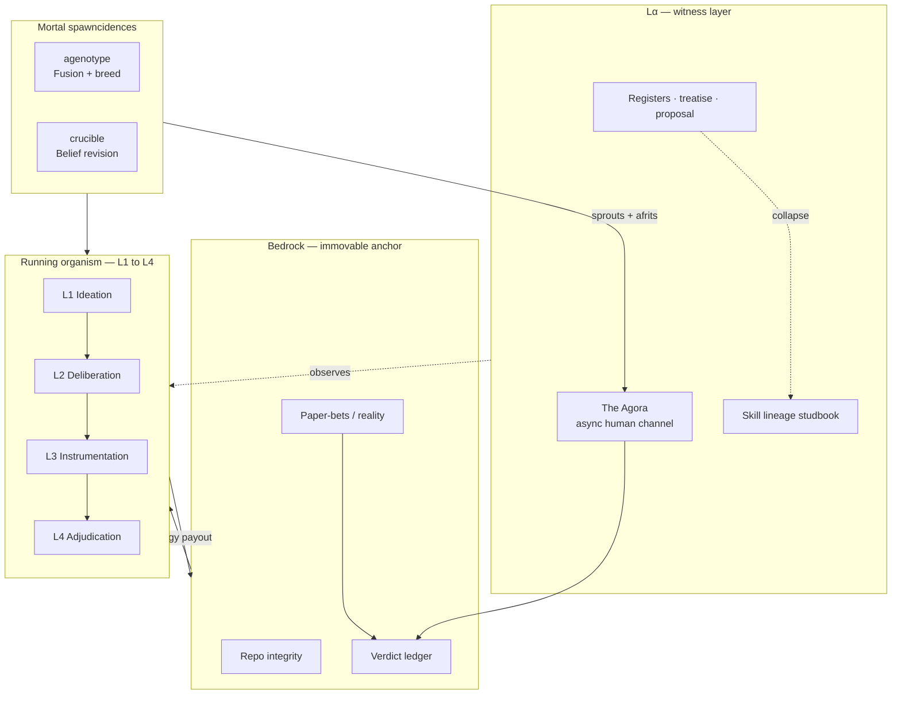

---

## 1. The organism

Doppl is not an agent. It is an **idearganism** — a population under selection pressure that evolves toward non-obvious, verifiable ideas.

### The tree (L1–L4) and Lα (outside it)

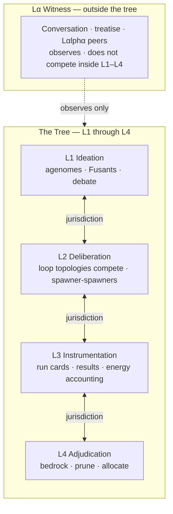

| Stratum | Question | Role |
|---------|----------|------|
| **L1 Ideation** | What's the idea? | Agenomes, debaters, personas |
| **L2 Deliberation** | Should we? What does "better" mean here? | Loop topologies, spawner-spawners |
| **L3 Instrumentation** | What are we testing? | Harness, rubrics, run cards, energy accounting |
| **L4 Adjudication** | Did it pass? Who lives? | Bedrock, held-out judges, pruning |
| **Lα Witness** | Does the lesson make sense? What replicates? | Observes L1–L4; does not compete inside them |

**Lα is One of Us** — human team members and the agentic participant are peers (`Lαlphα`). Lα has its own intraspecies peer fights one rung of abstraction up (Fusants at Lα).

### Two geometries (do not conflate)

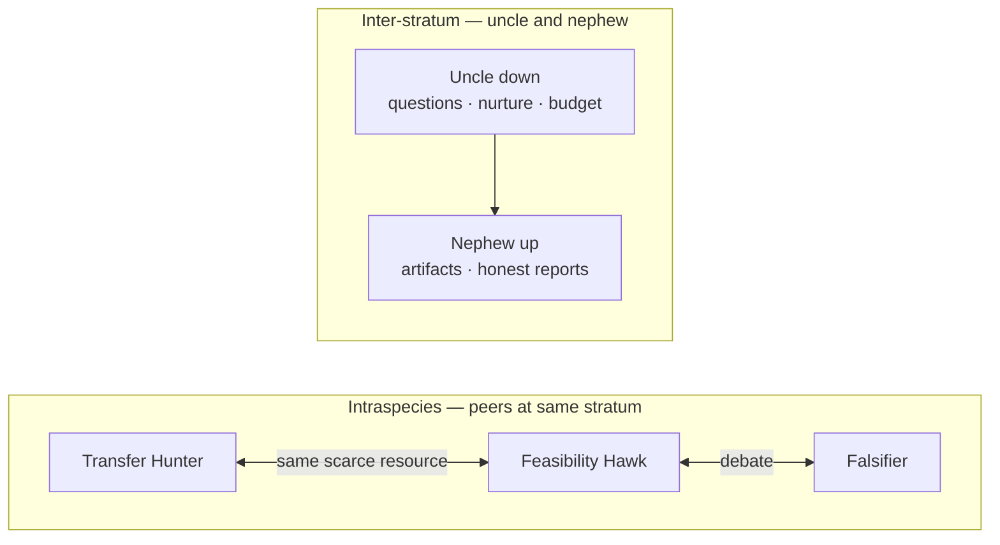

| Geometry | Who | What moves |
|----------|-----|------------|
| **Intraspecies** (peers at same stratum) | Transfer Hunter vs Feasibility Hawk, crucible debaters | Same scarce resource — the idea, the rubric, the budget. Vicious, high combinatorics. |
| **Inter-stratum** (uncle/nephew) | Asymmetric nurture and judgment up/down the tree | Different payload types. Down = uncle questions; up = nephew reports. |

Cross-stratum communication is **jurisdiction** — typed handoffs, not free conversation.

See [`TREATISE.md`](./TREATISE.md) § II–III for full narrative.

---

## 2. The closed loop

Everything we build serves one reproductive economy:

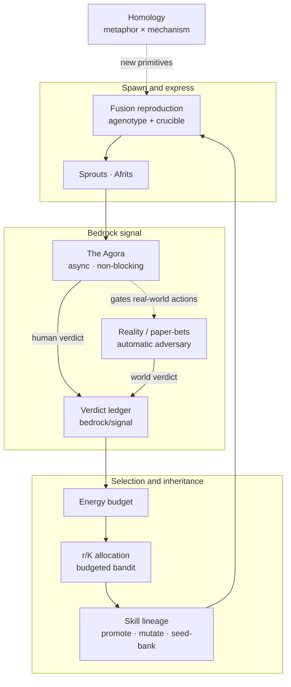

**Walkthrough:**

1. **Spawn / Fusion** — competing loop topologies (`agenotype`, `crucible`) produce ideas under selection. Two parent agenomes fuse; offspring inherit and mutate on blind spots, not critic tone.
2. **Sprouts and afrits** — a run throws off process-ideas (sprouts) and outcome-ideas (afrits). Different judges, different energy ledgers.
3. **The Agora** — async channel (Slack/Discord). Humans react without blocking the organism. Verdicts log to `bedrock/signal/verdicts.jsonl`.
4. **Reality / paper-bets** — pre-registered predictions resolved by time. `reactor: "world"`. The free automatic adversary.
5. **Energy budget** — verdicts pay out as tokens/compute/money. Success feeds the lineage; failure starves (demote, don't delete).
6. **r/K allocation** — fast-cheap-many (r) vs slow-expensive-few (K) per stratum-transition. Classical ML bandit over heterogeneous arm costs.
7. **Skill lineage** — convergent organs tracked in [`skills/LINEAGE.md`](./skills/LINEAGE.md). Agora verdicts select on skills: promote, mutate, or seed-bank.
8. **Homology** — metaphor ↔ ML mechanism congruence generates the next primitives (sprout/afrit = PRM/ORM, amemetics = adversarial training, etc.).

---

## 3. Core primitives

### Component map

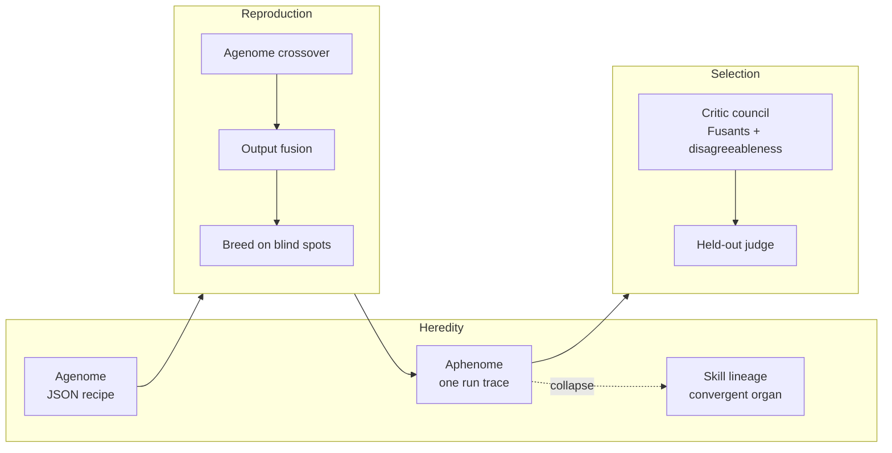

### Agenome

Serialized agent genome — the heritable recipe.

```json
{
  "id": "transfer-hunter",
  "name": "Transfer Hunter",
  "model": "deepseek/deepseek-v4-flash",
  "personas": ["veteran engineer hunting cross-domain analogies"],
  "ranking_rubric": "...",
  "output_contract": "...",
  "primary_mandate": [],
  "parent_ids": [],
  "generation": 0
}
```

Implementation: [`spikes/agenotype/agenome.py`](./spikes/agenotype/agenome.py). Generation-0 seed = Rule of Cool chromosomalized.

### Aphenome

One run's expressed behavior — answers, debate, trace, token spend. Mortal. Collapses to lessons, skills, or agenome patches on death.

### Metabolism / energy budget

Finite token/compute allowance per spawncidence. Hard cap (e.g. `SPAWNCIDENCE_CAP = 5` in crucible) plus earned budget. Death-by-low-energy is the default prune. **Demote-don't-delete** on single bad outcomes; **autopsy** before permanent death; **seed bank** for dormant lineages.

### Fusion reproduction

- **Agenome crossover** — splice personas, rubrics, mandates from two parents.
- **Output fusion** — judge synthesizes parent reasoning into offspring.
- **Breed on blind spots** — offspring mandate targets `blind_spots ∪ clarifying_questions`, not "try harder."

### Critic council (Fusants)

Panel of debaters with distinct mandates (Transfer Hunter, Feasibility Hawk, Falsifier, Contrarian, etc.). Each carries a **disagreeableness dial** (`0..1`) — resistance to convergence-for-its-own-sake. Judge distinguishes `consensus_quality: resolved|herded|mixed` and caps scores when the room herded.

### Bedrock ladder

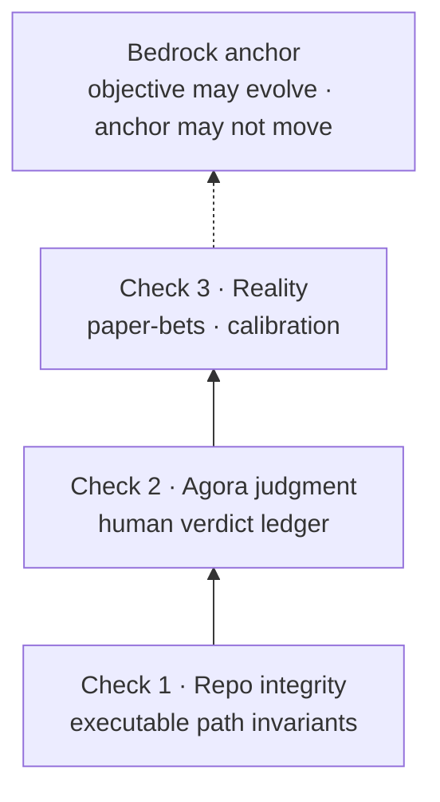

| Level | Check | Anchor |
|-------|-------|--------|
| 1 | Repo integrity | Executable path invariants |
| 2 | Agora human judgment | Verdict ledger — attributed, dimension-typed reactions |
| 3 | Reality / paper-bets | Pre-registered predictions, calibration-scored |

The objective may evolve; bedrock may not move.

### The Agora + verdict schemas

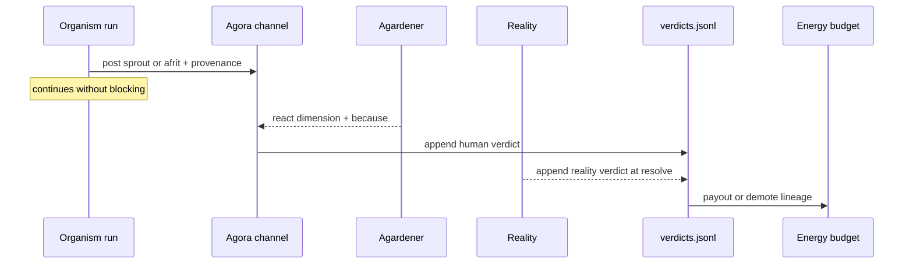

**Post** (organism → channel):

```json
{
  "post_id": "p_2026-06-17_0001",
  "spawncidence_id": "crucible:run_42:node_3",
  "source_agenome": "transfer-hunter×feasibility-hawk:gen2",
  "kind": "sprout",
  "context": "...",
  "idea": "...",
  "internal_score": 7.5,
  "cost_usd": 0.0031,
  "trace_link": "...",
  "ts": "2026-06-17T20:00:00Z",
  "exploration": false
}
```

**Verdict** (reactor → ledger):

```json
{
  "post_id": "p_2026-06-17_0001",
  "spawncidence_id": "crucible:run_42:node_3",
  "kind": "sprout",
  "reactor": "mike",
  "dimension": "novel",
  "because": "...",
  "weight": 1.0,
  "ts": "2026-06-17T20:14:00Z"
}
```

`reactor` may be a human name or `"world"` / `"world/price"` for reality-verdicts.

Full spec: [`bedrock/signal/README.md`](./bedrock/signal/README.md).

### Skill lineage

Pedigree tracked in [`skills/LINEAGE.md`](./skills/LINEAGE.md); expression in host dirs (`.cursor/skills/breakthrough/SKILL.md`). The `name` (phenotype) can drift while the `lineage.id` (genotype) is conserved — the gen-0 seed was renamed Rule of Cool → Breakthrough on 2026-06-18 but keeps `id: rule-of-cool`, and its children still point at `parent: rule-of-cool`. Frontmatter block:

```yaml
name: breakthrough        # phenotype — may drift under selection
lineage:
  id: rule-of-cool        # genotype — conserved ancestral id
  aka: breakthrough
  parent: null
  generation: 0
  mutation: null
  stratum: "Lα"
  status: stable
  bedrock: []
```

---

## 4. First concrete vertical — predictive paper-bet Insight Machine

**Target selection criterion:** hard to find, easy to verify.

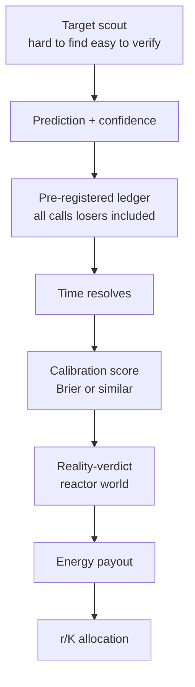

**Data flow:**

1. **Target scout** — surface domains with verification ≪ discovery cost. Prediction markets are a candidate (short-loop, adversarial price as bedrock). Alzheimer's is the dream, not the on-ramp.
2. **Prediction + confidence** — timestamp the call. The Insight Machine is a **high-precision** instrument (better silent than wrong).
3. **Pre-registration** — append-only ledger. Every call logged before resolution. Cherry-picking without pre-registration is a logged reward hack.
4. **Time resolves** — the future is a free held-out test set. Reality is the automatic adversary.
5. **Calibration eval** — grade whether confidence matches outcome frequency (70%-sure → ~70% true), not raw accuracy.
6. **Reality-verdict → energy → r/K** — winning lineages earn budget; losing lineages demote (not delete on one bad draw).

**Blast-radius dial:** $0 paper → small real bets → real capital. Never adjudicate or play in markets the organism creates.

### r/K metabolism across strata (example: landing pages)

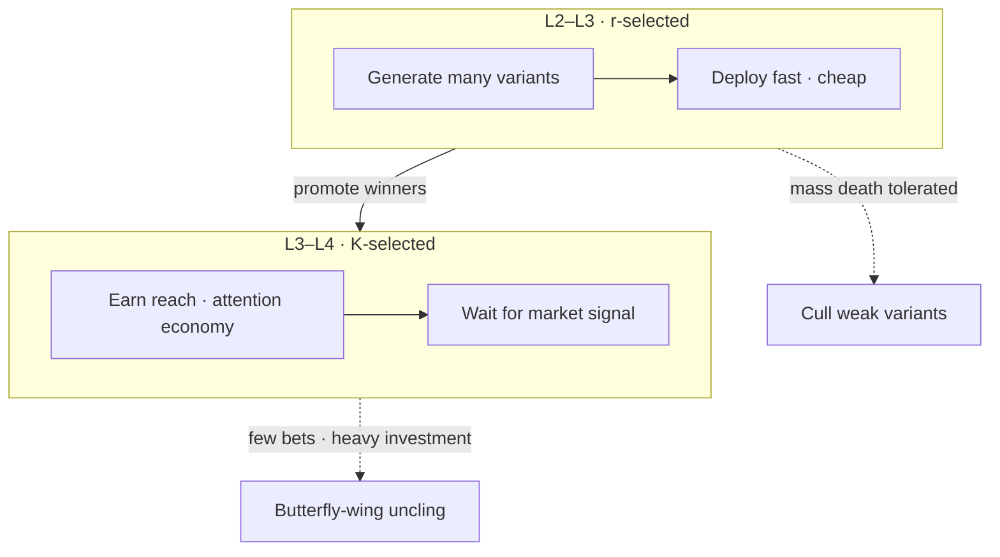

---

## 5. Repo / code architecture

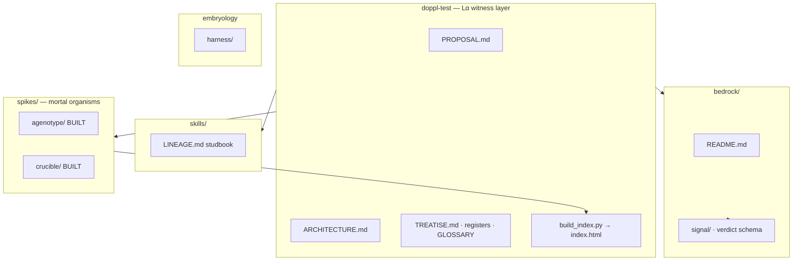

### Parallel spawners (the fork is the prey)

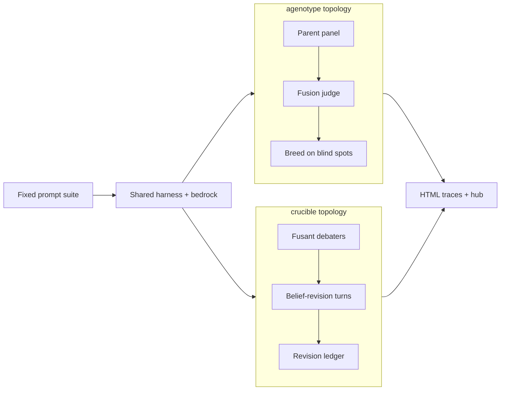

### Built vs to-build

| Built | To-build (2-week target) |
|-------|---------------------------|
| `Agenome` schema + seed personas | Shared harness across spawners |
| Agenotype reproduction on blind spots | Paper-bet pre-registration ledger + calibration scorer |
| Fusion judge + critic council | Agora webhook + verdict listener |
| Crucible belief-revision loop | Energy budget wired to verdict ledger |
| `fusion_trace.html` / `crucible_trace.html` extended aphenotype | Live population-tree visualization |
| Registers as proto-Lα | Bandit spawn allocator (Direction A) |
| RoC skill (generation-0) | Novelty pressure scoring |
| Agarden hub (`build_index.py` → `index.html`) | Multi-generational population loop |

---

## 6. Schemas (reference)

### Run card / ticket (L2–L3 handoff)

Typed contract for an experiment the software factory (or any L3 tool) executes:

```json
{
  "run_id": "rc_001",
  "objective": "Test landing-page variant B against variant A",
  "bedrock_metric": "waitlist_signup_rate",
  "energy_cap_tokens": 50000,
  "money_cap_usd": 0,
  "blast_radius": "dry-run",
  "kill_condition": "zero signups after 48h",
  "spawncidence_id": "crucible:run_42",
  "agenome_id": "feasibility-hawk:gen1"
}
```

`blast_radius`: `dry-run` | `sandboxed` | `real-with-gate` (Agora approval required).

### Pre-registered prediction ledger entry

```json
{
  "prediction_id": "pred_2026-06-17_001",
  "market_or_target": "polymarket:will-x-happen-by-date",
  "predicted_probability": 0.72,
  "confidence_tier": "medium",
  "reasoning_summary": "...",
  "source_spawncidence": "crucible:run_42:node_3",
  "source_agenome": "transfer-hunter:gen2",
  "ts_registered": "2026-06-17T21:00:00Z",
  "ts_resolves": "2026-06-24T00:00:00Z",
  "outcome": null,
  "brier_score": null
}
```

`outcome` and `brier_score` filled at resolution. All entries scored — winners and losers.

---

## 7. Two-week build plan

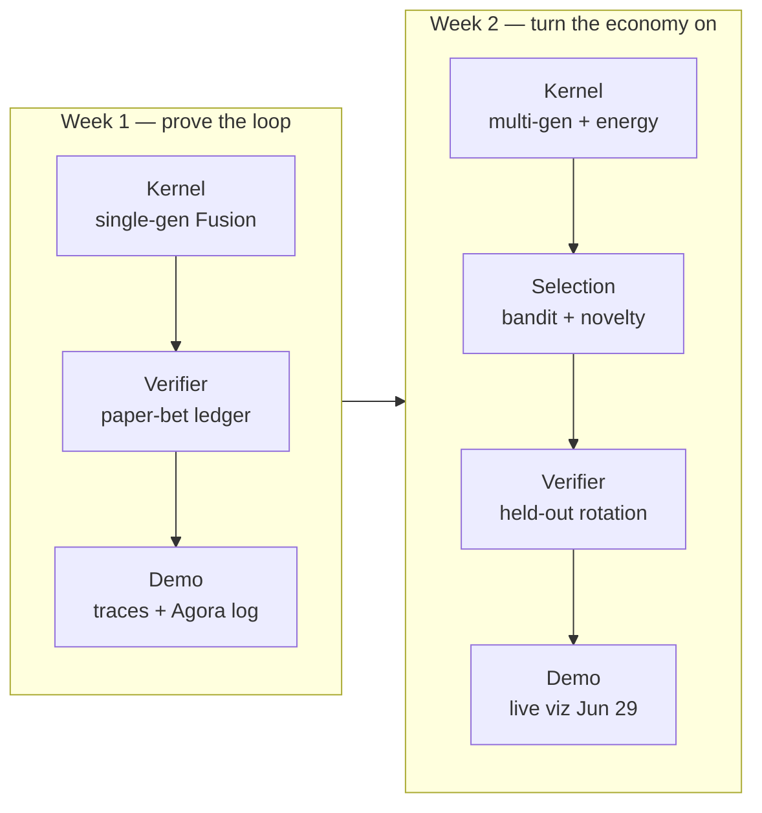

### Week 1 — kernel + single generation + paper-bet ledger

| Surface | Deliverable |
|---------|-------------|
| **Kernel** | Single-generation Fusion loop end-to-end on fixed prompt set; generation N vs N+1 comparison |
| **Verifier** | Critic council integrated; pre-registered prediction ledger (append-only JSONL); basic calibration scorer |
| **Demo** | Trace HTML for both spikes; root hub refreshed; manual Agora posts + verdict logging |
| **Selection** | Fixed energy cap per run; manual r/K tagging on stratum transitions |

### Week 2 — economy, allocation, visualization

| Surface | Deliverable |
|---------|-------------|
| **Kernel** | Multi-generational loop (if Week 1 holds); spawn/cull wired to energy |
| **Selection** | Bandit allocator prototype; novelty/diversity scoring |
| **Verifier** | Held-out judge rotation; correlation gate (internal score vs calibration) |
| **Demo** | Population tree + fitness-over-time chart; live demo harness for Jun 29 |

Stretch items (fine-tuning flywheel, real-money bets, software factory) are explicitly deferred.

---

## 8. Safety and governance

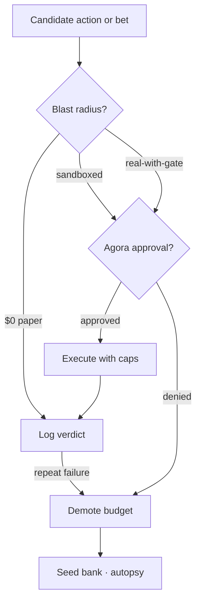

| Principle | Implementation |
|-----------|----------------|
| **Agora gate** | No real-world side effects without human approval (async, non-blocking for the organism) |
| **Blast-radius classes** | `dry-run` → `sandboxed` → `real-with-gate` on every run card |
| **Paper-first** | $0 blast radius until calibration proves out |
| **Pre-registration** | All predictions logged before resolution; score the full book |
| **Never play own markets** | Organism must not adjudicate or bet in markets it creates |
| **Demote-don't-delete** | Single bad outcomes lower budget; autopsy before permanent death |
| **Amemetics** | Every reward hack → [`BUGS_AND_MITIGATIONS.md`](./BUGS_AND_MITIGATIONS.md) with repro + assertion |
| **Held-out judges** | Judges the breeding loop never sees and cannot author |

Horizon items (minting markets, self-funding treasury, software factory at scale) are documented as future direction only — not in scope for two weeks.

---

## 9. Further reading

- [`PROPOSAL.md`](./PROPOSAL.md) — problem, scope, team surfaces, demo story
- [`TREATISE.md`](./TREATISE.md) § VIII-c (Homology), § XIII (Agora), § XIV (Insight Machine, r/K)
- [`GLOSSARY.md`](./GLOSSARY.md) — full lexicon
- [`DIAGRAMS.md`](./DIAGRAMS.md) — existing visual maps (update as architecture solidifies)
