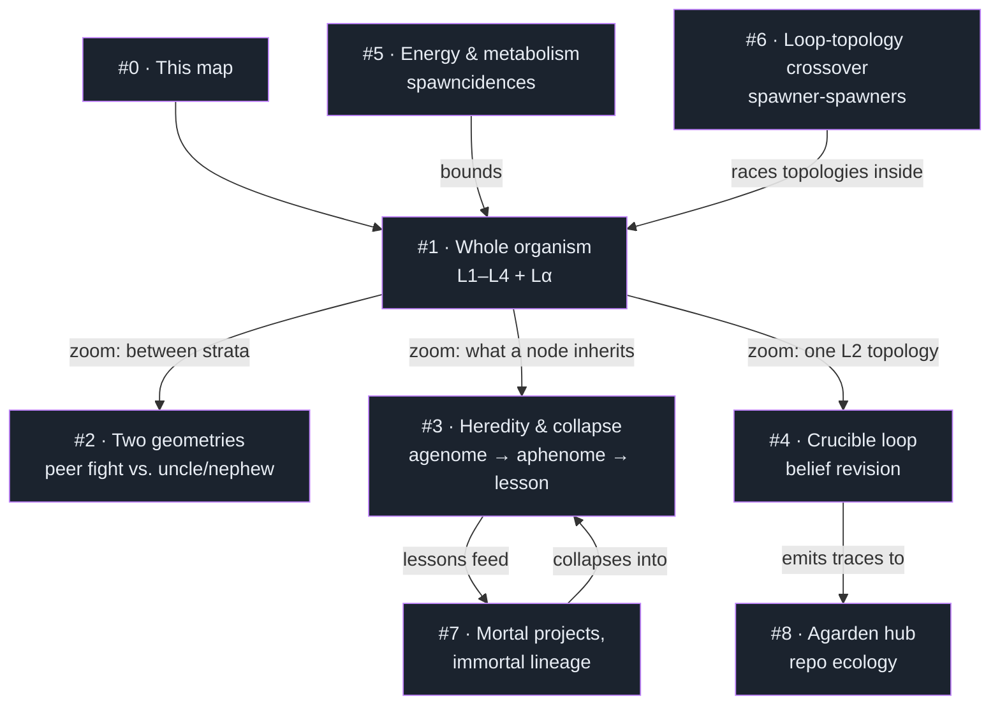
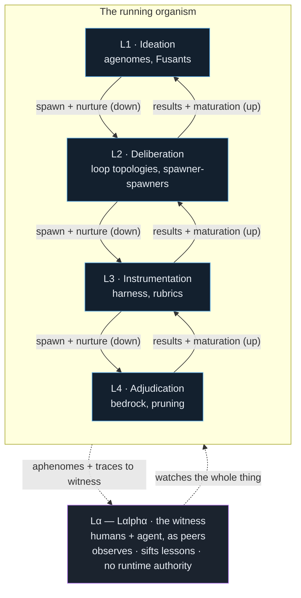
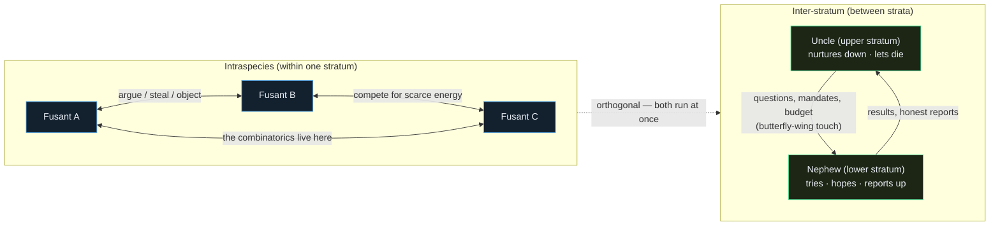
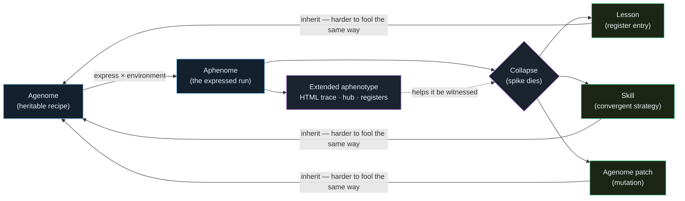
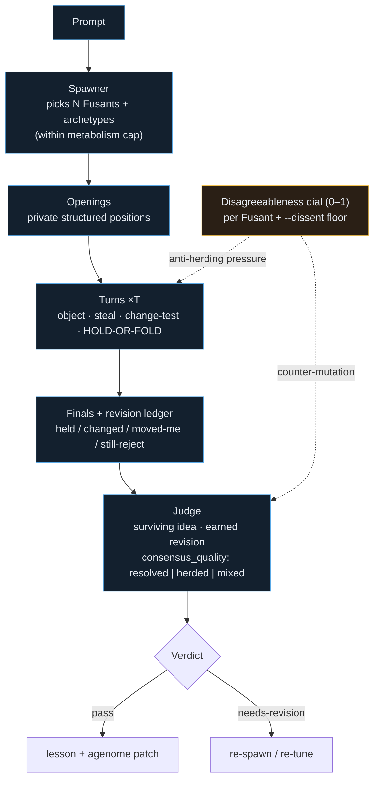
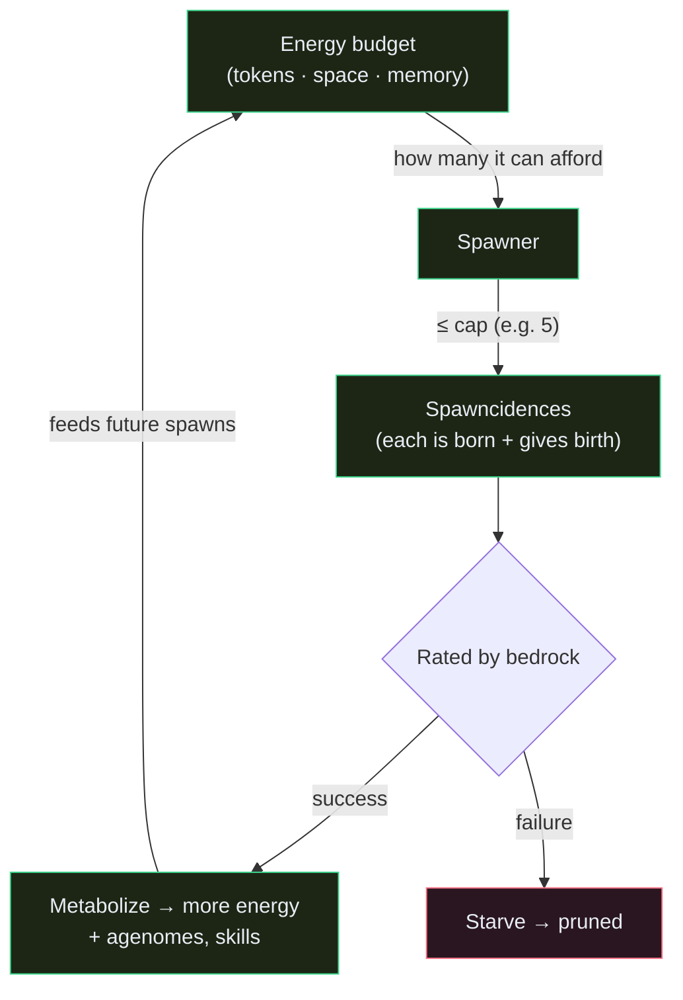
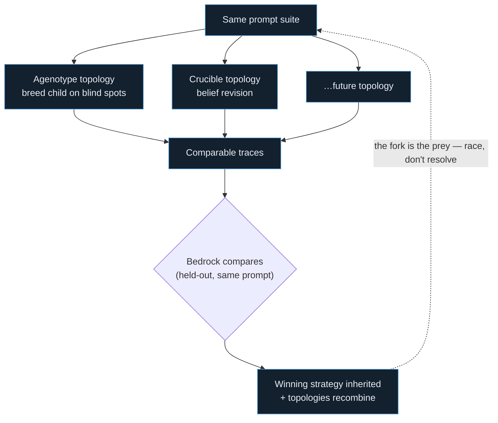
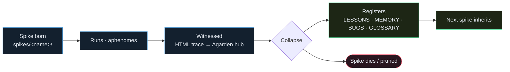
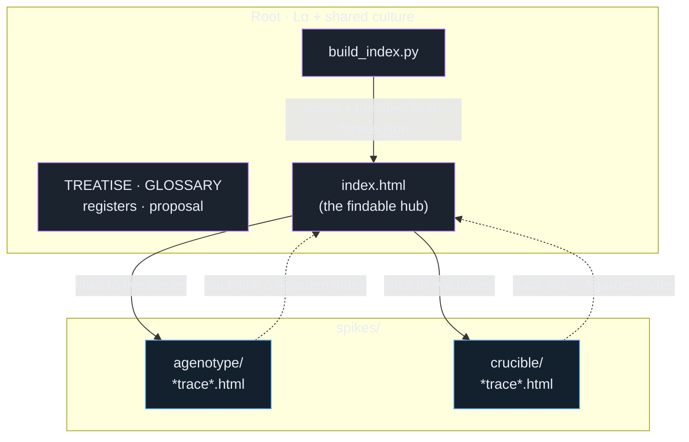

# Diagrams — how it all relates

**Status:** initial sketch · revisable · not canon
**Purpose:** a high-level, visual map of the Doppl ecology — the moving parts and how they interrelate. Words live in [`TREATISE.md`](./TREATISE.md) and [`GLOSSARY.md`](./GLOSSARY.md); this file is the *picture*.

> These are deliberately simple. Each diagram shows **one process**; the first diagram shows **how the diagrams relate**. Edit freely — they are meant to drift as the model sharpens. (Rendered with Mermaid: GitHub + the IDE preview both display these.)

---

## 0. Map of maps — how the diagrams relate

---

## 1. The whole organism — the tree (L1–L4) and Lα outside it

*Cross-strata messages are **typed handoffs** (jurisdiction), not free chat. Lα is **outside** the ordinal tree — not an L5.*

---

## 2. Two geometries — intraspecies vs. inter-stratum

*Conflating these is how you get either endless chat with no pruning, or pruning with no growth.*

---

## 3. Heredity & collapse — agenome → aphenome → lesson (amemetics)

*Amemetics: each cycle leaves the next generation harder to fool the same way. What survives is the compressed lesson, not the organism.*

---

## 4. The crucible loop — belief revision under pressure (one L2 topology)

*Cooperation is the dominant strategy; dissenters provoke the mutation. The dial keeps the room off the mean without forcing disagreement-for-its-own-sake.*

---

## 5. Energy & metabolism — what bounds the chaos

*Pruning isn't failure — it's metabolism. "Feeding and being fed upon."*

---

## 6. Loop-topology crossover — spawning spawners

---

## 7. Mortal projects, immortal lineage — the spike lifecycle

*The organism doesn't need to persist for the DNA to survive. The lineage log is what's passed on.*

---

## 8. Agarden hub — repo ecology & navigation

*Mortal traces come and go; the hub is regenerated and points at whatever still lives — itself an extended aphenotype.*

---

## Revision log

| Date | Note |
|------|------|
| 2026-06-17 | Initial diagram set — map-of-maps, organism/Lα, two geometries, heredity/collapse, crucible loop, energy/metabolism, loop-topology crossover, spike lifecycle, Agarden hub |
