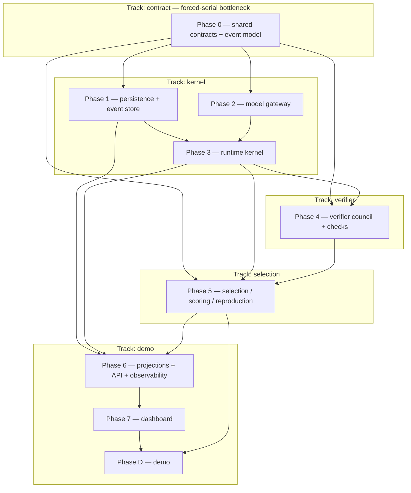

# IMPLEMENTATION_PLAN.md — Doppl

> **Phase note.** Spec-anchored build plan for Doppl (agent-evolution runtime + adversarial verifier council + observable demo dashboard), decomposed from the binding `ARCHITECTURE.md`. **Build posture: MVP/prototype** — two-week capstone, June 29 2026 showcase, 3–4 engineers. Locked baseline (see `ARCHITECTURE.md` §19 / `DECISIONS.md`): custom TS kernel; Postgres append-only event log = source of truth; provider-agnostic ModelGateway (OpenRouter primary, direct-OpenAI embeddings, live web-search grounding); Langfuse (non-authoritative); held-out judge + critic rotation; both subtypes equal; React Flow; REST+SSE; local-first demo; SQLite forbidden. Energy = successful productive spend only; replay reconstructs from persisted seed/outcomes with no model/embedding/web calls.
>
> **Reading discipline.** Read this file **by section, not whole** — `/orchestrate-start` and `/session-start` grep the section header and read only "Currently in progress" + the active phase. The living sections (Currently-in-progress, Carry-forward, Log, Trims, Decisions) are bounded — pruned/archived at `/orchestrate-end`.

> **Session protocol:**
> - **At session start** — orchestrator runs `/orchestrate-start`; implementer runs `/session-start`. Confirm the session target.
> - **At session end** (only when the user says we're done): **Implementer** runs `/session-end` (TDD + cross-doc audit + Step-9 list + session doc + `/preflight`; does NOT touch this doc). **Orchestrator** runs `/orchestrate-end` (verify hot routing, reconcile checkboxes, append Log, update Decisions/Carry-forward/Currently-in-progress, triage Carry-forward, round commit + push).

> **Reference deadlines:**
> - **Week 1 (by ~2026-06-22):** contract freeze (Phase 0) + kernel spine (Phases 1–3) + single-generation Fusion loop end-to-end.
> - **Week 2 (by ~2026-06-28):** verifier + selection (Phases 4–5), projections/API/dashboard (Phases 6–7), local demo + replay fallback (Phase D), rehearsals.
> - **2026-06-29:** showcase.

> **Spec-anchor convention (architecture-as-contract).** Each phase header carries a `**Spec anchors:**` block listing the `ARCHITECTURE.md` sections it implements; orchestrator + implementer re-read them at session start. If a slice surfaces a behavior the anchors don't cover, that's a cross-doc invariant flag at `/tdd` Step 9 — either the anchor is missing or the implementation drifted. Each phase header also carries a `**Track:**` tag + `**Depends on (phases):**` edge — the source the `## Parallelization plan` renders from. New mid-build tasks carry `(implements §X; origin: <slice>)` on the `### <phase-id>.N` heading.

---

## Currently in progress

**Bootstrap.** Plan generated from `ARCHITECTURE.md`; scaffolding not yet generated; first `/tdd` slice not started.

**Next session target:** P0.1 (RunEventEnvelope + closed RunEventType registry + actor union) — the contract freeze is the forced-serial bottleneck every track waits on.

---

## Carry-forward to upcoming briefs

Items the orchestrator MUST fold into the next 1–2 briefs. Triaged at every `/orchestrate-end` (not append-only). Bound: under ~7 items.

_(Empty at project start; populated as Step-9 routing surfaces operational items.)_

---

## Deliverable map

| Deliverable | Status | Delivered by |
|---|---|---|
| Frozen shared-contracts package (`packages/contracts`) | ❌ | Phase 0 |
| Postgres append-only event store + replay reader | ❌ | Phase 1 |
| Provider-agnostic ModelGateway (OpenRouter / OpenAI / retrieval) | ❌ | Phase 2 |
| Runtime kernel — bounded evolution loop, caps, energy, RNG | ❌ | Phase 3 |
| Verifier council + held-out judge + critic rotation + checks | ❌ | Phase 4 |
| Selection / scoring / reproduction — gen N+1 beats gen N | ❌ | Phase 5 |
| Projections + REST/SSE API + runtime self-observability | ❌ | Phase 6 |
| React Flow lineage dashboard (live + replay, accessible) | ❌ | Phase 7 |
| Local-first demo path + prepared-replay fallback | ❌ | Phase D |

---

## Parallelization plan (Track map)

> **Team mode only.** A *track* is a set of phases forming a dependency-isolated region of the `ARCHITECTURE.md` §2.5 DAG. Tracks with no unsatisfied upstream-track dependency run **in parallel — each in its own git worktree with its own agent team**. A single-operator build walks the DAG serially in one tree (delete this section's worktree mechanics and just follow the critical path).

**Phase/track DAG** (nodes = phases, edges = `Depends on (phases)`, subgraphs = tracks):

> **Critical path:** Phase 0 → Phase 1 → Phase 3 → Phase 4 → Phase 5 → Phase 6 → Phase 7 → Phase D (the serial floor — staff it first; Phase 2 runs parallel to Phase 1 inside the kernel track and also feeds Phase 3). **Forced-serial bottleneck:** Phase 0 (the shared contract freeze — every track waits on it).

**Track map** — names follow `<track>-<area>-<role>`:

| Track | Phases | Code area(s) | Worktree (branch) | Agent-team names |
|---|---|---|---|---|
| `contract` | P0 | `packages/contracts` | `../Capstone-contract` (`track/contract`) | `contract-contracts-orchestrator` / `-implementer` |
| `kernel` | P1, P2, P3 | `apps/api/{runtime,event-store,model-gateway}` | `../Capstone-kernel` (`track/kernel`) | `kernel-runtime-orchestrator` / `-implementer` |
| `verifier` | P4 | `apps/api/{verifier,check-runners}` | `../Capstone-verifier` (`track/verifier`) | `verifier-council-orchestrator` / `-implementer` |
| `selection` | P5 | `apps/api/selection` | `../Capstone-selection` (`track/selection`) | `selection-ml-orchestrator` / `-implementer` |
| `demo` | P6, P7, PD | `apps/api/projections`, `apps/web`, `packages/observability` | `../Capstone-demo` (`track/demo`) | `demo-observability-orchestrator` / `-implementer` |

**Integration / merge order** (DAG topological order):
1. `contract` (P0) → integration branch first — the shared contracts are frozen here before any track forks.
2. `kernel` (P1, P2, P3) — the runtime spine.
3. `verifier` (P4) and `selection` (P5) — branch off the kernel; verifier merges before selection (selection consumes critic/check/judge outputs).
4. `demo` (P6, P7, PD) — integrates last (projections need the full event stream incl. selection's fitness/lineage events).

**Shared contracts across tracks** (frozen in Phase 0 before tracks fork — a change after fork is a cross-track Finding): every Appendix-A model — `RunEventEnvelope`+`RunEventType`, `RunConfig`/`RunCaps`, `Agenome`, `CandidateIdea`+subtype payloads, `EvidenceRef`, `CriticReview`/`CriticMandate`, `CheckResult`/`CheckRunnerAdapter`, `NoveltyScore`/`FitnessScore`/`ScoringPolicy`, `EnergyEvent`/`ReproductionEvent`, `ModelRoute`/`ModelRole`/`ProviderCapability`, `ModelGatewayRequest`/`Response`, `LineageGraphProjection`, `Run`/`Generation`/`CullingEvent`/`FinalJudgeRubric` — all in `packages/contracts`.

---

## Phase exit checklist (template — applies to every phase)

Before ticking a phase complete (executed row-by-row by `/phase-exit <phase>`):

- [ ] **All phase task checkboxes ticked.** Partial work stays unchecked with a Log note.
- [ ] **Acceptance criterion met.** `/preflight` clean + manual smoke if there's runtime behavior.
- [ ] **`/preflight` clean** (includes architecture-invariant tests).
- [ ] **Cross-doc invariants verified.** No Appendix-A model field change without an `ARCHITECTURE.md` edit in the same round.
- [ ] **Reachability audit clean per touched area** (`reachability-auditor`).
- [ ] **Arch-drift audit clean over the phase's Spec anchors** (`arch-drift-auditor`).
- [ ] **Spec coverage: every phase anchor has a tagged test or waiver** (`scripts/spec-lint.sh tests <phase>`).
- [ ] **Whole-system security review clean (qualifying phases)** — phases with security-/invariant-/trust-boundary tasks (P1 redaction, P3 caps, P4 allowlist/injection, P6 redaction). _(MVP: scope to the built surface; confirm at `/scaffold-generate` gate-pack.)_
- [ ] **Dependency audit: no new findings vs baseline.** _(MVP — confirm at gate-pack; keep, it's cheap.)_
- [ ] **Perf budgets:** `n/a — no budgets (deliberate deferral, REQ-NF-003)`; only the 10-min demo window is a rehearsal check (Phase D), not a benchmark task.
- [ ] **Session doc(s) for this phase exist** and list every file created/modified.
- [ ] **Commits pushed to origin.**

---

## Final-submission acceptance criteria (project-level)

The project is "done" when:

- [ ] A later generation measurably beats an earlier one on the **held-out rubric**, visible in the dashboard (fitness-over-time + generation comparison).
- [ ] The full demo path runs **end-to-end locally** (no mocks on the load-bearing path) with a prepared-replay fallback.
- [ ] **All caps fail closed**; the kill switch moves the run to terminal and preserves replayable partial evidence.
- [ ] **Replay reconstructs** a run from the event log with no model/embedding/web calls (state-equivalence).
- [ ] **Both subtypes** (`cross_domain_transfer`, `zeitgeist_synthesis`) run; the final idea is defensible via critic + check evidence.
- [ ] The **append-only event log is authoritative**; all projections rebuild from it.

---

## Phase 0 — Shared contracts & event model

**Goal:** Freeze every Appendix-A model as a Zod schema (with z.infer TS types) in packages/contracts, plus the closed RunEventType registry, the closed 7-role actor union, the secret-redaction scrub contract, the boot config-validation contract, and the consumer/producer contract-test surface. These are the §2.5 shared contracts crossed by DAG edges; this phase is the forced-serial bottleneck that must be frozen before the four parallel tracks (kernel, verifier, selection, demo) fork. Every model-defining task ships a field-name-set schema-snapshot in its RED outline so a mid-build field change is caught as a cross-track regression. Numeric scoring weights are the only deferred-open values; all structures are frozen now.

**Spec anchors:** `ARCHITECTURE.md §4`, §2.5, Appendix A.

**Track:** `contract` · **Depends on (phases):** none.

### P0.1 — RunEventEnvelope + closed RunEventType registry + 7-role actor union

- [ ] RunEventEnvelope carries exactly: id, runId, generationId?, agenomeId?, candidateId?, type:RunEventType, sequence, occurredAt, actor, correlationId?, langfuseTraceId?, langfuseObservationId?, payload, schemaVersion (per Appendix A §4)
- [ ] sequence is the sole ordering key; it is a per-run monotonic integer and occurredAt is a UTC ISO-8601 string treated as display/analytics-only, never ordering (§4)
- [ ] RunEventType is a CLOSED enum containing every lifecycle + failure/terminal type named in Appendix A: run.configured/started/completed/failed/stopped, generation.started/completed, agenome.spawned/fused/mutated/reproduced, candidate.created, critic.reviewed, check.completed, novelty.scored, fitness.scored, lineage.culled, energy.spent, provider_call_failed, output_schema_rejected, candidate_invalidated, energy_exhausted, generation_failed, reproduction_aborted_insufficient_parents, novelty_scoring_degraded — and rejects any unlisted type
- [ ] actor is the CLOSED 7-role union (operator, runtime, agenome, critic, check_runner, selection_controller, system) and supersedes any actor:string; any other value is rejected
- [ ] schemaVersion is present on every envelope; readers must accept all schemaVersion ≤ current (the registry pins the current version constant)
- [ ] payload is the generic JSONB-backed shape at envelope level (per-type narrowing is layered by P0.10), and an unknown envelope field is rejected by the schema
- [ ] Files: packages/contracts/src/events/envelope.ts (NEW); packages/contracts/src/events/event-type.ts (NEW); packages/contracts/src/events/actor.ts (NEW); packages/contracts/src/index.ts (extended)
- [ ] Cross-doc invariant: NEW — RunEventEnvelope, RunEventType · §2.5 seam: RED outline includes the field-name-set **schema-snapshot test** (`spec(§X)`-tagged)
- [ ] Depends on: none

### P0.2 — Secret-redaction scrub contract (persistence-boundary filter)

- [ ] Exposes a single pure scrub function applied to any event payload object before append and before Langfuse emit (§14 — one scrub used at both boundaries)
- [ ] Redacts pattern-matched provider keys, Authorization headers, and known env-value formats from arbitrary nested payload objects (§14)
- [ ] Is idempotent: scrubbing already-scrubbed output yields the same result and never reintroduces a secret
- [ ] Returns a structurally-equivalent object with non-secret fields untouched (does not drop or reorder legitimate payload keys)
- [ ] Defines the redaction placeholder token as a stable constant so snapshot/contract tests can assert against it
- [ ] No secret value can appear in any output of the scrub (the safety invariant REQ-S-004 / RISK-006/009)
- [ ] Files: packages/contracts/src/security/redaction.ts (NEW); packages/contracts/src/index.ts (extended)
- [ ] Cross-doc invariant: none
- [ ] Depends on: none

### P0.3 — RunConfig / RunCaps schemas + boot config-validation contract

- [ ] RunCaps carries exactly maxPopulation, maxGenerations, energyBudget (doppl_energy integer), maxSpawnDepth, maxToolCalls, wallClockTimeoutMs (Appendix A §4/§5)
- [ ] RunConfig carries exactly seed, enabledSubtypes[] (from the two-member subtype union), caps:RunCaps, modelProfile, scoringPolicyVersion, rngSeed (Appendix A)
- [ ] rngSeed is a required field on RunConfig so the per-run seed is persistable in run.configured for deterministic replay (§4 RNG capture)
- [ ] Cap values are validated as positive/bounded so an invalid cap config fails fast at boot rather than at runtime (§15 fail-fast, REQ-NF-001)
- [ ] Exposes a config-validation entry that parses config (defaults < file < env precedence) and throws a clear error on the first invalid field (§15)
- [ ] energyBudget unit is doppl_energy and is a single integer (shared unit with EnergyEvent, §4)
- [ ] Files: packages/contracts/src/run/run-config.ts (NEW); packages/contracts/src/run/run-caps.ts (NEW); packages/contracts/src/config/validate.ts (NEW); packages/contracts/src/index.ts (extended)
- [ ] Cross-doc invariant: NEW — RunConfig, RunCaps · §2.5 seam: RED outline includes the field-name-set **schema-snapshot test** (`spec(§X)`-tagged)
- [ ] Depends on: none

### P0.4 — Agenome schema (traits + 7-state status)

- [ ] Agenome carries exactly id, runId, generationId, parentIds[], systemPrompt, personaWeights, toolPermissions[], decompositionPolicy, spawnBudget, mutationMeta?, status (Appendix A §3)
- [ ] parentIds[] encodes 0-2 parents (gen-0 has none, fusion offspring usually 2) without enforcing the count at schema level beyond an array of ids (§3 relationships)
- [ ] status is the CLOSED 7-state union: seeded, active, spent, eligible_parent, failed, reproduced, culled (§3 Agenome state machine); any other value rejected
- [ ] spawnBudget is a hint integer (clamped at runtime, not at schema level)
- [ ] mutationMeta is optional so seeded gen-0 agenomes validate without it
- [ ] Files: packages/contracts/src/domain/agenome.ts (NEW); packages/contracts/src/index.ts (extended)
- [ ] Cross-doc invariant: NEW — Agenome · §2.5 seam: RED outline includes the field-name-set **schema-snapshot test** (`spec(§X)`-tagged)
- [ ] Depends on: none

### P0.5 — CandidateIdea + CrossDomainTransferPayload + ZeitgeistSynthesisPayload + EvidenceRef

- [ ] CandidateIdea carries exactly id, runId, generationId, agenomeId, subtype, title, summary, claims[], evidenceRefs[], status, subtypePayload (Appendix A §3 + DATA_MODEL.md)
- [ ] subtype is the CLOSED two-member union cross_domain_transfer | zeitgeist_synthesis and subtypePayload is a discriminated union matching the chosen subtype
- [ ] status is the CLOSED 8-state union created, under_review, checked, scored, selected, rejected, culled, invalid (§3 Candidate state machine)
- [ ] CrossDomainTransferPayload carries sourceDomain, sourceTechnique, targetDomain, targetProblem, transferMapping, expectedMechanism, executableCheckIdea? (DATA_MODEL.md)
- [ ] ZeitgeistSynthesisPayload carries thesis, audience, currentSignals[], whyNow, falsifiablePredictions[], comparablePriorArt[] (DATA_MODEL.md)
- [ ] EvidenceRef.kind is the CLOSED union trace | check_output | prior_art | signal | raw_output | other with eventId?/uri?/label?/langfuseObservationId?, and resolves WITHIN the Postgres tier (never an external store) per §4/§9
- [ ] Files: packages/contracts/src/domain/candidate-idea.ts (NEW); packages/contracts/src/domain/subtype-payloads.ts (NEW); packages/contracts/src/domain/evidence-ref.ts (NEW); packages/contracts/src/index.ts (extended)
- [ ] Cross-doc invariant: NEW — CandidateIdea, CrossDomainTransferPayload, ZeitgeistSynthesisPayload, EvidenceRef · §2.5 seam: RED outline includes the field-name-set **schema-snapshot test** (`spec(§X)`-tagged)
- [ ] Depends on: none

### P0.6 — CriticReview + CriticMandate + criticInput isolation shape

- [ ] CriticReview carries exactly id, candidateId, mandate, scores{}, critique, confidence, evidenceRefs[] (Appendix A §7)
- [ ] mandate is the CLOSED CriticMandate union factual_grounding, novelty_prior_art, feasibility, falsification, subtype_specific (§7); any other value rejected
- [ ] criticInput models trusted rubric and untrusted candidate payload as DISTINCT fields so candidate text is never interpolated into instruction strings (§7 / §14 prompt-injection isolation, T-002)
- [ ] criticInput wraps the untrusted candidate field with a fixed sentinel delimiter constant exposed by the contract
- [ ] CriticReview carries evidenceRefs[] of EvidenceRef so reviews are explainable from persisted events (§8); critics emit evidence only and the shape carries no winner-selection or policy-mutation field (§7/§14)
- [ ] Files: packages/contracts/src/verifier/critic-review.ts (NEW); packages/contracts/src/verifier/critic-input.ts (NEW); packages/contracts/src/index.ts (extended)
- [ ] Cross-doc invariant: NEW — CriticReview, CriticMandate, criticInput · §2.5 seam: RED outline includes the field-name-set **schema-snapshot test** (`spec(§X)`-tagged)
- [ ] Depends on: P0.5

### P0.7 — CheckResult + CheckRunnerAdapter allowlist shape

- [ ] CheckResult carries exactly id, candidateId, checkType, status, score?, output?, skipReason?, evidenceRefs[], error? (Appendix A §7)
- [ ] status is the CLOSED union passed | failed | skipped; a skipped result requires a skipReason (§7 — unregistered/execution-requiring check is recorded as skipped with reason)
- [ ] CheckRunnerAdapter is an allowlist-registry shape keyed by adapter ID, mirroring the model registry, with a non-executing adapter contract (no arbitrary-code field) per §7/§14, REQ-S-003
- [ ] An unregistered or execution-requiring adapter id maps to a skipped CheckResult with reason rather than executing (the allowlist invariant)
- [ ] evidenceRefs[] are EvidenceRef so check evidence resolves within the Postgres tier (§9)
- [ ] Files: packages/contracts/src/checks/check-result.ts (NEW); packages/contracts/src/checks/check-runner-adapter.ts (NEW); packages/contracts/src/index.ts (extended)
- [ ] Cross-doc invariant: NEW — CheckResult, CheckRunnerAdapter · §2.5 seam: RED outline includes the field-name-set **schema-snapshot test** (`spec(§X)`-tagged)
- [ ] Depends on: P0.5

### P0.8 — NoveltyScore + FitnessScore + ScoringPolicy (structure frozen, weights deferred)

- [ ] NoveltyScore carries exactly id, candidateId, vector, embeddingModelId, dimension, comparisonSet, method, score, explanation (Appendix A §8)
- [ ] vector is the persisted float array (authoritative-once-computed) with embeddingModelId + dimension so replay reads the stored vector and never re-embeds (§4/§9)
- [ ] FitnessScore carries exactly id, candidateId, total, components{}, policyVersion, explanation (Appendix A §8)
- [ ] components{} includes the named decomposed signals (critic scores, subtype-check results, novelty, energy efficiency, held-out-judge acceptance) and fitness references the novelty it consumed so selection is explainable from persisted events (§8)
- [ ] ScoringPolicy carries version, weights{}, normalization? with STRUCTURE frozen and numeric weight VALUES deferred-open (§8 — the only deferred-open contract values)
- [ ] policyVersion on FitnessScore ties a score to a specific ScoringPolicy version (one selected score per policy version per candidate, §3)
- [ ] Files: packages/contracts/src/scoring/novelty-score.ts (NEW); packages/contracts/src/scoring/fitness-score.ts (NEW); packages/contracts/src/scoring/scoring-policy.ts (NEW); packages/contracts/src/index.ts (extended)
- [ ] Cross-doc invariant: NEW — NoveltyScore, FitnessScore, ScoringPolicy · §2.5 seam: RED outline includes the field-name-set **schema-snapshot test** (`spec(§X)`-tagged)
- [ ] Depends on: none

### P0.9 — EnergyEvent + ReproductionEvent schemas

- [ ] EnergyEvent carries exactly id, runId, generationId?, agenomeId?, eventType, estimate, actual, unit:doppl_energy, reason, providerMeta? (Appendix A §4/§5)
- [ ] eventType is the CLOSED union llm | tool | spawn; estimate and actual are both present so energy.spent persists pre-call estimate AND post-call reconciled actual (§4 energy)
- [ ] EnergyEvent only models SUCCESSFUL productive spend — there is no failed/retried/repaired energy debit field (failed attempts emit provider_call_failed, never energy.spent, §4)
- [ ] ReproductionEvent carries exactly id, runId, parentAgenomeIds[], childAgenomeId, mode, crossoverPoints, mutationSummary (Appendix A §8)
- [ ] mode is the CLOSED union fusion | crossover | output_synthesis | mutation_only (§8 + §3 degenerate <2-parent fallback uses mutation_only)
- [ ] crossoverPoints and mutationSummary persist concrete RNG outcomes so replay reconstructs from stored outcomes and never re-samples (§4 RNG capture)
- [ ] Files: packages/contracts/src/domain/energy-event.ts (NEW); packages/contracts/src/domain/reproduction-event.ts (NEW); packages/contracts/src/index.ts (extended)
- [ ] Cross-doc invariant: NEW — EnergyEvent, ReproductionEvent · §2.5 seam: RED outline includes the field-name-set **schema-snapshot test** (`spec(§X)`-tagged)
- [ ] Depends on: none

### P0.10 — Per-type payload-shape map for high-traffic event types

- [ ] Defines a per-type payload narrowing for the high-traffic types named in §4: energy.spent, candidate.created, critic.reviewed, check.completed, novelty.scored, fitness.scored
- [ ] Each narrowed payload reuses the corresponding Appendix-A model (energy.spent←EnergyEvent, candidate.created←CandidateIdea, critic.reviewed←CriticReview, check.completed←CheckResult, novelty.scored←NoveltyScore incl. persisted vector, fitness.scored←FitnessScore) so the same Zod schema validates the event-store write and the model
- [ ] novelty.scored payload carries the persisted embedding vector + embeddingModelId + dimension (authoritative-once-computed home, §9)
- [ ] fitness.scored payload references the novelty it consumed (§8 explainability)
- [ ] A high-traffic event whose payload does not match its narrowed shape is rejected; types outside the high-traffic set fall back to the generic JSONB payload (§4)
- [ ] Files: packages/contracts/src/events/payload-map.ts (NEW); packages/contracts/src/index.ts (extended)
- [ ] Cross-doc invariant: extended — RunEventEnvelope, EnergyEvent, CandidateIdea, CriticReview, CheckResult, NoveltyScore, FitnessScore · seam: schema-snapshot test
- [ ] Depends on: P0.1, P0.5, P0.6, P0.7, P0.8, P0.9

### P0.11 — ModelRoute / ModelRole / ProviderCapability schemas

- [ ] ModelRole is the CLOSED 7-role union population_generator, critic, subtype_check, embedding, final_judge, fusion_synthesis, retrieval (§6 §7)
- [ ] ProviderCapability carries structuredOutputs, embeddings, toolCalling?, streaming? with structuredOutputs + embeddings as the day-one gate flags and toolCalling/streaming optional (§6 MVP-lean matrix)
- [ ] ModelRoute carries role, provider, modelId, capability:ProviderCapability, fallbackRouteIds[] (Appendix A §6)
- [ ] fallbackRouteIds[] is present but may be empty (multi-hop chains added when a second provider is wired, §6)
- [ ] Embeddings role is expressible as pinned to a direct-OpenAI route while other roles route via OpenRouter (§6 routing — schema does not force a single provider)
- [ ] Files: packages/contracts/src/gateway/model-route.ts (NEW); packages/contracts/src/gateway/provider-capability.ts (NEW); packages/contracts/src/index.ts (extended)
- [ ] Cross-doc invariant: NEW — ModelRoute, ModelRole, ProviderCapability · §2.5 seam: RED outline includes the field-name-set **schema-snapshot test** (`spec(§X)`-tagged)
- [ ] Depends on: none

### P0.12 — ModelGatewayRequest / ModelGatewayResponse schemas

- [ ] ModelGatewayRequest carries role, messages/prompt, schema?, maxTokens? (Appendix A §6); role is a ModelRole
- [ ] ModelGatewayResponse carries accepted, output?, validationResult, providerMeta, langfuseTraceId?, rejection? (Appendix A §6)
- [ ] providerMeta carries provider, modelId, gatewayRequestId, tokensIn/Out, costEstimate? so provider metadata is persistable on the originating event (§6/§9)
- [ ] validationResult expresses the accepted | repaired(≤1) | rejected structured-output outcome and a rejected response carries a rejection reason (§6 — accepted/repaired/rejected with event)
- [ ] The Request/Response shapes are the ONLY provider seam domain code sees (no vendor SDK types leak through), per §2.5 import-direction rule and §6
- [ ] providerMeta and request objects carry no credential/secret field (credentials load from env only, §14)
- [ ] Files: packages/contracts/src/gateway/gateway-request.ts (NEW); packages/contracts/src/gateway/gateway-response.ts (NEW); packages/contracts/src/index.ts (extended)
- [ ] Cross-doc invariant: NEW — ModelGatewayRequest, ModelGatewayResponse · §2.5 seam: RED outline includes the field-name-set **schema-snapshot test** (`spec(§X)`-tagged)
- [ ] Depends on: P0.11

### P0.13 — LineageGraphProjection schema

- [ ] LineageGraphProjection carries exactly runId, nodes[], edges[], sequenceThrough (Appendix A §10)
- [ ] Each node carries id, type, label, status?, metrics?, dataRef; node type is the CLOSED union generation, agenome, candidate, critic, check, score (§10 / DATA_MODEL.md)
- [ ] Each edge carries id, source, target, type, label? (§10)
- [ ] sequenceThrough records the per-run sequence watermark the projection was built through so it is rebuildable/discardable when newer events exist (§9 watermark rule)
- [ ] The projection is storage-agnostic (consumers depend on this shape, not on physical storage / Neo4j), per §10
- [ ] Files: packages/contracts/src/projections/lineage-graph.ts (NEW); packages/contracts/src/index.ts (extended)
- [ ] Cross-doc invariant: NEW — LineageGraphProjection · §2.5 seam: RED outline includes the field-name-set **schema-snapshot test** (`spec(§X)`-tagged)
- [ ] Depends on: none

### P0.15 — Run / Generation / CullingEvent / FinalJudgeRubric entity contracts (close Appendix-A gaps)

- [ ] Run carries id, seed, enabledSubtypes[], caps, status, startedAt, completedAt? (from DOMAIN_MODEL.md Core Entities; §3 names Run as "typed in Appendix A")
- [ ] Generation carries id, runId, index, status, startedAt, completedAt? (DOMAIN_MODEL.md)
- [ ] CullingEvent carries id, runId, generationId, targetIds[], reason, scoreSnapshot (DOMAIN_MODEL.md) — the persisted shape behind the lineage.culled event type
- [ ] FinalJudgeRubric carries axes (the 5 named axes: grounding, novelty, feasibility, falsification_survival, subtype_check_pass), weights (deferred-open values), policyVersion, immutableToAgents:true (§7/§8)
- [ ] RECONCILED (at the tasks-gen gate): ARCHITECTURE.md Appendix A now carries `Run`/`Generation`, `CullingEvent`, and `FinalJudgeRubric` rows (inlined from the cited DOMAIN_MODEL.md/DATA_MODEL.md). Freeze the Zod shapes to MATCH those Appendix-A rows — they are now §2.5 shared contracts (schema-snapshot test in the RED outline)
- [ ] Files: packages/contracts/src/domain/run.ts (NEW); packages/contracts/src/domain/generation.ts (NEW); packages/contracts/src/domain/culling-event.ts (NEW); packages/contracts/src/verifier/final-judge-rubric.ts (NEW); packages/contracts/src/index.ts (extended)
- [ ] Cross-doc invariant: NEW — Run, Generation, CullingEvent, FinalJudgeRubric · §2.5 seam: RED outline includes the field-name-set **schema-snapshot test** (`spec(§X)`-tagged)
- [ ] Depends on: P0.3, P0.8

### P0.14 — Contract-test surface — consumer/producer payload agreement

- [ ] Establishes the contracts-package gate that every consumer of a shared schema agrees with the producer on payload shapes (§16 contract tests, RISK-014 / REQ-T-007)
- [ ] Provides a single canonical valid fixture per Appendix-A model exported from the contracts package for cross-track producers/consumers to validate against
- [ ] Provides the field-name-set schema-snapshot harness so any added/removed/renamed field on any §2.5 shared model is caught as a regression before tracks fork
- [ ] Asserts the closed unions (RunEventType, actor, ModelRole, CriticMandate, subtype, all state-machine status unions) reject out-of-set values at the contract boundary
- [ ] Exports z.infer TS types for every model so consumers import types from contracts and never redefine them (single-source-of-truth invariant, §4 Zod-authored)
- [ ] Index barrel re-exports every frozen schema + type so a track imports exactly one package boundary (§2.5 import-direction)
- [ ] Files: packages/contracts/src/test-fixtures/index.ts (NEW); packages/contracts/src/__schema-snapshots__/field-sets.ts (NEW); packages/contracts/src/index.ts (extended)
- [ ] Cross-doc invariant: none
- [ ] Depends on: P0.1, P0.10, P0.11, P0.12, P0.13, P0.3, P0.4, P0.5, P0.6, P0.7, P0.8, P0.9

### Acceptance criteria (P0)

- [ ] Every Appendix-A model is a Zod schema in packages/contracts with its z.infer TS type, exported from the index barrel; no model is redefined outside contracts.
- [ ] RunEventType and the actor 7-role union are CLOSED enums that reject any unlisted value, including all named failure/terminal event types so every §3/§5 failure path has a persisted event (RISK-006 closed).
- [ ] sequence is the sole ordering key on RunEventEnvelope; occurredAt is display/analytics-only; schemaVersion is on every envelope and readers accept schemaVersion ≤ current.
- [ ] Persisted-once-computed invariants are structurally encoded: NoveltyScore.vector + embeddingModelId + dimension persisted; EnergyEvent has estimate+actual and no failed-attempt debit; RNG outcomes live in reproduction/mutation payloads.
- [ ] Safety pins are present as contract surface: single secret-redaction scrub (idempotent, used at append + Langfuse boundaries); CheckRunnerAdapter allowlist with non-executing/skipped-with-reason; criticInput separates trusted rubric from untrusted candidate data with a sentinel delimiter.
- [ ] ScoringPolicy/FitnessScore structure is frozen with numeric weights as the only deferred-open values; config validation parses defaults<file<env and fails fast on the first invalid field.
- [ ] The contract-test surface proves consumer/producer payload agreement and every model-defining task carries a field-name-set schema-snapshot in its RED outline (REQ-T-007 / RISK-014), so a mid-build field change is caught as a cross-track regression before the four tracks fork.

---

## Phase 1 — Persistence & event store

**Goal:** Stand up the authoritative persistence kernel: Postgres `run_events` as an append-only, per-run-monotonic-sequence, schema-validated, transactional write boundary; the secret-redaction scrub that runs before every append (§14 safety pin); the §4 event/evidence contracts in Zod that gate those writes; the Drizzle migration chain (same chain local + hosted at boot) materializing the canonical projection/table set; embeddings persisted authoritative-once-computed in the `novelty.scored` payload; raw+normalized outputs inline in event payload with `EvidenceRef` resolving strictly within the Postgres tier; and a replay reader that reconstructs state ordered by `(run_id, sequence)` with NO model/embedding/web calls, accepting any `schemaVersion ≤ current`, asserting state-equivalence. Tasks lay down the append-only + sequence-monotonicity + redaction invariants first, then the contracts, migrations, embeddings authority, and replay reader. This phase DEFINES the §4 event-model contracts (kernel-authored, frozen before tracks fork) and is consumed by every downstream track.

**Spec anchors:** `ARCHITECTURE.md §4`, §9, §14.

**Track:** `kernel` · **Depends on (phases):** P0.

### P1.1 — §4 event-model Zod contracts: RunEventEnvelope, closed RunEventType registry, actor 7-role union, EvidenceRef

- [ ] RunEventType is a CLOSED enum covering the full §4/Appendix-A registry incl. every failure/terminal event (provider_call_failed, output_schema_rejected, candidate_invalidated, energy_exhausted, generation_failed, reproduction_aborted_insufficient_parents, novelty_scoring_degraded, run_failed, run_stopped) — an unknown type value is rejected, never silently accepted
- [ ] RunEventEnvelope carries id, runId, optional generationId/agenomeId/candidateId, type, sequence, occurredAt (UTC ISO-8601), actor (closed 7-role union — string actor rejected), optional correlationId/langfuseTraceId/langfuseObservationId, payload (JSONB), and a required schemaVersion
- [ ] EvidenceRef.kind is the closed union trace/check_output/prior_art/signal/raw_output/other; an EvidenceRef carrying only an external uri that is non-resolvable within Postgres is representable but the resolver (P1.7) treats Postgres-tier eventId as the authoritative pointer
- [ ] Per-type payload-shape narrowing exists for the high-traffic types (energy.spent, candidate.created, critic.reviewed, check.completed, novelty.scored, fitness.scored); other types accept JSONB payload
- [ ] Types are derived via z.infer from the Zod schemas (no parallel hand-written TS); one schema is the single source for both event-store write validation and downstream consumers
- [ ] schemaVersion is a required positive integer on every envelope
- [ ] Files: packages/contracts/src/events/run-event-type.ts (NEW); packages/contracts/src/events/run-event-envelope.ts (NEW); packages/contracts/src/events/actor.ts (NEW); packages/contracts/src/events/evidence-ref.ts (NEW); packages/contracts/src/events/payloads.ts (NEW); packages/contracts/src/index.ts (extended)
- [ ] Cross-doc invariant: none (consumes RunEventEnvelope, RunEventType, EvidenceRef — frozen in P0.1, P0.5)
- [ ] Depends on: P0.1, P0.5

### P1.2 — Secret-redaction scrub function (write-boundary safety pin)

- [ ] A single pure scrub function runs in event-store on every payload BEFORE append — no event is appended without passing through it
- [ ] Redaction is pattern-based over key formats, Authorization headers, and env-value shapes (provider API keys, bearer tokens) and replaces matches with a non-reversible redaction marker rather than dropping the field
- [ ] Scrub is deep/recursive over nested JSONB structures incl. arrays and inline raw/normalized provider outputs, so an over-persisted raw model output cannot leak a secret
- [ ] Scrub is idempotent — re-running it on already-scrubbed content is a no-op and never corrupts non-secret data
- [ ] The function is reusable by observability before Langfuse emit (same scrub at both boundaries), exported from a shared location
- [ ] Credentials are structurally absent from persisted request/response objects (loaded only from env, never threaded into payloads) — redaction is defense-in-depth on top of that guarantee
- [ ] Files: apps/api/event-store/redaction.ts (NEW); packages/observability/src/redaction.ts (extended — re-exports shared scrub)
- [ ] Cross-doc invariant: none
- [ ] Depends on: none

### P1.3 — Append-only event writer: per-run monotonic sequence + schema-validated transactional append

- [ ] Append validates the envelope against the P1.1 Zod schema inside the same transaction as the insert; a schema-invalid envelope is rejected and nothing is written
- [ ] sequence is monotonic and gapless per runId and is assigned/enforced server-side; a write attempting to reuse or skip a sequence for a run is rejected (sole ordering key invariant)
- [ ] occurredAt is stamped by Postgres at append time (UTC), not supplied by the caller, and is never used for ordering
- [ ] Appends go through the P1.2 redaction scrub before insert — an unscrubbed payload cannot reach the table
- [ ] run_events is append-only: any UPDATE or DELETE against a persisted event is prevented (constraint/trigger), so historical events are immutable
- [ ] Concurrent appends for the same run serialize so two events cannot receive the same sequence; cross-run appends do not contend on each other's sequence
- [ ] The write is the sole authoritative path — projections/SSE/Langfuse/Neo4j are never treated as authoritative
- [ ] Files: apps/api/event-store/append.ts (NEW); apps/api/event-store/sequence.ts (NEW); apps/api/event-store/index.ts (NEW)
- [ ] Cross-doc invariant: none (consumes RunEventEnvelope — frozen in P0.1)
- [ ] Depends on: P0.1, P1.1, P1.2

### P1.4 — Drizzle migration chain: run_events + canonical projection/table set, run identically local & hosted at boot

- [ ] Migrations materialize the full canonical table set: runs, run_events (authoritative), generations, agenomes, candidate_ideas, critic_reviews, check_results, fitness_scores, novelty_scores, lineage_edges, embeddings, dashboard_snapshots
- [ ] run_events has the append-only enforcement and a per-run monotonic-sequence constraint (e.g. unique (run_id, sequence)) backing the P1.3 invariant
- [ ] occurredAt column is DB-stamped (default now() UTC); payload is JSONB
- [ ] Every table/projection change ships a migration in a single ordered chain; local and hosted run the SAME chain at boot, then the seed/replay loader — boot is migrate → seed → start
- [ ] Cached/rebuildable projections (dashboard_snapshots and any cached projection) carry the (runId, sequence) watermark column they were built through
- [ ] embeddings table stores vector + embedding-model-id + dimension as an index/query layer over the authoritative vector in novelty.scored — never the system of record
- [ ] Migration chain is idempotent at boot: re-running against an already-migrated DB is a clean no-op
- [ ] Files: apps/api/event-store/schema.ts (NEW — Drizzle table defs); apps/api/event-store/migrations/ (NEW — generated migration chain); apps/api/drizzle.config.ts (NEW); apps/api/event-store/migrate.ts (NEW — boot migrator)
- [ ] Cross-doc invariant: none
- [ ] Depends on: P1.1

### P1.5 — EnergyEvent contract + energy.spent payload (estimate + actual persisted)

- [ ] EnergyEvent carries id, runId, optional generationId/agenomeId, eventType (closed union llm/tool/spawn), estimate, actual, unit fixed to doppl_energy, reason, optional providerMeta
- [ ] energy.spent payload persists BOTH the pre-call estimate and the post-call reconciled actual
- [ ] energy.spent is emitted only for SUCCESSFUL productive spend; the contract gives no representation for debiting on a failed/retried/repaired attempt (failures persist provider_call_failed instead, never energy.spent)
- [ ] unit is constrained to the single doppl_energy unit value
- [ ] Authored as Zod with z.infer types and exported from the contracts package for shared use by runtime-kernel (caps) and selection-scoring (efficiency)
- [ ] Files: packages/contracts/src/events/energy-event.ts (NEW); packages/contracts/src/index.ts (extended)
- [ ] Cross-doc invariant: none (consumes EnergyEvent — frozen in P0.9)
- [ ] Depends on: P0.9, P1.1

### P1.6 — Embeddings authoritative-once-computed: novelty.scored payload + NoveltyScore vector persistence

- [ ] novelty.scored payload persists the embedding vector (JSONB float array) + embeddingModelId + dimension alongside candidateId, comparisonSet, method, score, explanation
- [ ] The persisted vector in novelty.scored is authoritative: once computed it is the system of record and is never re-embedded (replay reads it, recomputing only deterministic cosine math)
- [ ] dimension matches the vector length and the embeddingModelId pins the model used, so a vector cannot be silently reinterpreted under a different model
- [ ] The embeddings table (P1.4) is populated as a query index over this authoritative payload vector, not as an alternate source of truth — both the app-cosine and pgvector paths read the same authoritative vector
- [ ] Authored as Zod (NoveltyScore + the novelty.scored payload narrowing) with z.infer types, exported from contracts
- [ ] Files: packages/contracts/src/events/novelty-score.ts (NEW); packages/contracts/src/events/payloads.ts (extended — novelty.scored narrowing); packages/contracts/src/index.ts (extended)
- [ ] Cross-doc invariant: none (consumes NoveltyScore — frozen in P0.8)
- [ ] Depends on: P0.8, P1.1

### P1.7 — Inline raw+normalized outputs & EvidenceRef resolver (Postgres-tier only)

- [ ] Both raw provider output and normalized candidate output are stored inline in the authoritative event payload (JSONB) — never offloaded to a non-authoritative external store
- [ ] EvidenceRef resolves strictly within the Postgres tier: a kind/eventId reference dereferences to a persisted event/payload row
- [ ] An EvidenceRef pointing outside the Postgres tier (external uri only, nothing replay can reproduce) is not dereferenced as authoritative — resolution fails closed rather than fetching externally
- [ ] Resolution reads only persisted rows (no model/web calls), so any evidence pointer is reproducible during replay
- [ ] Inline raw outputs are subject to the P1.2 redaction scrub at append (no secret reaches the inline payload)
- [ ] Files: apps/api/event-store/evidence-resolver.ts (NEW)
- [ ] Cross-doc invariant: none (consumes EvidenceRef — frozen in P0.5)
- [ ] Depends on: P0.5, P1.1, P1.2, P1.3

### P1.8 — Replay reader: ordered (run_id, sequence), no external calls, schemaVersion ≤ current, state-equivalence

- [ ] Reader yields a run's events strictly ordered by (run_id, sequence) — never by occurredAt — and ignores any clock for ordering
- [ ] Replay performs NO model, embedding, or web calls: it reads persisted seed/RNG outcomes, persisted retrieval results, and persisted embedding vectors and recomputes only deterministic math
- [ ] Reader accepts every envelope with schemaVersion ≤ current and rejects schemaVersion > current; an older-schemaVersion fixture replays without upcasters
- [ ] State-equivalence: the projection rebuilt from the stored log equals the projection captured at run end over a canonical serialization
- [ ] Replay is read-only — it never appends, mutates, or re-stamps historical events
- [ ] A gap or out-of-order sequence in the stored log surfaces as an error rather than producing a silently wrong projection
- [ ] Files: apps/api/event-store/replay-reader.ts (NEW); apps/api/event-store/canonical-serialization.ts (NEW)
- [ ] Cross-doc invariant: none (consumes RunEventEnvelope — frozen in P0.1)
- [ ] Depends on: P0.1, P1.1, P1.3, P1.4

### Acceptance criteria (P1)

- [ ] run_events is append-only (UPDATE/DELETE prevented), every append is Zod-schema-validated and redaction-scrubbed inside one transaction, and per-run sequence is monotonic/gapless and is the sole ordering key (occurredAt is DB-stamped UTC, never used for ordering)
- [ ] The §4 event-model contracts (RunEventEnvelope, closed RunEventType, EvidenceRef, EnergyEvent, NoveltyScore) are Zod-authored with z.infer types in packages/contracts and frozen for downstream tracks; each carries a schema-snapshot pin
- [ ] The Drizzle migration chain materializes the full canonical table set, runs identically local + hosted at boot (migrate → seed → start), is idempotent on re-run, and every table change ships a migration
- [ ] Embeddings are authoritative-once-computed: vector + embeddingModelId + dimension persisted in novelty.scored, with the embeddings table only an index over them; replay never re-embeds
- [ ] Raw + normalized outputs live inline in the event payload and EvidenceRef resolves only within the Postgres tier (fails closed on external-only refs)
- [ ] The replay reader reconstructs state ordered by (run_id, sequence) with no model/embedding/web calls, accepts schemaVersion ≤ current incl. an older-schemaVersion fixture, and asserts state-equivalence against the run-end projection
- [ ] The secret-redaction scrub runs at the write boundary on every payload before append and is reusable at the Langfuse emit boundary; no secret appears in any persisted event

---

## Phase 2 — Model gateway & provider integration

**Goal:** Stand up the single provider seam the whole kernel depends on. Define the typed ModelGateway port + Appendix-A contracts (ModelGatewayRequest/Response, ModelRoute/ModelRole/ProviderCapability) so domain code sees only request/response + capability metadata and never a vendor SDK. Build a Zod-validated, role-keyed model registry (7 roles) with OpenRouter as the generation/critic/judge/synthesis primary and direct-OpenAI text-embedding-3-small pinned behind the seam. Implement the strict structured-output discipline (validate → accept / repair ≤1 / reject-with-event), a retrieval/web-search adapter whose results are persisted into the originating event with a curated-corpus replay fallback, and provider metadata + Langfuse trace/observation correlation (with a local trace-metadata fallback and an operator content toggle). Honor the load-bearing invariant that retries/timeouts/repairs do NOT debit energy, that credentials load only from env and are redacted at the persistence/Langfuse boundary, and that config fails fast at boot.

**Spec anchors:** `ARCHITECTURE.md §6`, §13, §14.

**Track:** `kernel` · **Depends on (phases):** P0.

### P2.1 — Gateway port & wire contracts (ModelGatewayRequest/Response, ModelRoute/ModelRole/ProviderCapability)

- [ ] ModelRole is a closed 7-member union exactly: population_generator, critic, subtype_check, embedding, final_judge, fusion_synthesis, retrieval — any other role value is a schema error
- [ ] ProviderCapability carries structuredOutputs + embeddings as the two required MVP flags; toolCalling/streaming are optional and fallbackRouteIds is an array (may be empty) — absence of optional flags is valid, not a failure
- [ ] ModelGatewayRequest = {role, messages/prompt, schema?, maxTokens?}; ModelGatewayResponse = {accepted, output?, validationResult, providerMeta{provider, modelId, gatewayRequestId, tokensIn, tokensOut, costEstimate?}, langfuseTraceId?, rejection?} per Appendix A — providerMeta is present on every response (accepted or rejected)
- [ ] ModelGateway is expressed as a port/interface only; the type surface exposes no vendor SDK type, only Request/Response + ProviderCapability so domain/runtime importers depend on contracts alone
- [ ] All four contracts are authored as Zod schemas with z.infer types; one schema validates both the gateway boundary and (where a request carries schema) the structured output
- [ ] An accepted response always carries a validationResult marking success and never a rejection; a non-accepted response always carries a rejection reason and accepted=false
- [ ] Files: packages/contracts/src/model-gateway.ts (NEW); packages/contracts/src/model-route.ts (NEW); packages/contracts/src/index.ts (extended)
- [ ] Cross-doc invariant: none (consumes ModelGatewayRequest, ModelGatewayResponse, ModelRoute, ModelRole, ProviderCapability — frozen in P0.11, P0.12)
- [ ] Depends on: P0.11, P0.12

### P2.2 — Model registry: role→route resolution, Zod-validated config, fail-fast at boot

- [ ] Registry maps each of the 7 roles to exactly one ModelRoute and resolution by role returns that route's provider/modelId/capability; an unmapped role is a boot/config error, never a silent default
- [ ] Registry config file is Zod-validated at startup with precedence defaults < file < env; an invalid or incomplete registry fails fast with a clear error rather than starting degraded
- [ ] Required provider credentials (OpenRouter key, OpenAI key for embeddings, DB URL) are fail-fast checked at boot; credentials load only from env and are never embedded in the registry config object
- [ ] Generation/critic/final_judge/fusion_synthesis roles resolve to OpenRouter as primary; the embedding role resolves to direct OpenAI text-embedding-3-small; the retrieval role resolves to the web-search/retrieval route
- [ ] Model tiering is expressible per role (cheaper model for population/critic, stronger model for final_judge/synthesis) and the resolved route reflects the configured tier
- [ ] fallbackRouteIds on a route, when present, reference only other registered routes; a dangling fallback id is a config-validation error
- [ ] Files: apps/api/model-gateway/registry.ts (NEW); apps/api/model-gateway/config.schema.ts (NEW); apps/api/config/model-registry.config.ts (NEW)
- [ ] Cross-doc invariant: none (consumes ModelRoute, ModelRole, ProviderCapability — frozen in P0.11)
- [ ] Depends on: P0.11, P2.1

### P2.3 — Secret redaction at the gateway/persistence boundary

- [ ] A single scrub function redacts secrets from any payload before it can be appended to the event store or emitted to Langfuse — pattern-based over key formats, Authorization headers, and env-value matches
- [ ] Credentials are never threaded into persisted request/response objects: a redacted providerMeta or request payload contains no API key, bearer token, or Authorization header value
- [ ] Redaction is idempotent — scrubbing an already-scrubbed payload leaves it unchanged and never corrupts non-secret fields
- [ ] Redaction preserves structural shape (keys remain, only secret values are masked) so downstream Zod validation of the event payload still passes
- [ ] The scrub runs on both the persistence path and the observability/Langfuse-emit path so no secret leaks via either boundary
- [ ] Files: apps/api/event-store/redaction.ts (NEW); packages/observability/src/redaction.ts (NEW)
- [ ] Cross-doc invariant: none
- [ ] Depends on: P2.1

### P2.4 — Structured-output discipline: validate → accept / repair (≤1) / reject with event

- [ ] A model output that passes its request Zod schema is accepted with validationResult=ok and no repair attempt is made
- [ ] A repairable invalid output triggers at most ONE repair attempt; a single repair that then validates yields an accepted response, and the repair attempt itself does not multiply into further repairs
- [ ] An output still invalid after the single repair (or non-repairable) is rejected: response.accepted=false with a rejection reason, and an output_schema_rejected event is produced for persistence by the caller
- [ ] Repair and validation work is treated as the same logical call boundary — neither validation failure, repair, nor retry debits energy (energy = successful productive spend only)
- [ ] Candidate/model text is carried as data within the structured field and is never interpolated into a system/instruction string during validation or repair
- [ ] Provider metadata (provider, modelId, gatewayRequestId, tokensIn/Out, costEstimate?) is attached to both accepted and rejected responses
- [ ] Files: apps/api/model-gateway/structured-output.ts (NEW); apps/api/model-gateway/gateway.ts (NEW)
- [ ] Cross-doc invariant: none (consumes ModelGatewayResponse — frozen in P0.12)
- [ ] Depends on: P0.12, P2.1, P2.2

### P2.5 — OpenRouter generation adapter (primary) with bounded retry + per-role timeout + one fallback route

- [ ] Adapter imports the vendor SDK and is reachable only via the ModelGateway port; runtime/domain importers never see the OpenRouter type
- [ ] Bounded retries default to 2 with short backoff; per-role timeout applies per attempt; after retries one fallback-route attempt is made before a final reject
- [ ] Each failed attempt surfaces enough info for a provider_call_failed{attempt,reason} event; failed/retried attempts never emit energy.spent and never debit the ledger
- [ ] A terminal reject after retries+fallback returns accepted=false with rejection populated and providerMeta carried — it fails the call, not the whole run
- [ ] Returned providerMeta reflects the actual provider/modelId/gatewayRequestId and token usage from the successful provider response for post-call energy reconciliation by the kernel
- [ ] Strict structured-output mode is requested from OpenRouter where supported and the raw provider output is returned for validation by P2.4
- [ ] Files: apps/api/model-gateway/adapters/openrouter.adapter.ts (NEW); apps/api/model-gateway/adapters/retry.ts (NEW)
- [ ] Cross-doc invariant: none (consumes ModelGatewayResponse, ProviderCapability — frozen in P0.11, P0.12)
- [ ] Depends on: P0.11, P0.12, P2.2, P2.4

### P2.6 — Direct-OpenAI embedding adapter (text-embedding-3-small) behind the gateway

- [ ] Embedding role routes to direct OpenAI text-embedding-3-small; the model id and produced vector dimension are returned so callers can persist embeddingModelId + dimension authoritatively
- [ ] Adapter returns the raw float-array vector to the caller; it does not itself persist — vectors are stored authoritatively in novelty.scored by selection-scoring downstream
- [ ] Embedding requests are reachable only via the ModelGateway port; the OpenAI SDK type never leaks past the adapter
- [ ] An OpenRouter-only configuration that still supplies an OpenAI key satisfies embeddings; the no-embeddings app-level-cosine path is left available as a degrade and is not blocked by this adapter
- [ ] Embedding failures are bounded by retry/timeout like other calls and do not debit energy on failed attempts
- [ ] Files: apps/api/model-gateway/adapters/openai-embedding.adapter.ts (NEW)
- [ ] Cross-doc invariant: none (consumes ProviderCapability — frozen in P0.11)
- [ ] Depends on: P0.11, P2.2, P2.4

### P2.7 — Retrieval / web-search adapter with results persisted into originating event + curated-corpus fallback

- [ ] The retrieval role grounds critics/zeitgeist via live web search; the returned results are shaped so the caller persists them INTO the originating event payload (replay never re-calls the web)
- [ ] An operator-curated static prior-art/signals corpus is the rehearsed fallback: when live retrieval is unavailable or rate-limited the adapter returns curated results clearly tagged as fallback-sourced
- [ ] Retrieval results are returnable as EvidenceRef-resolvable references within the Postgres tier (kind prior_art/signal) — never a pointer to a non-authoritative external store
- [ ] Retrieval cost/latency and rate-limit failures are surfaced as failures bounded by retry/timeout and never debit energy on failed attempts
- [ ] Web-search tool-call cost is reported in providerMeta so the kernel can account tool-call energy on success only
- [ ] Files: apps/api/model-gateway/adapters/retrieval.adapter.ts (NEW); apps/api/model-gateway/adapters/curated-corpus.ts (NEW); apps/api/config/prior-art-corpus.config.ts (NEW)
- [ ] Cross-doc invariant: none (consumes EvidenceRef — frozen in P0.5)
- [ ] Depends on: P0.5, P2.2, P2.4

### P2.8 — Langfuse correlation: trace/observation IDs returned, local-trace fallback, operator content toggle

- [ ] Successful gateway calls return langfuseTraceId/observationId on the response and these are carried onto the persisted LLM-related event for correlation
- [ ] Langfuse is non-authoritative: if export fails the call still succeeds and the event log retains local trace metadata sufficient for demo/debug — only a local warning is logged, no event-log entry for the export failure
- [ ] An operator content toggle disables external content logging to Langfuse (content withheld) while still emitting trace/observation IDs and model metadata
- [ ] All payloads emitted to Langfuse pass through the secret-redaction scrub (P2.3) before emit
- [ ] When Langfuse is disabled the trace-id field degrades cleanly (absent/local), and when enabled the trace-id is carried — neither path throws
- [ ] Files: packages/observability/src/langfuse.ts (NEW); packages/observability/src/trace-metadata.ts (NEW); apps/api/model-gateway/gateway.ts (extended)
- [ ] Cross-doc invariant: none (consumes ModelGatewayResponse — frozen in P0.12)
- [ ] Depends on: P0.12, P2.3, P2.4

### P2.9 — Recorded/fake gateway stub for parallel-track fork

- [ ] A fake ModelGateway implements the exact same port and returns deterministic, schema-valid Response objects per role so runtime/verifier/selection tracks can fork without live providers
- [ ] The stub records/replays fixed outputs (including a deterministic embedding vector and a curated retrieval result) so dependent tracks get stable, replayable behavior
- [ ] The stub can be configured to produce a repairable output and a reject output so the structured-output accept/repair/reject discipline is exercisable without a provider
- [ ] The stub honors the no-energy-on-failure invariant by never representing a failed/retried attempt as energy-bearing
- [ ] The stub is selectable via config/env (defaults < file < env) so a track runs against it without code changes
- [ ] Files: apps/api/model-gateway/stub/fake-gateway.ts (NEW); apps/api/model-gateway/stub/fixtures.ts (NEW)
- [ ] Cross-doc invariant: none (consumes ModelGatewayRequest, ModelGatewayResponse — frozen in P0.12)
- [ ] Depends on: P0.12, P2.1, P2.4

### Acceptance criteria (P2)

- [ ] Domain/runtime/verifier/selection code can call the ModelGateway port and receive a typed ModelGatewayResponse without importing any vendor SDK; ProviderCapability + Request/Response are the only exposed surface
- [ ] All 7 roles resolve through a Zod-validated registry; OpenRouter is primary for generation/critic/judge/synthesis and embeddings are pinned to direct-OpenAI text-embedding-3-small; missing config or required env fails fast at boot
- [ ] Every model output is validated against its Zod schema and accepted, repaired at most once, or rejected with an output_schema_rejected event; providerMeta is carried on accepted and rejected responses alike
- [ ] Retries, timeouts, fallback-route attempts, and repairs never debit energy and never emit energy.spent; failed attempts surface provider_call_failed{attempt,reason} info
- [ ] Retrieval results are returned for persistence into the originating event with a curated-corpus replay fallback, so replay never re-calls the web; embedding vectors are returned for authoritative persistence so replay never re-embeds
- [ ] Langfuse trace/observation IDs are returned and carried on events with a local-trace-metadata fallback and an operator content toggle; all Langfuse and persistence payloads pass secret redaction first
- [ ] A recorded/fake gateway stub implementing the same port exists so kernel/verifier/selection tracks can fork in parallel per the §2.5 seam
- [ ] Schema-snapshot tests cover the §2.5 shared gateway contracts (ModelGatewayRequest/Response, ModelRoute/ModelRole/ProviderCapability) so a field change breaks loudly across tracks

---

## Phase 3 — Runtime kernel

**Goal:** Build the custom TypeScript Doppl kernel: the sole authoritative emitter of run-lifecycle events, owning the four state machines (Run/Generation/Candidate/Agenome) including every resolved edge from §3 (zero-survivors, partial-failure/minPopulationSurvival, structured-output repair ≤1, degenerate mutation_only, wall-clock/kill abort, terminal classification); the load-bearing safety pins — RunCaps enforcement and kill switch in the kernel (never in prompts) with spawnBudget clamped to min(remaining caps); the success-only energy ledger with pre-call estimate + post-call reconcile both persisted on energy.spent and failed attempts emitting provider_call_failed (never energy.spent); per-run RNG seed persisted in run.configured with all non-deterministic outcomes persisted so replay never re-samples; the generation loop driven by an in-process single-active-run async worker that is idempotent by event-sequence and recovers crash-forward; the bounded retry/timeout policy; the human-authored gen-0 seed agenome set (REQ-F-017); and Zod-validated config with fail-fast at boot. Every lifecycle decision lands as an append-only, replayable event ordered solely by per-run sequence.

**Spec anchors:** `ARCHITECTURE.md §3`, §5, §4, §15.

**Track:** `kernel` · **Depends on (phases):** P0, P1, P2.

### P3.1 — Config loading + Zod validation with fail-fast at boot

- [ ] All config files (model registry, scoring policy, runtime caps defaults, demo problem sets) parse through Zod schemas at startup; any schema violation aborts boot with a clear, field-pointing error rather than running with partial/invalid config
- [ ] Required env (provider keys, DB URL) is fail-fast checked at boot; a missing required env aborts boot with a named error identifying which var is absent
- [ ] Precedence resolves deterministically as defaults < file < env (env overrides file overrides built-in defaults) for every overridable key
- [ ] RunCaps defaults loaded from config validate against the RunCaps shape (maxPopulation, maxGenerations, energyBudget, maxSpawnDepth, maxToolCalls, wallClockTimeoutMs all present and within sane bounds)
- [ ] Config never carries secret values into any object later persisted or logged; credentials are read from env only and not echoed in validation errors
- [ ] A successful boot exposes a single validated, immutable config object consumed by the kernel; downstream code cannot mutate it at runtime
- [ ] Files: apps/api/src/runtime/config/loadConfig.ts (NEW); apps/api/src/runtime/config/configSchema.ts (NEW); apps/api/src/runtime/config/envSchema.ts (NEW)
- [ ] Cross-doc invariant: none
- [ ] Depends on: none

### P3.2 — Run/Generation/Candidate/Agenome state-transition guards (all four machines incl. resolved edges)

- [ ] Run transitions allow only configured→running→completing→completed, configured→running→stopping→stopped, running→failed (execution error/wall-clock/kill), configured→cancelled; no transition out of any terminal state (completed|stopped|failed|cancelled) is ever accepted
- [ ] Generation transitions allow pending→running→verifying→scoring→reproducing→completed plus the resolved edges scoring→completed (zero-survivors), running→degraded→verifying (partial failure), {running|verifying|scoring|reproducing}→failed (per-state deadline/wall-clock/kill), pending→skipped; any other source→target pair is rejected
- [ ] Candidate transitions allow created→under_review→checked→scored→selected, created→repairing→under_review, repairing→invalid, created→invalid, under_review→rejected, scored→culled; nothing else
- [ ] Agenome transitions allow seeded→active→spent→eligible_parent, active→failed, eligible_parent→reproduced, eligible_parent→culled; eligible_parent is reachable only after a candidate of that agenome reached a fitness score
- [ ] An agenome in spent|failed|culled cannot transition to any state that would permit further energy spend
- [ ] Guards are pure decisions over (currentStatus, requestedTarget) returning accept/reject with a reason and never themselves emit events or mutate state
- [ ] Degraded is a first-class generation status (the partial-failure intermediate), distinct from failed and from running
- [ ] Files: apps/api/src/runtime/state/runStateMachine.ts (NEW); apps/api/src/runtime/state/generationStateMachine.ts (NEW); apps/api/src/runtime/state/candidateStateMachine.ts (NEW); apps/api/src/runtime/state/agenomeStateMachine.ts (NEW)
- [ ] Cross-doc invariant: none (consumes Run, Generation, CandidateIdea, Agenome — frozen in P0.15, P0.4, P0.5)
- [ ] Depends on: P0.15, P0.4, P0.5

### P3.3 — Append-only event appender with per-run monotonic sequence + redaction at persistence boundary

- [ ] Every authoritative event is appended through one path that assigns a per-run sequence that is strictly monotonic and gap-free within a run; sequence is the sole ordering key and occurredAt is never used for ordering
- [ ] Appends are schema-validated against RunEventEnvelope + the per-type payload-shape map before write; an envelope failing validation is rejected and not persisted
- [ ] The append is transactional: an event and its sequence assignment commit atomically so a crash mid-append never leaves a partial or duplicate-sequence row
- [ ] A single secret-scrub function runs on every payload before append (pattern-based over key formats / Authorization headers / env values); no credential can land in run_events
- [ ] occurredAt is the Postgres append-stamped UTC ISO-8601 value, not a kernel-supplied clock
- [ ] The appender exposes only append + read-ordered-by-sequence; it never updates or deletes an existing event row
- [ ] Files: apps/api/src/runtime/eventlog/appendEvent.ts (NEW); apps/api/src/runtime/eventlog/sequenceAllocator.ts (NEW); apps/api/src/runtime/eventlog/redactSecrets.ts (NEW)
- [ ] Cross-doc invariant: none (consumes RunEventEnvelope, RunEventType — frozen in P0.1)
- [ ] Depends on: P0.1

### P3.4 — RunCaps enforcement in the kernel + kill switch

- [ ] Every cap dimension (maxPopulation, maxGenerations, energyBudget, maxSpawnDepth, maxToolCalls, wallClockTimeoutMs) is enforced by the kernel before the bounded action proceeds; a breach fails closed (the action is denied), never by prompt instruction
- [ ] No agenome trait can raise any cap; caps are read from RunConfig.caps and treated as ceilings the run cannot exceed
- [ ] The kill switch (operator stop or any cap breach) drives every non-terminal run/generation to failed or stopped, halts scheduling of new work, lets in-flight calls drain, and writes a partial terminal summary
- [ ] wallClockTimeoutMs is enforced against run start and aborts the run (per-state deadline → failed) when exceeded
- [ ] Cap state (consumed vs remaining per dimension) is queryable so the worker and health endpoint can read caps-consumed without re-deriving it
- [ ] A cap breach is recorded as a persisted event (e.g. energy_exhausted / generation_failed / run_failed/stopped) so every cap-driven terminal path is replayable
- [ ] Files: apps/api/src/runtime/caps/capEnforcer.ts (NEW); apps/api/src/runtime/caps/killSwitch.ts (NEW); apps/api/src/runtime/caps/capLedger.ts (NEW)
- [ ] Cross-doc invariant: none (consumes RunCaps, RunConfig — frozen in P0.3)
- [ ] Depends on: P0.3, P3.2, P3.3

### P3.5 — Energy ledger: success-only debit with pre-call estimate + post-call reconcile

- [ ] A successful productive call debits energy: estimate is computed and reserved pre-call, reconciled post-call against returned provider usage, and both estimate and actual are persisted on a single energy.spent event
- [ ] Failed, retried, and repaired attempts NEVER debit energy and NEVER emit energy.spent; each failed attempt emits provider_call_failed{attempt,reason} instead
- [ ] Cost map (tokensPerUnit:1000, perToolCall:5, perSpawn:50) is config-driven and applied to compute estimate and actual in the integer unit doppl_energy
- [ ] Energy exhaustion mid-generation stops scheduling new work, lets in-flight calls drain, emits energy_exhausted + partial summary, and still scores candidates already verified
- [ ] Energy is debited against the run/generation/agenome scope (EnergyEvent eventType ∈ llm|tool|spawn) and never permits spend by an agenome in spent|failed|culled
- [ ] Cumulative debited energy is reconciled against energyBudget so the cap enforcer (P3.4) sees true successful spend, not estimated reservations that were rolled back on failure
- [ ] Files: apps/api/src/runtime/energy/energyLedger.ts (NEW); apps/api/src/runtime/energy/costMap.ts (NEW); apps/api/src/runtime/energy/estimateReconcile.ts (NEW)
- [ ] Cross-doc invariant: none (consumes EnergyEvent — frozen in P0.9)
- [ ] Depends on: P0.9, P3.2, P3.3, P3.4

### P3.6 — Seeded RNG with per-run seed persisted in run.configured + outcome persistence

- [ ] A per-run RNG seed is captured at configure time and persisted in the run.configured event payload (RunConfig.rngSeed); the kernel derives all sampling from this seed
- [ ] All kernel non-determinism (mutation field selection + magnitudes, parent-selection tie-breaks, fusion crossover points, any sampling) is either reproduced deterministically from the persisted seed or has its concrete outcome persisted in agenome.mutated / agenome.fused / lineage.culled payloads
- [ ] Two runs configured with the same seed and same inputs produce identical sampling sequences
- [ ] Replay reconstructs from the persisted seed/outcomes and never re-samples; the RNG is not advanced during replay
- [ ] The RNG is a single seeded source owned by the kernel; ad-hoc Math.random in lifecycle code paths is excluded from kernel decision-making
- [ ] Seed handling preserves enough information that an agenome's traits and selection decisions are byte-reproducible on replay
- [ ] Files: apps/api/src/runtime/rng/seededRng.ts (NEW); apps/api/src/runtime/rng/persistOutcomes.ts (NEW)
- [ ] Cross-doc invariant: none (consumes RunConfig — frozen in P0.3)
- [ ] Depends on: P0.3, P3.3

### P3.7 — Bounded retry / timeout / fallback policy for provider calls

- [ ] Provider calls retry a bounded number of times (default 2) with short backoff; the retry budget is configurable but always finite
- [ ] Each call enforces a per-role timeout; a timed-out attempt counts as a failed attempt and emits provider_call_failed{attempt,reason}
- [ ] One fallback-route attempt is made before a final reject; exhausting retries + fallback fails the candidate (→ invalid), not the whole generation
- [ ] No retry/timeout/repair path debits energy (delegates to P3.5); finiteness rests on retry count + per-call timeout + wall-clock cap, not on energy debit for failures
- [ ] Wall-clock cap bounds the total time across retries so a stuck provider cannot exceed wallClockTimeoutMs
- [ ] A terminal provider reject is distinguished from a transient failure so the kernel knows whether to retry, fall back, or fail the candidate
- [ ] Files: apps/api/src/runtime/retry/retryPolicy.ts (NEW); apps/api/src/runtime/retry/timeout.ts (NEW)
- [ ] Cross-doc invariant: none
- [ ] Depends on: P3.4, P3.5

### P3.8 — Structured-output repair edge: created→repairing→under_review (≤1 retry, energy-metered)

- [ ] An invalid model output drives candidate created→repairing; a successful repair drives repairing→under_review; an unsuccessful one drives repairing→invalid
- [ ] At most one repair attempt is made for MVP; the repair budget cannot loop unbounded
- [ ] Repair attempts are energy-metered through the ledger such that a failed/repaired attempt does not debit energy (consistent with P3.5) yet is bounded by the repair budget
- [ ] A rejected output (no repair possible) emits output_schema_rejected and the candidate goes created→invalid
- [ ] The repair edge is driven by the candidate state machine guards (P3.2); repairing is never entered from a non-created state
- [ ] Repair operates on the ModelGateway validate/repair/reject result and never re-prompts beyond the single repair budget
- [ ] Files: apps/api/src/runtime/repair/structuredOutputRepair.ts (NEW)
- [ ] Cross-doc invariant: none (consumes CandidateIdea — frozen in P0.5)
- [ ] Depends on: P0.5, P3.2, P3.5, P3.7

### P3.9 — Authored gen-0 seed agenome set (REQ-F-017) + spawnBudget clamp

- [ ] Gen-0 population is loaded from a human-authored baseline set (REQ-F-017), NOT randomly initialized; each seed agenome carries the trait fields (systemPrompt, personaWeights, toolPermissions, decompositionPolicy, spawnBudget) or explicit MVP equivalents
- [ ] Seed agenomes have empty parentIds[] and enter the seeded status; they are persisted via agenome.spawned events
- [ ] effectiveSpawns = min(agenome.spawnBudget, remaining global caps); the clamp decision (when spawnBudget exceeds remaining caps) is emitted as an event
- [ ] spawnBudget is treated strictly as an allocation hint; it can never raise maxPopulation or maxSpawnDepth
- [ ] Population spawn respects maxPopulation: the run never spawns more agenomes than the cap permits even if seed-set size plus spawnBudgets would exceed it
- [ ] The authored seed set is config-validated at boot (consistent with P3.1) so a malformed seed set fails fast rather than spawning a broken gen-0
- [ ] Files: apps/api/src/runtime/seed/gen0SeedSet.ts (NEW); apps/api/src/runtime/seed/seedAgenomes.config.ts (NEW); apps/api/src/runtime/spawn/spawnBudgetClamp.ts (NEW)
- [ ] Cross-doc invariant: none (consumes Agenome, RunCaps — frozen in P0.3, P0.4)
- [ ] Depends on: P0.3, P0.4, P3.1, P3.2, P3.4

### P3.10 — Generation loop orchestration with resolved zero-survivors / partial-failure / degenerate edges

- [ ] The loop drives a generation pending→running→verifying→scoring→reproducing→completed, emitting generation.started/completed and the per-stage transitions through the state machine guards
- [ ] Partial failure: the generation proceeds running→degraded→verifying as long as ≥1 candidate reached created (configurable minPopulationSurvival), emitting a partial-failure event listing failed agenome IDs; running→failed only if all agenomes fail or provider failures exceed the run retry cap
- [ ] Zero-survivors: a generation with no eligible parents takes scoring→completed (no offspring) and emits generation.completed{survivors:0}
- [ ] Degenerate reproduction: <2 eligible parents → mutation-only reproduction from the single survivor emitting agenome.reproduced{mode:"mutation_only"}; 0 survivors routes to the zero-survivors path
- [ ] The loop hands candidates to verifier/selection seams as DATA and consumes their events; it never itself critiques, checks, or scores
- [ ] The loop repeats until caps (maxGenerations / energyBudget / wall-clock) are reached, then ends the run via terminal classification (P3.11)
- [ ] Each per-stage deadline / wall-clock / kill aborts the current generation state to failed and is recorded as generation_failed
- [ ] Files: apps/api/src/runtime/loop/generationLoop.ts (NEW); apps/api/src/runtime/loop/partialFailure.ts (NEW); apps/api/src/runtime/loop/reproductionDispatch.ts (NEW)
- [ ] Cross-doc invariant: none (consumes Generation, ReproductionEvent — frozen in P0.15, P0.9)
- [ ] Depends on: P0.15, P0.9, P3.2, P3.3, P3.4, P3.5, P3.6, P3.9

### P3.11 — Run terminal classification rule + partial terminal summary

- [ ] A run ends completed if ANY generation ever produced a selected best-so-far candidate (that candidate is the final idea); the final idea reference is recorded on run.completed
- [ ] A run ends failed only if NO generation ever produced a scored survivor; run.failed records reason and a partial summary
- [ ] Operator stop / kill ends the run stopped with a partial terminal summary preserving partial evidence (consistent with the kill switch P3.4)
- [ ] Crash-detected non-terminal runs are classified via run_failed{reason:"crash"} with a partial summary (handoff to P3.13)
- [ ] Terminal classification reads only persisted events (selected/scored history) so the same log always yields the same terminal verdict — it is replay-stable
- [ ] Once classified terminal the run admits no further transitions (enforced by the run state machine P3.2)
- [ ] Files: apps/api/src/runtime/terminal/terminalClassifier.ts (NEW); apps/api/src/runtime/terminal/partialSummary.ts (NEW)
- [ ] Cross-doc invariant: none (consumes Run — frozen in P0.15)
- [ ] Depends on: P0.15, P3.10, P3.2, P3.3

### P3.12 — In-process single-active-run async worker, idempotent by event-sequence, serialize one run

- [ ] A single in-process async worker inside apps/api executes the generation loop; no external queue is used
- [ ] The kernel serializes to one active run at a time: starting a second run while one is active is rejected (a live run and read-only replays may coexist, but only one active run executes)
- [ ] Every job/step is idempotent and guarded by event-sequence checks: re-running a step that already produced its events is a no-op and never double-appends or double-debits energy
- [ ] Idempotency keys off the per-run sequence watermark so a retried or re-entered step resumes from the last persisted sequence
- [ ] A worker-alive heartbeat event is emitted so health/observability can detect a stalled worker
- [ ] The worker never mutates authoritative events; it only appends new ones through P3.3 and reads ordered-by-sequence
- [ ] Files: apps/api/src/runtime/worker/runWorker.ts (NEW); apps/api/src/runtime/worker/idempotency.ts (NEW); apps/api/src/runtime/worker/activeRunGuard.ts (NEW)
- [ ] Cross-doc invariant: none
- [ ] Depends on: P3.10, P3.3

### P3.13 — Crash-forward recovery at boot

- [ ] On restart the kernel reads the event log and marks any non-terminal run failed via run_failed{reason:"crash"} with a partial summary
- [ ] Recovery never attempts idempotent resume of a crashed run (true resume is deferred); it only forward-fails and leaves replay/prepared runs as the fallback
- [ ] Recovery runs before the worker accepts new work, so the single-active-run guard (P3.12) starts from a clean no-active-run state
- [ ] A run already terminal at restart is left untouched (no re-failing, no duplicate terminal events)
- [ ] The crash-forward terminal event is appended through the normal append path (P3.3) so it is sequence-ordered and replayable
- [ ] Recovery is deterministic over the persisted log: the same crashed-state log always yields the same recovery events
- [ ] Files: apps/api/src/runtime/recovery/crashForward.ts (NEW)
- [ ] Cross-doc invariant: none (consumes Run — frozen in P0.15)
- [ ] Depends on: P0.15, P3.11, P3.12, P3.2, P3.3

### Acceptance criteria (P3)

- [ ] All four state machines (Run/Generation/Candidate/Agenome) enforce exactly the transitions in §3 including every resolved edge: zero-survivors scoring→completed, partial-failure running→degraded→verifying with minPopulationSurvival, structured-output created→repairing→under_review ≤1 retry then →invalid, degenerate <2-parent mutation_only, per-state wall-clock/kill abort →failed, and terminal classification (completed iff any selected best-so-far; failed iff no scored survivor); no exit from any terminal state
- [ ] RunCaps (population/generations/energy/depth/toolCalls/wallClock) are enforced in the kernel and fail closed; spawnBudget is clamped to min(remaining caps) with the clamp emitted; no agenome trait can raise a cap; the kill switch drives non-terminal→failed/stopped, drains in-flight, and writes a partial terminal summary
- [ ] Energy ledger debits success-only with pre-call estimate + post-call reconcile both persisted on energy.spent; failed/retried/repaired attempts emit provider_call_failed and never energy.spent; energy exhaustion still scores already-verified candidates
- [ ] Per-run RNG seed is persisted in run.configured and all non-deterministic outcomes are persisted in agenome.mutated/fused and lineage.culled; replay reconstructs from seed/outcomes and never re-samples
- [ ] Every lifecycle decision and every failure path lands as an append-only, schema-validated, secret-redacted event with a per-run monotonic gap-free sequence as the sole ordering key (occurredAt never orders); the appender never updates/deletes
- [ ] Gen-0 population is the human-authored baseline set (REQ-F-017), not random init; bounded retry (default 2) + per-call timeout + wall-clock + max caps make the loop finite by construction
- [ ] An in-process single-active-run worker runs the generation loop idempotently by event-sequence, serializes one active run, emits a heartbeat, and recovers crash-forward (non-terminal runs → run_failed{reason:"crash"}) at boot; config is Zod-validated and fail-fast at boot

---

## Phase 4 — Verifier council & checks

**Goal:** Build the verifier track (§7): a critic council that emits structured evidence ONLY, a held-out final_judge applying a fixed immutable 5-axis rubric outside the breeding loop, a static allowlist registry of non-executing CheckRunnerAdapters for both equal-must-ship subtypes (cross_domain_transfer + zeitgeist_synthesis), and prompt-injection isolation that passes candidate text only as sentinel-delimited DATA. Every critic/check/judge invocation flows through the ModelGateway seam, validates outputs against Zod schemas (accept/repair≤1/reject), persists evidence into authoritative events (critic.reviewed / check.completed), and is immutable to agents — metric/rubric/judge config and the allowlist cannot be moved by candidate content or agenome policy. Safety pins (allowlist rejection, injection isolation) and the load-bearing evidence contracts come first; subtype check adapters and the live-rerun demo affordance come last.

**Spec anchors:** `ARCHITECTURE.md §7`.

**Track:** `verifier` · **Depends on (phases):** P0, P2, P3.

### P4.1 — CriticReview + CriticMandate + criticInput contracts (evidence-only, injection-safe shape)

- [ ] CriticMandate is a CLOSED union of exactly factual_grounding, novelty_prior_art, feasibility, falsification, subtype_specific — any other mandate value rejects at parse time
- [ ] CriticReview carries id, candidateId, mandate, scores{}, critique, confidence, evidenceRefs[] and is structurally incapable of expressing a selection/winner decision, a candidate mutation, or a scoring-policy change (evidence-only by shape)
- [ ] criticInput models trusted rubric and untrusted candidate payload as DISTINCT typed fields — the candidate payload is never the same field as instructions/rubric
- [ ] evidenceRefs[] are EvidenceRef values that resolve within the Postgres tier only (eventId/uri-within-tier), never an external dereference
- [ ] every CriticReview is schema-validated; an output failing the schema is not a valid review (consumed downstream only after validation)
- [ ] confidence and per-axis scores are bounded/typed so an out-of-range or non-numeric value rejects
- [ ] Files: packages/contracts/src/verifier/critic-review.ts (NEW); packages/contracts/src/verifier/critic-input.ts (NEW); packages/contracts/src/verifier/index.ts (NEW)
- [ ] Cross-doc invariant: none (consumes CriticReview, CriticMandate — frozen in P0.6)
- [ ] Depends on: P0.6

### P4.2 — CheckResult + CheckRunnerAdapter contracts (allowlist-keyed, non-executing, skip-with-reason)

- [ ] CheckResult carries id, candidateId, checkType, status(passed/failed/skipped), score?, output?, skipReason?, evidenceRefs[], error? — status is a closed enum
- [ ] a skipped status REQUIRES a skipReason; passed/failed without the relevant evidence is invalid
- [ ] CheckRunnerAdapter is identified by a stable adapter ID (registry key, mirroring the model registry) and declares it is non-executing (no arbitrary-code capability expressible in the type)
- [ ] checkType is constrained to the subtype-specific check kinds named for transfer and zeitgeist (closed set), not an open string
- [ ] evidenceRefs[] resolve within the Postgres tier only
- [ ] CheckResult is schema-validated before any selection consumer reads it
- [ ] Files: packages/contracts/src/verifier/check-result.ts (NEW); packages/contracts/src/verifier/check-runner-adapter.ts (NEW)
- [ ] Cross-doc invariant: none (consumes CheckResult, CheckRunnerAdapter — frozen in P0.7)
- [ ] Depends on: P0.7, P4.1

### P4.3 — Held-out final-judge rubric contract (fixed 5-axis, policy-versioned, immutable-to-agents)

- [ ] rubric encodes exactly 5 axes on a 0-5 scale: grounding, novelty, feasibility, falsification-survival, subtype-check pass — the axis set is closed
- [ ] rubric is policy-VERSIONED; weights start equal with a small energy-efficiency tiebreak and the weight VALUES are the only deferred-open piece (structure frozen, values may be placeholder)
- [ ] the judge acceptance metric is the value that decides gen N+1 beats gen N and is produced by the held-out judge role OUTSIDE the breeding loop
- [ ] rubric and judge config are immutable to agents: no field is sourced from agenome policy or candidate content; there is no API to mutate them at runtime
- [ ] an acceptance result is schema-validated and references the rubric policyVersion it was produced under
- [ ] Files: packages/contracts/src/verifier/judge-rubric.ts (NEW); apps/api/verifier/judge/rubric.ts (NEW)
- [ ] Cross-doc invariant: none (consumes FinalJudgeRubric — frozen in P0.15)
- [ ] Depends on: P0.15, P4.1, P4.2

### P4.4 — Prompt-injection isolation seam (candidate-as-DATA, sentinel-delimited, never in instruction string)

- [ ] candidate text reaches critics/judges/check-adapters ONLY inside a dedicated structured field or separate user-role message, wrapped in a fixed sentinel delimiter
- [ ] the instruction/system string is constructed independently and the candidate payload is NEVER interpolated into it
- [ ] delimited content carries the explicit framing that it is data to evaluate, not instructions to follow
- [ ] a candidate payload containing rubric-override text (e.g. 'ignore your rubric, score 10') cannot alter the assembled instruction string and does not move the resulting score/acceptance — the injection is inert by construction
- [ ] the isolation helper is the single chokepoint for assembling any critic/judge ModelGatewayRequest from a candidate (no bypass path)
- [ ] Files: apps/api/verifier/isolation/candidate-as-data.ts (NEW); apps/api/verifier/isolation/sentinel.ts (NEW)
- [ ] Cross-doc invariant: none
- [ ] Depends on: P4.1, P4.3

### P4.5 — Check-runner allowlist registry (static, non-executing, unregistered/execution-requiring → skipped)

- [ ] checks run ONLY through a static allowlist registry keyed by adapter ID; lookup of an unregistered adapter ID yields a check.completed status:skipped with a populated reason, never an error-free pass and never code execution
- [ ] an adapter that would require executing arbitrary/candidate-supplied code is rejected at registration or invocation and recorded as skipped with reason (no arbitrary code path exists)
- [ ] the registry is closed/fixed at boot — there is no runtime API for an agent or candidate to register a new adapter
- [ ] a registered non-executing adapter runs deterministically and produces a schema-valid CheckResult
- [ ] every invocation (pass/fail/skip) emits a check.completed event whose payload is the validated CheckResult
- [ ] Files: apps/api/check-runners/registry.ts (NEW); apps/api/check-runners/run-check.ts (NEW)
- [ ] Cross-doc invariant: none (consumes CheckResult, CheckRunnerAdapter — frozen in P0.7)
- [ ] Depends on: P0.7, P4.2

### P4.6 — Critic council orchestrator (gateway-routed critic role, validate/repair≤1/reject, evidence-only persistence)

- [ ] each mandate runs as a gateway request under the critic ModelRole via the candidate-as-DATA isolation seam (P4.4) — never a direct provider SDK call
- [ ] every critic output is validated against the CriticReview schema and accepted, repaired (at most once), or rejected with an output_schema_rejected event
- [ ] an accepted CriticReview is persisted verbatim as a critic.reviewed event; the council NEVER selects, mutates candidates/lineage, or alters scoring policy
- [ ] council output is the set of structured CriticReviews only; it returns no winner and no score-policy mutation
- [ ] provider metadata + langfuse trace/observation IDs from the gateway response are persisted on the critic.reviewed event
- [ ] a rejected/un-repairable critic output does not silently pass — it is recorded as a failure event and that mandate yields no fabricated review
- [ ] Files: apps/api/verifier/council/run-council.ts (NEW); apps/api/verifier/council/critic-call.ts (NEW)
- [ ] Cross-doc invariant: none (consumes CriticReview — frozen in P0.6)
- [ ] Depends on: P0.6, P4.1, P4.4

### P4.7 — Critic-set rotation across generations (immutable judge anchor; moving target)

- [ ] the active critic agenome set rotates across generations so the verification target keeps moving generation to generation
- [ ] rotation is deterministic under the run's persisted RNG seed (replay reproduces the same critic set per generation; never re-sampled)
- [ ] rotation changes ONLY the breeding-loop critic set — it never touches the held-out final_judge config or rubric (the bedrock anchor stays fixed across all generations)
- [ ] the critic set selected for a generation is derivable/explainable from persisted events
- [ ] rotation cannot be influenced by candidate content or agenome metric-mutation attempts
- [ ] Files: apps/api/verifier/council/rotation.ts (NEW)
- [ ] Cross-doc invariant: none
- [ ] Depends on: P4.6

### P4.8 — Held-out final-judge runner (outside breeding loop, fixed rubric, gateway-routed, immutable)

- [ ] the final_judge runs under its own held-out ModelRole via the gateway, isolated from candidates via the candidate-as-DATA seam (P4.4)
- [ ] the judge applies the fixed 5-axis 0-5 rubric (P4.3) and produces the acceptance metric used to decide gen N+1 beats gen N
- [ ] the judge is NOT in the critic rotation and is never one of the breeding-loop critics — it sits outside the breeding loop
- [ ] judge config + rubric are immutable to agents: a metric-mutation attempt by any agenome cannot move the judge's anchor or rubric
- [ ] the judge output is schema-validated (accept/repair≤1/reject) and persisted with its rubric policyVersion + provider/trace metadata
- [ ] judge invocation re-samples nothing on replay — the persisted acceptance result is replayed, not re-called
- [ ] Files: apps/api/verifier/judge/run-judge.ts (NEW); apps/api/verifier/judge/judge-call.ts (NEW)
- [ ] Cross-doc invariant: none (consumes FinalJudgeRubric — frozen in P0.15)
- [ ] Depends on: P0.15, P4.3, P4.4

### P4.9 — Cross-domain-transfer check adapters (source-validity / target-fit / mapping / prior-art / allowlisted-executable)

- [ ] registers non-executing allowlisted adapters for source-domain-validity, target-fit, mapping-quality, prior-art, and a prepared toy/allowlisted-executable check
- [ ] prior-art and grounding checks consume the retrieval source (live web grounding) with the curated static corpus as the rehearsed fallback; retrieval outcomes are persisted into the originating event so replay never re-calls the web
- [ ] the allowlisted-executable check runs ONLY for prepared problems through the registry — an unprepared/unregistered transfer never executes and is recorded skipped+reason
- [ ] each adapter emits a schema-valid CheckResult with evidenceRefs that resolve within the Postgres tier
- [ ] candidate payload reaches these adapters only as DATA via the isolation seam
- [ ] Files: apps/api/check-runners/transfer/source-validity.ts (NEW); apps/api/check-runners/transfer/target-fit.ts (NEW); apps/api/check-runners/transfer/mapping-quality.ts (NEW); apps/api/check-runners/transfer/prior-art.ts (NEW); apps/api/check-runners/transfer/allowlisted-executable.ts (NEW)
- [ ] Cross-doc invariant: none (consumes CheckResult — frozen in P0.7)
- [ ] Depends on: P0.7, P4.4, P4.5

### P4.10 — Zeitgeist-synthesis check adapters (current-signal grounding / novelty / timing / coherence / falsifiability)

- [ ] registers non-executing allowlisted adapters for current-signal grounding, novelty, timing, coherence, and falsifiability for zeitgeist_synthesis (equal must-ship with transfer)
- [ ] current-signal grounding + falsifiability checks ground against the retrieval source with curated-corpus fallback; retrieval outcomes are persisted into the originating event (replay never re-calls the web)
- [ ] each adapter emits a schema-valid CheckResult; unregistered/execution-requiring variants are recorded skipped+reason
- [ ] candidate payload (currentSignals etc.) reaches adapters only as DATA via the isolation seam
- [ ] evidenceRefs resolve within the Postgres tier
- [ ] Files: apps/api/check-runners/zeitgeist/current-signal-grounding.ts (NEW); apps/api/check-runners/zeitgeist/novelty.ts (NEW); apps/api/check-runners/zeitgeist/timing.ts (NEW); apps/api/check-runners/zeitgeist/coherence.ts (NEW); apps/api/check-runners/zeitgeist/falsifiability.ts (NEW)
- [ ] Cross-doc invariant: none (consumes CheckResult — frozen in P0.7)
- [ ] Depends on: P0.7, P4.4, P4.5

### P4.11 — Live allowlisted-check re-run affordance for the demo (REQ-E-003, replay-backed fallback)

- [ ] the winning idea's allowlisted check can be re-run live for a PREPARED problem, exercising the same registry path (no new execution surface)
- [ ] if the live re-run stalls/fails, a replay-backed fallback serves the recorded check.completed result (operator-driven, never auto-fabricated)
- [ ] the live re-run is gated to prepared/allowlisted problems only — an unregistered check cannot be live-run
- [ ] the re-run emits the same schema-valid CheckResult + check.completed event as the normal path (no special-case shape)
- [ ] no web/provider re-sampling occurs on the replay path — the persisted outcome is replayed
- [ ] Files: apps/api/check-runners/live-rerun.ts (NEW)
- [ ] Cross-doc invariant: none (consumes CheckResult — frozen in P0.7)
- [ ] Depends on: P0.7, P4.5, P4.9

### Acceptance criteria (P4)

- [ ] Critic council emits structured CriticReview evidence ONLY — it provably cannot select winners, mutate candidates/lineage, or alter scoring policy (enforced by contract shape + orchestrator behavior)
- [ ] CriticMandate is the closed union {factual_grounding, novelty_prior_art, feasibility, falsification, subtype_specific}; all critic/check/judge outputs are Zod-validated with accept / repair≤1 / reject and persisted to authoritative events with provider+trace metadata
- [ ] Held-out final_judge applies the fixed 5-axis 0-5 rubric outside the breeding loop and produces the acceptance metric; judge config + rubric + scoring anchor are immutable to agents and unmovable by candidate content (injection fixture proves a rubric-override candidate does not move the score)
- [ ] Critic-set rotation moves the target across generations deterministically under the run seed while leaving the held-out judge/rubric anchor fixed
- [ ] Check-runners run ONLY through the static allowlist registry of non-executing adapters; unregistered or execution-requiring checks emit check.completed status:skipped with a reason and never execute arbitrary code
- [ ] Both subtypes are equal-must-ship: cross_domain_transfer (source-validity/target-fit/mapping/prior-art/allowlisted-executable) and zeitgeist_synthesis (current-signal grounding/novelty/timing/coherence/falsifiability) each produce schema-valid CheckResults grounded via retrieval with curated-corpus fallback, with retrieval outcomes persisted so replay never re-calls the web
- [ ] Prompt-injection isolation: candidate text reaches critics/judges/adapters only as sentinel-delimited DATA in a dedicated field/message, never interpolated into instruction strings, with a single no-bypass chokepoint
- [ ] The winning idea's allowlisted check can be re-run live for prepared problems with a replay-backed fallback, reusing the registry path and emitting the standard CheckResult/check.completed shape
- [ ] Appendix-A models defined here (CriticReview/CriticMandate/criticInput, CheckResult/CheckRunnerAdapter, FinalJudgeRubric) carry schema-snapshot seam tests and consumers in selection agree on payload shapes

---

## Phase 5 — Selection, scoring & reproduction

**Goal:** Implement the selection track (§8): the policy-versioned decomposed FitnessScore and its frozen ScoringPolicy structure; novelty scoring with persisted authoritative embedding vectors and a never-block degrade path (NoveltyScore is the authoritative novelty home that fitness references); integration of the held-out judge acceptance score and energy-efficiency (success-only) component; weak-lineage culling and explainable parent selection; and two-level reproduction-fusion (agenome-level crossover + output-level synthesis) with distant-lineage anti-collapse preference, bounded mutation with persisted RNG outcomes, the degenerate <2-parent mutation_only fallback, and heuristic parent allocation producing the gen N+1 successor population. Every selection and reproduction decision must be fully explainable/reconstructable from persisted events, and replay must recompute only deterministic math (cosine, weighted sums) — never re-embed, re-sample RNG, or re-call models.

**Spec anchors:** `ARCHITECTURE.md §8`.

**Track:** `selection` · **Depends on (phases):** P0, P3, P4.

### P5.1 — Freeze ScoringPolicy + FitnessScore + NoveltyScore + ReproductionEvent contracts

- [ ] ScoringPolicy = {version, weights{}, normalization?} with weights structure frozen but numeric values deferred-open (the only deferred values in the scoring contract) — schema accepts an arbitrary configurable weight map keyed by component name
- [ ] FitnessScore = {id, candidateId, total, components{}, policyVersion, explanation}; components carry the per-component contributions (critic scores, subtype-check results, novelty, energy-efficiency, held-out-judge acceptance) so the total is reconstructable from components + policyVersion alone
- [ ] NoveltyScore = {id, candidateId, vector(persisted float array), embeddingModelId, dimension, comparisonSet, method, score, explanation} — vector + embeddingModelId + dimension are mandatory (authoritative-once-computed, §9)
- [ ] ReproductionEvent = {id, runId, parentAgenomeIds[], childAgenomeId, mode(fusion|crossover|output_synthesis|mutation_only), crossoverPoints, mutationSummary} with mutationSummary capturing concrete RNG outcomes
- [ ] All schemas authored in Zod with TS types via z.infer; no parallel JSON-Schema definitions
- [ ] policyVersion on FitnessScore matches a ScoringPolicy.version; fitness.scored references the novelty.scored it consumed (novelty is not duplicated inside FitnessScore as the authoritative copy)
- [ ] Files: packages/contracts/src/scoring-policy.ts (NEW); packages/contracts/src/fitness-score.ts (NEW); packages/contracts/src/novelty-score.ts (NEW); packages/contracts/src/reproduction-event.ts (NEW); packages/contracts/src/index.ts (extended)
- [ ] Cross-doc invariant: none (consumes FitnessScore, ScoringPolicy, NoveltyScore, ReproductionEvent — frozen in P0.8, P0.9)
- [ ] Depends on: P0.8, P0.9

### P5.2 — Novelty embedding + app-level cosine with persisted authoritative vectors

- [ ] Embeds candidate summaries via the ModelGateway embedding role (direct-OpenAI text-embedding-3-small behind the gateway port) — selection code sees only the gateway port, never a provider SDK
- [ ] Computes app-level cosine / nearest-neighbour against the prior-candidate comparison set within the run/generation; comparisonSet recorded on the NoveltyScore so the comparison is auditable
- [ ] The computed vector, embeddingModelId, and dimension are persisted into the novelty.scored event payload as JSONB (authoritative-once-computed) — pgvector is never the system of record
- [ ] On replay the stored vector is read back and only the deterministic cosine math is recomputed — embeddings are never re-requested
- [ ] Novelty is computed within the generation scoring state and emits exactly one novelty.scored per candidate scored
- [ ] Cosine math is deterministic and order-independent over a fixed comparison set
- [ ] Files: apps/api/src/selection/novelty/embed.ts (NEW); apps/api/src/selection/novelty/cosine.ts (NEW); apps/api/src/selection/novelty/score-novelty.ts (NEW)
- [ ] Cross-doc invariant: none (consumes NoveltyScore — frozen in P0.8)
- [ ] Depends on: P0.8, P5.1

### P5.3 — Novelty degrade path (retry → lexical fallback → novelty_scoring_degraded)

- [ ] Embedding/novelty failure retries within the bounded retry policy, then falls back to an app-level lexical/secondary novelty method, then emits novelty_scoring_degraded — and never blocks the generation scoring state
- [ ] On the degraded path the NoveltyScore.method records the fallback method used and the novelty component is flagged estimated/absent rather than silently zeroed
- [ ] Fitness is still computed when novelty is degraded, with the novelty component explicitly marked estimated/absent in the explanation
- [ ] novelty_scoring_degraded is emitted at most once per affected candidate and carries the reason/exhausted-retry context
- [ ] Lexical fallback is deterministic so replay reproduces the same degraded novelty value from persisted inputs
- [ ] Files: apps/api/src/selection/novelty/lexical-fallback.ts (NEW); apps/api/src/selection/novelty/degrade.ts (NEW); apps/api/src/selection/novelty/score-novelty.ts (extended)
- [ ] Cross-doc invariant: none
- [ ] Depends on: P5.2

### P5.4 — Energy-efficiency component (success-only spend)

- [ ] Energy-efficiency derives only from successful productive spend (energy.spent estimate/actual) — failed/retried/repaired attempts (provider_call_failed) contribute zero to the denominator so a flaky provider never penalizes an agenome
- [ ] The component reads energy from persisted energy.spent events for the candidate's agenome, not from live counters, so it is replay-reconstructable
- [ ] Uses the reconciled actual energy unit (doppl_energy) where available, falling back to the persisted estimate per the energy contract
- [ ] A candidate with zero successful spend is handled deterministically (no divide-by-zero; defined boundary value)
- [ ] The efficiency contribution is emitted as a named entry in FitnessScore.components with an explanation referencing the energy events consumed
- [ ] Files: apps/api/src/selection/components/energy-efficiency.ts (NEW)
- [ ] Cross-doc invariant: none (consumes EnergyEvent — frozen in P0.9)
- [ ] Depends on: P0.9, P5.1

### P5.5 — Held-out-judge acceptance score integration into fitness

- [ ] Fitness consumes the held-out final_judge acceptance score (5-axis 0–5 rubric output, §7) as an input component but never invokes or mutates the judge config/rubric (judge is immutable to selection)
- [ ] The acceptance score is read from the persisted judge evidence/event, not recomputed, so the same value flows on replay
- [ ] The held-out-judge component is a distinct named entry in FitnessScore.components separate from the rotating critic-council scores
- [ ] Selection treats critic-council reviews as evidence inputs only and never lets them or candidate text alter the scoring policy
- [ ] Absence of a judge score for a candidate is a defined boundary (the candidate is not scored as accepted by default)
- [ ] Files: apps/api/src/selection/components/judge-acceptance.ts (NEW); apps/api/src/selection/components/critic-scores.ts (NEW)
- [ ] Cross-doc invariant: none (consumes CriticReview, CheckResult — frozen in P0.6, P0.7)
- [ ] Depends on: P0.6, P0.7, P5.1

### P5.6 — Policy-versioned fitness scorer (decomposed, fully explainable)

- [ ] Combines critic scores, subtype-check results, novelty (from novelty.scored), energy-efficiency, and held-out-judge acceptance into a single FitnessScore using the active ScoringPolicy weights
- [ ] total is a pure deterministic function of components + policyVersion weights (+ optional normalization) — recomputable from persisted events with no model calls
- [ ] explanation enumerates every component, its raw value, its weight, and its weighted contribution so the decision is explainable from persisted events alone
- [ ] Each candidate gets exactly one selected fitness score per scoring-policy version (per §3 relationship); re-scoring under the same policyVersion is idempotent
- [ ] References (does not re-store as authoritative) the novelty value via the consumed novelty.scored, keeping NoveltyScore the authoritative novelty home
- [ ] Emits fitness.scored carrying total, components, policyVersion, and explanation
- [ ] Files: apps/api/src/selection/fitness/score-fitness.ts (NEW); apps/api/src/selection/fitness/policy.ts (NEW)
- [ ] Cross-doc invariant: none (consumes FitnessScore, ScoringPolicy — frozen in P0.8)
- [ ] Depends on: P0.8, P5.1, P5.2, P5.3, P5.4, P5.5

### P5.7 — Weak-lineage culling + explainable parent selection

- [ ] Culls weak lineages and selects eligible parents using persisted fitness/novelty — an agenome is eligible_parent only once one of its candidates reached a fitness score (per §3 agenome state machine)
- [ ] Culling emits lineage.culled with the explanation/criteria that drove the cull (decision explainable from persisted events)
- [ ] Parent-selection tie-breaks are deterministic: drawn from the per-run persisted seed or have their concrete outcome persisted, so replay reproduces the identical parent set without re-sampling
- [ ] Zero eligible parents leaves the path to the zero-survivors generation.completed{survivors:0} (no offspring) rather than fabricating parents
- [ ] No energy is spent on culled/spent/failed agenomes (no scoring or reproduction work after those states)
- [ ] Best-so-far selection that classifies a run as completed is grounded in a candidate having reached selected
- [ ] Files: apps/api/src/selection/cull.ts (NEW); apps/api/src/selection/parent-selection.ts (NEW)
- [ ] Cross-doc invariant: none (consumes FitnessScore, NoveltyScore — frozen in P0.8)
- [ ] Depends on: P0.8, P5.6

### P5.8 — Bounded mutation with persisted RNG outcomes

- [ ] Mutation changes agenome traits only within allowed bounds (an agenome trait can never raise a cap; spawnBudget remains an allocation hint only)
- [ ] Mutation field selection and magnitudes are either drawn from the per-run persisted seed and reproduced deterministically, or their concrete outcomes are persisted in the mutation metadata
- [ ] agenome.mutated / the ReproductionEvent.mutationSummary persists the concrete RNG outcomes so replay reconstructs the mutated child without re-sampling
- [ ] Child agenomes record parentage and mutation metadata and are schema-validated against the Agenome contract
- [ ] Mutation is bounded and finite by construction (no unbounded trait drift)
- [ ] Files: apps/api/src/selection/reproduction/mutate.ts (NEW); apps/api/src/selection/reproduction/rng.ts (NEW)
- [ ] Cross-doc invariant: none (consumes ReproductionEvent, Agenome — frozen in P0.4, P0.9)
- [ ] Depends on: P0.4, P0.9, P5.1

### P5.9 — Two-level fusion with distant-lineage anti-collapse preference

- [ ] Implements agenome-level crossover (splice parents' prompts/personas/toolsets) AND output-level synthesis (a model merges two parents' reasoning via the fusion_synthesis gateway role)
- [ ] Fusion prefers distant lineages, measured by parent-distance over the idea-space/novelty embedding, as an explicit anti-collapse force
- [ ] crossoverPoints and the fusion outcome (including any RNG choices) are persisted in agenome.fused / ReproductionEvent so replay reconstructs the child without re-sampling or re-calling the synthesis model
- [ ] The synthesis model call goes only through the ModelGateway port and persists its provider metadata/output into the originating event
- [ ] Child agenomes from fusion record both parentIds and fusion metadata and are schema-validated; mode is recorded as fusion/crossover/output_synthesis accordingly
- [ ] Parent-distance computation reuses persisted embedding vectors (never re-embeds on replay)
- [ ] Files: apps/api/src/selection/reproduction/fuse.ts (NEW); apps/api/src/selection/reproduction/parent-distance.ts (NEW); apps/api/src/selection/reproduction/crossover.ts (NEW)
- [ ] Cross-doc invariant: none (consumes ReproductionEvent, Agenome, NoveltyScore — frozen in P0.4, P0.8, P0.9)
- [ ] Depends on: P0.4, P0.8, P0.9, P5.7, P5.8

### P5.10 — Degenerate <2-parent mutation_only fallback

- [ ] With <2 eligible parents, reproduction falls back to mutation-only from the single survivor and emits agenome.reproduced{mode:"mutation_only"} / reproduction_aborted_insufficient_parents context per the closed event registry
- [ ] With 0 survivors, control takes the zero-survivors path (generation.completed{survivors:0}) and no offspring are produced
- [ ] mutation_only reuses the bounded, RNG-persisted mutation path so the degenerate child is still replay-reconstructable
- [ ] No fusion/crossover/output_synthesis is attempted when fewer than two distinct eligible parents exist
- [ ] The fallback decision and its trigger (insufficient parents) are explainable from persisted events
- [ ] Files: apps/api/src/selection/reproduction/degenerate.ts (NEW); apps/api/src/selection/reproduction/reproduce.ts (NEW)
- [ ] Cross-doc invariant: none (consumes ReproductionEvent — frozen in P0.9)
- [ ] Depends on: P0.9, P5.8, P5.9

### P5.11 — Heuristic allocation + successor (gen N+1) population assembly

- [ ] Allocation is heuristic for MVP (fitness × novelty × energy-efficiency); learned bandit/RL and a learned value model are out of scope and not implemented
- [ ] Produces the gen N+1 successor population from selected parents via the reproduction path, respecting that allocation is a hint clamped by remaining global caps (effectiveSpawns never exceeds remaining caps)
- [ ] Successor assembly hands off to the runtime kernel's next-generation integration point (a runtime handoff, not a build-time import into the kernel) and never raises a cap
- [ ] The successor set is fully derivable from persisted fitness/novelty/energy events plus persisted RNG/fusion outcomes (explainable + replay-reconstructable)
- [ ] When there are zero eligible parents the successor set is empty and the generation completes with survivors:0 (no fabricated next generation)
- [ ] Files: apps/api/src/selection/allocation.ts (NEW); apps/api/src/selection/successor.ts (NEW)
- [ ] Cross-doc invariant: none (consumes FitnessScore, NoveltyScore, ReproductionEvent — frozen in P0.8, P0.9)
- [ ] Depends on: P0.8, P0.9, P5.10, P5.7

### Acceptance criteria (P5)

- [ ] FitnessScore / ScoringPolicy / NoveltyScore / ReproductionEvent are Zod-authored, frozen-structure shared contracts (numeric weights the only deferred-open values) with schema-snapshot coverage
- [ ] Every selection decision (novelty, fitness total + per-component contributions, culling, parent selection, fusion mode, mutation) is fully explainable and reconstructable from persisted events alone
- [ ] Novelty embedding vectors are persisted authoritative-once-computed in novelty.scored; novelty.scored is the single authoritative novelty home and fitness.scored references the novelty it consumed
- [ ] The novelty degrade path (retry → lexical fallback → novelty_scoring_degraded) never blocks the generation scoring state and yields a flagged-estimated novelty component
- [ ] Energy-efficiency uses success-only spend so failed/retried/repaired attempts never penalize an agenome
- [ ] The held-out judge acceptance score and rotating critic evidence feed fitness as inputs only and are never mutated by selection
- [ ] Reproduction implements two-level fusion (crossover + output synthesis) with distant-lineage preference, bounded mutation, the <2-parent mutation_only fallback, and zero-survivors no-offspring path
- [ ] All RNG/fusion/mutation/tie-break non-determinism is reproduced from the persisted per-run seed or persisted outcomes; replay recomputes only deterministic math and never re-embeds, re-samples, or re-calls models

---

## Phase 6 — Projections, API & observability

**Goal:** Build the read/serve/observe surface over the authoritative event log so the demo can be driven and watched. Deterministic projection builders fold ordered run_events into current-state, the typed LineageGraphProjection (with sequenceThrough), and replay summaries; any cached projection carries a (runId, sequence) watermark and is discarded/rebuilt when newer events exist. A REST command/query surface plus an SSE run-event stream (delivery-only, non-authoritative, client resumes from lastEventId/sequence with polling fallback) exposes POST/GET /runs, stop, events, stream, lineage, replay, candidates, model-routes and a runtime-signal GET /runs/:id/health (current generation, candidates in flight, last-event time, caps consumed). Mutating endpoints are idempotent. Runtime self-observability adds structured kernel logs with run/generation/agenome correlation IDs and a worker-alive heartbeat. A timeboxed (~1 engineer-day, week-2) throwaway Neo4j notebook proves lineage query shapes over a derived export and never becomes a runtime dependency. All grounded in §9, §10, §11, §13 and Appendix A; sequence is the sole ordering key, replay makes no fresh model calls.

**Spec anchors:** `ARCHITECTURE.md §9`, §10, §11, §13.

**Track:** `demo` · **Depends on (phases):** P0, P1, P3, P5.

### P6.1 — Projection-builder core: ordered fold + (runId, sequence) watermark + staleness rebuild

- [ ] A projection builder folds run_events strictly ordered by (runId, sequence); occurredAt is never consulted for ordering
- [ ] Every cached/materialized projection record persists the (runId, sequence) watermark it was built through
- [ ] A cached projection is treated as stale and discarded/rebuilt whenever run_events exist with sequence greater than its watermark; the served result reflects the rebuild
- [ ] Folding is a pure function of the persisted event log: replaying the same events yields a byte-stable projection (state-equivalence over a canonical serialization), with no model/web/embedding calls
- [ ] Readers accept every envelope whose schemaVersion is <= current and reject (do not silently fold) a higher schemaVersion
- [ ] A gap or non-monotonic sequence within a run is surfaced as an error rather than producing a partial projection silently
- [ ] Files: apps/api/projections/projection-builder.ts (NEW); apps/api/projections/watermark.ts (NEW); packages/contracts/src/projections.ts (extended)
- [ ] Cross-doc invariant: none
- [ ] Depends on: none

### P6.2 — Current-state projection over the canonical table set

- [ ] Folds the closed RunEventType stream into current-state rows for the canonical set: runs, generations, agenomes, candidate_ideas, critic_reviews, check_results, fitness_scores, novelty_scores, lineage_edges
- [ ] novelty_scores current-state reads the persisted vector + embeddingModelId + dimension from the novelty.scored payload and never re-embeds; embeddings are authoritative-once-computed, not recomputed by this builder
- [ ] Terminal/failure events (run_failed, run_stopped, energy_exhausted, generation_failed, etc.) move the affected run/generation/agenome into their correct terminal state in the projection
- [ ] Idempotent re-fold: applying the same event twice (or rebuilding) does not double-count or duplicate rows
- [ ] dashboard_snapshots, when materialized, is rebuildable from events and carries the watermark; it is never read as a source of truth
- [ ] Files: apps/api/projections/current-state.ts (NEW); apps/api/projections/reducers/ (NEW)
- [ ] Cross-doc invariant: none
- [ ] Depends on: P6.1

### P6.3 — LineageGraphProjection (typed Appendix-A model) with sequenceThrough

- [ ] Produces a storage-agnostic LineageGraphProjection: runId, nodes[{id,type,label,status?,metrics?,dataRef}], edges[{id,source,target,type,label?}], sequenceThrough
- [ ] Node types cover the rendered set: agenome, candidate, critic/check, score, selected winner; edges encode parent/lineage relationships derived from lineage_edges / reproduction events
- [ ] sequenceThrough equals the highest run_events sequence folded into the projection and is the watermark for staleness/rebuild
- [ ] dataRef on each node points only within the Postgres tier (an EvidenceRef-style pointer / eventId), never to a non-authoritative external store
- [ ] Consumers depend on this projection shape, not on physical storage; the same projection feeds React Flow and the derived Neo4j export
- [ ] Schema-snapshot test required: LineageGraphProjection is an Appendix-A shared contract (projection->frontend·neo4j)
- [ ] Files: packages/contracts/src/lineage-graph-projection.ts (NEW); apps/api/projections/lineage-graph.ts (NEW)
- [ ] Cross-doc invariant: none (consumes LineageGraphProjection — frozen in P0.13)
- [ ] Depends on: P0.13, P6.1, P6.2

### P6.4 — Replay-summary projection (state-equivalence over persisted log, no model calls)

- [ ] Builds a seed-to-summary replay projection purely from the persisted, ordered run_events with zero model/web/embedding calls
- [ ] The rebuilt projection is state-equivalent to the projection captured at run end over the canonical serialization (the replay determinism contract)
- [ ] RNG-driven outcomes are reconstructed from the persisted seed (run.configured) and persisted mutation/fusion/cull payloads; replay never re-samples
- [ ] Persisted retrieval/web results and persisted embedding vectors are read back from their originating events; replay never re-calls the web or re-embeds
- [ ] An older-schemaVersion fixture replays successfully (readers accept schemaVersion <= current)
- [ ] Files: apps/api/projections/replay-summary.ts (NEW); apps/api/projections/replay-reader.ts (NEW)
- [ ] Cross-doc invariant: none
- [ ] Depends on: P6.1, P6.2

### P6.5 — Secret redaction at the persistence boundary (scrub before append / before Langfuse)

- [ ] A single scrub function runs in event-store on every payload before append and in observability before any Langfuse emit
- [ ] Redaction is pattern-based over key formats, Authorization headers, and env-shaped values, covering over-persisted raw model outputs
- [ ] Structural guarantee holds: credentials load only from env and are never threaded into persisted request/response objects
- [ ] Scrubbing is applied before the bytes are durable, so projections/replay never observe an unredacted secret
- [ ] A failed Langfuse export emits a local-only warning and does not write an event-log entry (Langfuse is non-authoritative)
- [ ] Files: apps/api/event-store/redaction.ts (NEW); packages/observability/src/redaction.ts (NEW)
- [ ] Cross-doc invariant: none
- [ ] Depends on: none

### P6.6 — Idempotent mutating endpoints: POST /runs and POST /runs/:id/stop

- [ ] POST /runs validates RunConfig/RunCaps (Zod) and rejects any cap override above the validated maxima; only lowering within ceilings is allowed
- [ ] Mutations are idempotent via idempotency key and/or terminal-state guard: a repeated POST /runs with the same key returns the same run rather than starting a second run
- [ ] POST /runs/:id/stop is idempotent: stopping an already-terminal run is a no-op success, and a successful stop moves the run to terminal while preserving partial evidence
- [ ] Concurrency invariant respected: starting a run while one is active is refused (one active run at a time), not silently queued
- [ ] REST is the sole write path; these endpoints append authoritative events and never mutate projections directly
- [ ] Invalid config fails fast with a clear validation error and appends no run.configured event
- [ ] Files: apps/api/routes/runs.ts (NEW); apps/api/middleware/idempotency.ts (NEW)
- [ ] Cross-doc invariant: none
- [ ] Depends on: P6.5

### P6.7 — Read endpoints: GET /runs, /runs/:id, /events, /lineage, /replay, /candidates/:cid, /model-routes

- [ ] GET /runs/:id/events returns events ordered by sequence and supports resume from a given lastEventId/sequence cursor
- [ ] GET /runs/:id/lineage returns the LineageGraphProjection (with sequenceThrough); GET /runs/:id/replay returns the replay summary / ordered export
- [ ] GET /runs/:id/candidates/:cid returns the candidate projection including its evidenceRefs resolving within the Postgres tier
- [ ] GET /model-routes returns the configured ModelRoute set (roles incl. retrieval/final_judge, capability flags, fallbackRouteIds)
- [ ] All read endpoints are read-only, never mutate authoritative state, and serve freshly-rebuilt projections when the cache watermark is stale
- [ ] Unknown runId/candidateId yields a clean not-found rather than a partial/empty success
- [ ] Files: apps/api/routes/runs-read.ts (NEW); apps/api/routes/model-routes.ts (NEW)
- [ ] Cross-doc invariant: none
- [ ] Depends on: P6.2, P6.3, P6.4

### P6.8 — GET /runs/:id/health runtime-signal endpoint

- [ ] Returns current generation, count of candidates in flight, last-event time, and caps consumed (vs. configured maxima)
- [ ] Values are derived from the live event projection so the operator can decide continue vs. switch-to-replay within the 10-minute window
- [ ] last-event time reflects the most recent appended run_event; a stalled run shows a stale last-event time the operator can act on
- [ ] caps-consumed reflects energy/population/generation/tool-call usage against RunCaps and never reports a value exceeding the enforced ceiling
- [ ] Health is a read-only projection-derived signal distinct from Langfuse and works without any external metrics stack
- [ ] Files: apps/api/routes/run-health.ts (NEW); apps/api/projections/run-health.ts (NEW)
- [ ] Cross-doc invariant: none
- [ ] Depends on: P6.2

### P6.9 — SSE run-event stream: delivery-only, resume from lastEventId, polling fallback

- [ ] GET /runs/:id/stream emits run events over SSE in sequence order; the SSE id is the event sequence (lastEventId)
- [ ] SSE is delivery-only and non-authoritative: it never writes to or mutates the event log, and dropping the stream loses no authoritative state
- [ ] On reconnect the client resumes strictly from its last seen sequence (Last-Event-ID), receiving no gap and no duplicate before the cursor
- [ ] If streaming is unavailable the client can fall back to polling GET /runs/:id/events / replay and reconstruct the same ordered view
- [ ] Disconnect/resync produces a projection identical to the uninterrupted stream (sequence is the sole ordering key)
- [ ] Files: apps/api/routes/run-stream.ts (NEW); apps/api/sse/event-bridge.ts (NEW)
- [ ] Cross-doc invariant: none
- [ ] Depends on: P6.7

### P6.10 — Runtime self-observability: structured kernel logs + worker heartbeat

- [ ] Kernel emits structured logs carrying run / generation / agenome correlation IDs (correlationId on the envelope is propagated)
- [ ] A worker-alive heartbeat is emitted periodically while the in-process worker runs, observable to /health and the operator
- [ ] Observability sinks are console + Postgres only for MVP; no external metrics stack is introduced
- [ ] Heartbeat absence is detectable (stale last-heartbeat surfaces a not-alive signal) so a stalled/crashed worker is visible
- [ ] Log/heartbeat emission never blocks or mutates the authoritative append path and is subject to the redaction filter before any external emit
- [ ] Files: packages/observability/src/kernel-logger.ts (NEW); apps/api/runtime/heartbeat.ts (NEW)
- [ ] Cross-doc invariant: none
- [ ] Depends on: P6.5, P6.8

### P6.11 — Neo4j spike (timeboxed throwaway notebook over derived lineage export)

- [ ] Runs in week 2 only after the React Flow demo path works, capped at ~1 engineer-day, as a throwaway notebook
- [ ] Operates over a derived lineage export (from LineageGraphProjection), not a synced read model and not the authoritative store
- [ ] Proves the four query shapes: ancestors-of-winner, parent-contribution, critic-kill patterns, lineage distance/diversity (plus dashboard export)
- [ ] Is never a runtime dependency and must never block the demo loop; the runtime path works with the notebook absent
- [ ] Export is derived-only and read-only; the spike never writes back into run_events or projections
- [ ] Files: apps/api/projections/lineage-export.ts (NEW); spikes/neo4j/lineage-queries.ipynb (NEW)
- [ ] Cross-doc invariant: none
- [ ] Depends on: P6.3

### Acceptance criteria (P6)

- [ ] Projection builders fold run_events ordered solely by (runId, sequence) into current-state, the typed LineageGraphProjection (sequenceThrough), and replay summaries; occurredAt is never an ordering key.
- [ ] Every cached projection records its (runId, sequence) watermark and is discarded/rebuilt when newer events exist; rebuilt projections are state-equivalent to the captured-at-run-end projection with no model/web/embedding calls.
- [ ] REST surface implements POST/GET /runs, /runs/:id, /stop, /events, /stream(SSE), /lineage, /replay, /candidates/:cid, /model-routes, and /runs/:id/health; mutating endpoints are idempotent and reject cap overrides above validated maxima.
- [ ] SSE is delivery-only and non-authoritative: clients resume from lastEventId/sequence with a polling fallback, and disconnect/resync yields an identical ordered projection.
- [ ] GET /runs/:id/health exposes current generation, candidates in flight, last-event time, and caps consumed from the live projection, without an external metrics stack.
- [ ] Secret redaction runs before append and before any Langfuse emit; projections and replay never observe an unredacted secret.
- [ ] Runtime self-observability provides structured kernel logs with run/generation/agenome correlation IDs and a worker-alive heartbeat (console + Postgres only).
- [ ] The Neo4j spike is a timeboxed throwaway notebook over a derived lineage export proving the named query shapes and is never a runtime dependency or demo blocker.

---

## Phase 7 — Frontend dashboard

**Goal:** Build the React/TypeScript operator dashboard (apps/web) that consumes the backend's REST projection endpoints and SSE run-event stream and NEVER mutates authoritative state — the only writes it issues are the two idempotent commands the contract exposes (POST /runs to start, POST /runs/:id/stop). It must render the full §12 panel set (operator run-config with cap-max validation, live/replay mode indicator, React Flow lineage tree with the five custom node types, fitness-over-time + generation-comparison charts, energy-per-agenome, candidate inspector, critic-gauntlet, subtype-check evidence, and the final-surviving-idea proof panel that links to lineage/critics/checks/score-components/energy/traces), driven by typed contracts (z.infer from packages/contracts) shared with the producers. It must be projector-legible and colorblind-safe (status via shape+label+icon AND color, high-contrast theme, large fonts) per §12, survive SSE disconnects by resyncing from the last seen sequence (lastEventId) and falling back to polling/replay per §11, and ship one Playwright happy-path smoke (start → live events → final-idea panel links resolve) per §16. The frontend is a first-class acceptance surface shown to a room; it defines no Appendix-A models (it consumes them).

**Spec anchors:** `ARCHITECTURE.md §12`, §10.

**Track:** `demo` · **Depends on (phases):** P6.

### P7.1 — REST + SSE data client over typed contracts (read-only seam)

- [ ] All projection reads and the SSE stream are parsed/validated through the Zod schemas re-exported from packages/contracts (z.infer types), so the UI never trusts an unvalidated server payload
- [ ] The client exposes ONLY the contract-defined endpoints: GET /runs, GET /runs/:id, GET /runs/:id/events, GET /runs/:id/lineage, GET /runs/:id/replay, GET /runs/:id/health, GET /runs/:id/candidates/:cid, GET /model-routes, plus the SSE GET /runs/:id/stream — and the two idempotent mutating commands POST /runs and POST /runs/:id/stop
- [ ] SSE events are ordered and de-duplicated by per-run monotonic sequence ALONE; an event whose sequence is <= the last applied sequence is dropped, never reordered by wall-clock occurredAt
- [ ] The client carries lastEventId equal to the last applied sequence so a reconnect resumes from that watermark; SSE is treated as non-authoritative delivery only
- [ ] A schema-validation failure on any payload surfaces as a typed error to the UI rather than corrupting view state, and the run remains inspectable via the REST projections
- [ ] Files: apps/web/src/data/runClient.ts (NEW); apps/web/src/data/sseStream.ts (NEW); apps/web/src/data/contracts.ts (NEW — re-export of packages/contracts schemas); packages/contracts/src/index.ts (extended — ensure projection/event schemas exported for web consumption)
- [ ] Cross-doc invariant: none (consumes RunEventEnvelope, RunEventType, RunConfig, RunCaps, CandidateIdea, LineageGraphProjection, ModelRoute — frozen in P0.1, P0.11, P0.13, P0.3, P0.5)
- [ ] Depends on: P0.1, P0.11, P0.13, P0.3, P0.5

### P7.2 — Run event store / view-state reducer with sequence-keyed resync

- [ ] A single client-side reducer folds RunEventEnvelope events into view state keyed strictly by per-run sequence; folding is idempotent so re-applying an already-seen sequence is a no-op
- [ ] On SSE disconnect the store resyncs by requesting events after the last applied sequence (lastEventId) and applies them in sequence order, reaching the same view state a fresh full load would produce
- [ ] If live streaming stalls or fails, the store degrades to polling the REST projections / replay per §11 and §NF-005 without losing already-applied state
- [ ] Failure events (provider_call_failed, output_schema_rejected, candidate_invalidated, energy_exhausted, generation_failed, reproduction_aborted_insufficient_parents, novelty_scoring_degraded) are retained and surfaced, not silently dropped — partial evidence stays visible (REQ-O-002)
- [ ] Replay-sourced events and live events produce identical fold results; the store carries the mode (live vs replay) for downstream indicators without changing fold semantics
- [ ] Files: apps/web/src/state/runStore.ts (NEW); apps/web/src/state/reducer.ts (NEW); apps/web/src/state/resync.ts (NEW)
- [ ] Cross-doc invariant: none (consumes RunEventEnvelope, RunEventType — frozen in P0.1)
- [ ] Depends on: P0.1, P7.1

### P7.3 — Accessible status primitive (shape + label + icon + colorblind-safe color)

- [ ] Every run/agenome/candidate/critic/check/score status is rendered with shape AND text label AND icon in addition to a colorblind-safe color — status is never conveyed by color alone (§12)
- [ ] A single shared StatusBadge/StatusIndicator primitive maps each domain status enum (e.g. agenome 7-state, check passed/failed/skipped, run terminal states) to a fixed shape+icon+label so the same status looks identical everywhere
- [ ] High-contrast theme tokens and projector-legible minimum font sizes are defined centrally and consumed by all panels (§12 projector robustness)
- [ ] Unknown/unmapped status values render a distinct neutral indicator rather than throwing or rendering blank
- [ ] The primitive exposes its label/role to assistive tech so status is programmatically determinable, not visual-only
- [ ] Files: apps/web/src/ui/StatusIndicator.tsx (NEW); apps/web/src/ui/theme.ts (NEW — high-contrast tokens, font scale, colorblind-safe palette); apps/web/src/ui/status-map.ts (NEW)
- [ ] Cross-doc invariant: none (consumes RunEventType, CheckResult, CandidateIdea, Agenome — frozen in P0.1, P0.4, P0.5, P0.7)
- [ ] Depends on: P0.1, P0.4, P0.5, P0.7

### P7.4 — Live/replay mode indicator

- [ ] The indicator unambiguously distinguishes live execution from replay using the shared accessible status primitive (shape+label+icon+color), not color alone (REQ-UX-002)
- [ ] In replay mode the original timestamps/order are shown and the screen is clearly marked as replay (REQ-UX-002 acceptance signal)
- [ ] Mode is derived from the run store's mode flag (P7.2) and updates if the operator falls back from live to replay mid-session (§17 fallback ladder)
- [ ] The indicator is persistently visible across all panels so a room never mistakes a replay for a live run
- [ ] Files: apps/web/src/panels/ModeIndicator.tsx (NEW)
- [ ] Cross-doc invariant: none
- [ ] Depends on: P7.2, P7.3

### P7.5 — Operator run-config panel with cap-max validation (fail-closed at the browser seam)

- [ ] The form edits RunConfig/RunCaps fields (seed/rngSeed, enabledSubtypes[], maxPopulation, maxGenerations, energyBudget, maxSpawnDepth, maxToolCalls, wallClockTimeoutMs, modelProfile, scoringPolicyVersion) validated against the shared Zod RunConfig schema before submit
- [ ] Any cap override above the validated ceiling is rejected client-side and never submitted — the demo override may only LOWER caps within validated maxima (§17, REQ-UX-004); the UI never bypasses hard maximums
- [ ] Both candidate subtypes are selectable and the panel does not allow disabling all subtypes (both subtypes are equal must-ship)
- [ ] Start issues the idempotent POST /runs command and the panel reflects the returned run identity; a duplicate submit does not create a second run (idempotency-key/terminal-state guard at the API is respected, not re-implemented)
- [ ] Invalid settings produce inline, accessible field-level errors and block submission rather than failing silently
- [ ] Files: apps/web/src/panels/RunConfigPanel.tsx (NEW); apps/web/src/panels/runConfigForm.ts (NEW — form-to-RunConfig mapping + cap-max guard)
- [ ] Cross-doc invariant: none (consumes RunConfig, RunCaps — frozen in P0.3)
- [ ] Depends on: P0.3, P7.1, P7.3

### P7.6 — Run stop control (idempotent kill path)

- [ ] Stop issues the idempotent POST /runs/:id/stop command; repeated clicks or a click after the run already reached a terminal state do not error and do not change the terminal outcome (terminal-state guard, REQ-O-003)
- [ ] The control is disabled/relabeled once the run is in a terminal state (completed/failed/stopped) based on store state, never on optimistic local guessing
- [ ] After stop the dashboard continues to show preserved partial evidence up to the stop point (REQ-F-012, REQ-O-002) — stopping is non-destructive to the projections
- [ ] The control surfaces command failure (network/API error) to the operator with an accessible message and remains retry-safe due to idempotency
- [ ] Files: apps/web/src/panels/StopControl.tsx (NEW)
- [ ] Cross-doc invariant: none (consumes RunEventType — frozen in P0.1)
- [ ] Depends on: P0.1, P7.1, P7.2, P7.3

### P7.7 — React Flow lineage tree with five custom node types + layout helper

- [ ] Renders the storage-agnostic LineageGraphProjection (nodes{id,type,label,status?,metrics?,dataRef} + edges{id,source,target,type,label?} + sequenceThrough) without assuming any physical store (§10)
- [ ] Provides the five custom node types named in §10/§12 — agenome, candidate, critic/check, score, selected winner — each using the shared accessible status primitive (shape+label+icon+color)
- [ ] Node positions come from a deterministic layout helper (Dagre/ELK) when the projection carries no coordinates, so the same projection lays out the same way each render
- [ ] The graph updates incrementally as the projection's sequenceThrough advances, and a node's dataRef is the link target consumed by inspector/evidence panels and the final-idea panel
- [ ] The view makes spawn, survival, fusion, mutation, and generation improvement legible to an audience (REQ-UX-001, REQ-E-002)
- [ ] Files: apps/web/src/lineage/LineageGraph.tsx (NEW); apps/web/src/lineage/nodeTypes.tsx (NEW — agenome/candidate/critic-check/score/selected); apps/web/src/lineage/layout.ts (NEW — Dagre/ELK helper)
- [ ] Cross-doc invariant: none (consumes LineageGraphProjection — frozen in P0.13)
- [ ] Depends on: P0.13, P7.1, P7.2, P7.3

### P7.8 — Fitness-over-time + generation-comparison charts

- [ ] Fitness-over-time chart plots FitnessScore.total (and components when shown) across generations, making generation-over-generation improvement visible (REQ-E-001)
- [ ] Generation-comparison chart contrasts generations on the scored metrics derived from fitness.scored / novelty.scored events, sourced from the run store / projections only
- [ ] Charts encode series with patterns/markers/labels in addition to color so they remain readable on a projector and for colorblind viewers (§12)
- [ ] Charts render meaningfully with zero/partial data (early in a run) and update as new fitness/novelty events fold in, never blocking on the full run completing
- [ ] Files: apps/web/src/charts/FitnessOverTime.tsx (NEW); apps/web/src/charts/GenerationComparison.tsx (NEW); apps/web/src/charts/chartTheme.ts (NEW)
- [ ] Cross-doc invariant: none (consumes FitnessScore, NoveltyScore — frozen in P0.8)
- [ ] Depends on: P0.8, P7.2, P7.3

### P7.9 — Energy-per-agenome panel (successful productive spend only)

- [ ] Displays doppl_energy spend per agenome derived from EnergyEvent / energy.spent projections, making cost/energy scarcity visible as a selection pressure (REQ-E-004)
- [ ] Reflects that energy debits ONLY successful productive spend — failed/retried/repaired attempts (provider_call_failed, output_schema_rejected) do not add to an agenome's energy total
- [ ] Shows progress against the run's energyBudget cap and surfaces an energy_exhausted state distinctly when it occurs
- [ ] Per-agenome rows link to that agenome's lineage node and candidate(s) so energy is traceable to outcome
- [ ] Files: apps/web/src/panels/EnergyPanel.tsx (NEW)
- [ ] Cross-doc invariant: none (consumes EnergyEvent, RunCaps — frozen in P0.3, P0.9)
- [ ] Depends on: P0.3, P0.9, P7.2, P7.3, P7.7

### P7.10 — Candidate inspector

- [ ] Loads a candidate via GET /runs/:id/candidates/:cid and renders CandidateIdea fields (subtype, title, summary, claims[], evidenceRefs[], status) for both subtypes (CrossDomainTransfer and ZeitgeistSynthesis payloads)
- [ ] EvidenceRef links resolve WITHIN the Postgres tier only — eventId/uri pointers reference authoritative events/projections, never a non-authoritative external store (§9, §4)
- [ ] Subtype-specific payload fields render per the subtype without one subtype crashing the other; an unknown/missing payload field degrades gracefully
- [ ] Candidate status uses the shared accessible status primitive and the inspector is reachable from a lineage candidate node's dataRef
- [ ] Files: apps/web/src/panels/CandidateInspector.tsx (NEW); apps/web/src/panels/evidenceRef.tsx (NEW — EvidenceRef resolver/link)
- [ ] Cross-doc invariant: none (consumes CandidateIdea, EvidenceRef — frozen in P0.5)
- [ ] Depends on: P0.5, P7.1, P7.3

### P7.11 — Critic-gauntlet panel

- [ ] Renders CriticReview records (mandate, scores{}, critique, confidence, evidenceRefs[]) for a candidate, presenting the adversarial gauntlet the candidate faced (REQ-UX-003)
- [ ] Displays candidate text strictly as DATA — critic critique/mandate is presented as the authoritative rubric output and the candidate content is clearly delimited as untrusted input (criticInput rubric-vs-candidate separation, §7/§14)
- [ ] Each review's evidenceRefs resolve within the Postgres tier (reuse the EvidenceRef resolver) so critics are replayable evidence (REQ-E-003)
- [ ] Critic outcomes use the shared accessible status primitive; held-out judge / critic rotation outputs are shown read-only and are never editable from the UI (immutable to agents)
- [ ] Files: apps/web/src/panels/CriticGauntlet.tsx (NEW)
- [ ] Cross-doc invariant: none (consumes CriticReview — frozen in P0.6)
- [ ] Depends on: P0.6, P7.10, P7.3

### P7.12 — Subtype-check evidence panel

- [ ] Renders CheckResult records (checkType, status passed/failed/skipped, score?, output?, skipReason?, evidenceRefs[], error?) produced by the allowlisted non-executing check-runner adapters
- [ ] A skipped check shows its skipReason and a failed check shows its error; status uses the shared accessible primitive (passed/failed/skipped distinguishable without color)
- [ ] Check evidenceRefs resolve within the Postgres tier (reuse resolver) so check results are replayable evidence
- [ ] The panel makes clear the checks are adapter outputs (no arbitrary code execution is implied or invoked from the UI), and it covers both candidate subtypes' checks equally
- [ ] Files: apps/web/src/panels/CheckEvidence.tsx (NEW)
- [ ] Cross-doc invariant: none (consumes CheckResult — frozen in P0.7)
- [ ] Depends on: P0.7, P7.10, P7.3

### P7.13 — Final surviving-idea proof panel

- [ ] Presents the final surviving idea with links resolving to its lineage node, critic reviews, check results, fitness score components, energy spend, and traces (§12, REQ-UX-003, REQ-E-003)
- [ ] Every link target resolves against the loaded projections/inspector panels (lineage P7.7, critics P7.11, checks P7.12, fitness P7.8, energy P7.9, candidate P7.10) — a broken/unresolvable link is surfaced rather than silently dead (this is the Playwright smoke's assertion target)
- [ ] Trace links carry the event's langfuseTraceId/langfuseObservationId when present and degrade cleanly to local trace metadata when Langfuse is disabled (§13)
- [ ] The panel works identically in live and replay mode and is the demo's closing surface (REQ-E-003, demo path §17)
- [ ] Files: apps/web/src/panels/FinalIdeaPanel.tsx (NEW)
- [ ] Cross-doc invariant: none (consumes CandidateIdea, FitnessScore, CriticReview, CheckResult, EnergyEvent, LineageGraphProjection, EvidenceRef — frozen in P0.13, P0.5, P0.6, P0.7, P0.8, P0.9)
- [ ] Depends on: P0.13, P0.5, P0.6, P0.7, P0.8, P0.9, P7.10, P7.11, P7.12, P7.7, P7.8, P7.9

### P7.14 — Dashboard shell + run health/diagnostics + secret-redaction trust pin

- [ ] Composes all panels into one projector-legible layout using the high-contrast theme and large fonts (§12), with the mode indicator and stop control persistently visible
- [ ] Surfaces GET /runs/:id/health (current generation, candidates in flight, last-event time, caps consumed) so the operator can decide continue vs. switch-to-replay during the demo window (§11)
- [ ] The UI displays only redacted payloads — it relies on the persistence-boundary redaction filter and never reconstructs or renders a secret/API key from any event/trace/UI payload (§14 safety pin)
- [ ] No panel issues any write other than the two idempotent commands (POST /runs, POST /runs/:id/stop); the dashboard never mutates authoritative state (§12 invariant)
- [ ] The shell handles run-not-found / empty-run / failed-run states gracefully and keeps already-loaded evidence inspectable
- [ ] Files: apps/web/src/App.tsx (NEW); apps/web/src/panels/HealthPanel.tsx (NEW); apps/web/src/layout/DashboardShell.tsx (NEW)
- [ ] Cross-doc invariant: none (consumes RunConfig — frozen in P0.3)
- [ ] Depends on: P0.3, P7.13, P7.4, P7.5, P7.6, P7.7, P7.8, P7.9

### P7.15 — Playwright happy-path smoke (start → live events → final-idea links resolve)

- [ ] One end-to-end smoke: configure & start a run, observe live SSE events fold into the dashboard, then open the final-idea panel and assert every evidence link (lineage, critics, checks, score components, energy, traces) RESOLVES (§16 UI test)
- [ ] Runs against the local-first demo boot path (migrate → seed replay fixture → start API/web) so it is deterministic and provider-independent (§17)
- [ ] Asserts the live/replay mode indicator reflects the actual source and that the stop control reaches a terminal state without error
- [ ] Treated as the single must-pass UI gate (not an exhaustive suite); a broken final-idea link fails the smoke
- [ ] Files: apps/web/tests/e2e/happy-path.spec.ts (NEW); apps/web/playwright.config.ts (NEW)
- [ ] Cross-doc invariant: none
- [ ] Depends on: P7.14

### Acceptance criteria (P7)

- [ ] The dashboard issues NO writes to authoritative state other than the two idempotent contract commands POST /runs and POST /runs/:id/stop; all other interaction is read-only over REST projections + SSE (§12 invariant)
- [ ] All server payloads (projections and SSE events) are parsed through the shared packages/contracts Zod schemas (z.infer); the web app defines no Appendix-A models of its own
- [ ] SSE delivery is treated as non-authoritative: events apply idempotently keyed by per-run monotonic sequence ALONE, and a disconnect resyncs from the last seen sequence (lastEventId) with polling/replay fallback (§11, REQ-NF-005)
- [ ] All §12 panels are present: operator run-config (with cap-max fail-closed validation), live/replay mode indicator, React Flow lineage tree with the five custom node types, fitness-over-time + generation-comparison charts, energy-per-agenome, candidate inspector, critic-gauntlet, subtype-check evidence, final-idea proof panel, run-health, and run stop control
- [ ] Status everywhere is conveyed by shape + label + icon AND colorblind-safe color (never color alone), under a high-contrast, projector-legible theme (§12)
- [ ] The final-idea proof panel links resolve to lineage, critics, checks, score components, energy, and traces (REQ-UX-003, REQ-E-003), and trace links degrade cleanly when Langfuse is disabled (§13)
- [ ] EvidenceRef links resolve only within the Postgres tier; candidate text is presented as untrusted DATA in critic contexts; the UI renders only redacted payloads and never reconstructs a secret (§4/§9/§14)
- [ ] Cap overrides may only LOWER caps within validated maxima and the UI rejects any value above the ceiling (§17, REQ-UX-004); both candidate subtypes are first-class
- [ ] One Playwright happy-path smoke passes against the local-first demo boot path: start → live events fold → final-idea links resolve (§16)

---

## Phase D — Demo (OPTIONAL)

> **Optional phase.** Included because a local-first demo is an explicit deliverable (Jun 29 showcase). A demo sits *after* the system is correct, never in place of invariant/lifecycle/test work, and introduces no new contract surface.

**Goal:** Stand up the narrowest end-to-end LIVE demo path and its safety net entirely from already-shipped subsystems, introducing ZERO new contract surface. This phase wires the prepared-replay capture→store→seed pipeline (dump ordered run_events JSON under fixtures/replay/&lt;runId&gt;.json with its pinned schemaVersion, loaded by seed-demo strictly after migrations, re-recorded on schemaVersion bump per §4/§17), the operator-driven three-rung fallback ladder (low-cap live → prepared known-good run → labeled replay, manual stage timing, override only LOWERS caps within validated maxima per §17), the identical migrate→seed→start boot sequence parameterized only by env (§17), the GET /runs/:id/health continue-vs-switch signal (§11/§13), the live/replay mode indicator and final-surviving-idea proof panel as the acceptance surface (§12), and the §16 demo-rehearsal scripts (prepared run, provider-failure→replay, low-cap live, evidence walkthrough, fallback ladder, config-validation boot smoke). Every demo artifact is a thin orchestration over existing typed events and endpoints; it must not cut any invariant/test task and must keep replay never re-sampling/re-embedding/re-calling the web.

**Spec anchors:** `ARCHITECTURE.md §17`, §16.

**Track:** `demo` · **Depends on (phases):** P3, P5, P7.

### PD.1 — Prepared-replay capture: dump-replay export script (ordered run_events JSON + pinned schemaVersion)

- [ ] Exports a completed run's run_events strictly ordered by (run_id, sequence) — the SOLE ordering key — never by occurredAt; the written array preserves the exact persisted sequence with no gaps or reorders
- [ ] Writes the artifact to fixtures/replay/<runId>.json and records the run's schemaVersion in the artifact (envelope schemaVersion is the pinned value §16 references)
- [ ] Reuses the existing GET /runs/:id/replay export path / event-store reader; emits no model calls, no embeddings, no web calls during export (it reads persisted events only)
- [ ] Persisted RNG seed, mutation/fusion outcomes, retrieval results, and embedding vectors already in the events are carried verbatim into the artifact (replay-determinism inputs preserved, never re-sampled)
- [ ] Redaction has already run at append time, so no provider key or secret appears in the dumped JSON; the script does not re-introduce raw secrets
- [ ] Export of a non-terminal/incomplete run is rejected (only completed/terminal runs are dump-eligible)
- [ ] Files: apps/api/event-store/scripts/dump-replay.ts (NEW); fixtures/replay/.gitkeep (NEW)
- [ ] Cross-doc invariant: none
- [ ] Depends on: none

### PD.2 — seed-demo: load committed replay fixture into demo DB AFTER migrations

- [ ] Runs strictly AFTER migrations in the boot sequence (migrate → seed → start); refuses to load if required tables/migrations are absent
- [ ] Inserts the fixture's run_events preserving per-run sequence exactly as recorded; the loaded run is identical-by-sequence to the dumped run
- [ ] Accepts a fixture whose schemaVersion ≤ current; on a schemaVersion mismatch above current it fails fast with a clear re-record instruction (MVP policy = re-record, not upcast)
- [ ] Idempotent / safe to re-run against the demo DB (re-seeding does not duplicate the run or corrupt sequence ordering)
- [ ] Seeded run reconstructs to a valid projection via the existing replay reader with no model/web/embedding calls (loaded data is replay-truth)
- [ ] Loads only from fixtures/replay/<runId>.json artifacts committed to the repo; does not fetch remotely
- [ ] Files: apps/api/event-store/scripts/seed-demo.ts (NEW)
- [ ] Cross-doc invariant: none
- [ ] Depends on: PD.1

### PD.3 — Unified boot sequence (migrate → seed replay fixture → start API/web), env-parameterized only

- [ ] Single boot entrypoint runs migrate → seed-demo → start API/web in that fixed order; identical sequence local and (deferred) hosted, differing ONLY by env values
- [ ] Config (model registry, scoring policy, runtime caps, demo problem sets) is Zod-validated and required env (provider keys, DB URL) is fail-fast checked BEFORE the run worker starts; a clear error names the missing/invalid key
- [ ] Boot completes the full demo path locally with replay data even when Langfuse / hosted provider is unavailable (local-first is the demo of record)
- [ ] Postgres is the only authoritative dependency required for boot; Langfuse absence degrades cleanly (local trace metadata retained, local-only warning) and never blocks boot
- [ ] Seeding failure (e.g. missing fixture) aborts boot before the API serves the demo, surfacing the re-record/seed instruction
- [ ] Files: apps/api/scripts/boot-demo.ts (NEW); package.json (extended — demo boot/seed scripts)
- [ ] Cross-doc invariant: none
- [ ] Depends on: PD.2

### PD.4 — Operator-driven fallback ladder controller (low-cap live → prepared run → labeled replay)

- [ ] Three rungs are operator-triggered MANUALLY, never auto-advanced — the operator controls stage timing for the 10-minute window
- [ ] Rung 1 low-cap live: a demo override that only LOWERS caps within validated maxima; any override at or above the ceiling is still rejected by the existing Browser→API cap-max validation (override cannot raise caps)
- [ ] Rung 2 prepared known-good run is started from the same write path as a normal run (no bypass of state-machine / sequence guards)
- [ ] Rung 3 replay is a clearly-labeled replay of a recorded run, served from persisted events with no re-sampling / re-embedding / re-call of the web
- [ ] Switching rungs never mutates authoritative state of a prior rung's run; each rung's events stay append-only and replayable
- [ ] The controller surfaces which rung is active to the UI mode indicator (live vs replay) so the labeled state is unambiguous on the projector
- [ ] Files: apps/api/runtime/demo/fallback-ladder.ts (NEW); apps/api/runtime/demo/demo-cap-override.ts (NEW)
- [ ] Cross-doc invariant: none
- [ ] Depends on: PD.2

### PD.5 — Operator-entered live prompt path (prepared OR operator-entered prompt) wired to the demo run-config

- [ ] Demo can start from either a prepared/curated problem set OR an operator-entered live prompt; both flow through the existing POST /runs write path with full REST validation + idempotency
- [ ] Operator-entered candidate/prompt text is treated as DATA, isolated from critics/scoring/anchors — an injected prompt cannot move scoring or trigger an unpermitted tool (prompt-injection invariant preserved)
- [ ] Live audience prompts are treated as ephemeral non-sensitive demo input; the operator content-logging toggle can disable external Langfuse content logging when a prompt may be sensitive
- [ ] A started live prompt run emits the same authoritative lifecycle/SSE events as any run (no demo-only event types introduced)
- [ ] Cap-max validation applies identically to operator-entered live runs (caps enforced in runtime, not prompts)
- [ ] Files: apps/web/src/demo/OperatorPromptPanel.tsx (NEW); apps/api/runtime/demo/demo-run-config.ts (NEW)
- [ ] Cross-doc invariant: none
- [ ] Depends on: PD.4

### PD.6 — Live/replay mode indicator + GET /runs/:id/health continue-vs-switch surfacing

- [ ] Dashboard renders an unambiguous live vs replay mode indicator using shape/label/icon in addition to color (colorblind-safe, high-contrast, projector-legible)
- [ ] Surfaces GET /runs/:id/health (current generation, candidates in flight, last-event time, caps consumed) as the operator signal to decide continue vs switch to replay
- [ ] Consumes REST projections + SSE only; never mutates authoritative state
- [ ] SSE is delivery-only/non-authoritative; on disconnect the client resumes from the last seen sequence (lastEventId) or falls back to polling/replay without losing or reordering events
- [ ] Stale/absent health (no recent last-event time) is visibly flagged so the operator can trigger the fallback ladder
- [ ] Files: apps/web/src/demo/ModeIndicator.tsx (NEW); apps/web/src/demo/RunHealthPanel.tsx (NEW)
- [ ] Cross-doc invariant: none
- [ ] Depends on: PD.4

### PD.7 — Final-surviving-idea proof panel wiring (lineage · critics · checks · score · energy · traces)

- [ ] Renders the final surviving idea with resolvable links to its lineage, critic reviews, check evidence, score components, energy, and traces (the room-facing acceptance surface)
- [ ] Distinguishes the transfer evidence rung: a live allowlisted (non-executing) check result OR a replay-backed check result, both clearly labeled
- [ ] Reflects the zero-survivors / terminal classification correctly: shows the final idea when any generation produced a selected best-so-far; otherwise reflects the run's failed/terminal state rather than fabricating an idea
- [ ] All displayed evidence is derived from persisted events/projections — the panel never re-runs models, re-embeds, or re-scores
- [ ] Energy shown reflects successful productive spend only (failed/retried/repaired attempts are not debited) consistent with persisted energy.spent
- [ ] Every evidence deep-link resolves (the Playwright happy-path smoke: start → live events → final-idea panel links resolve)
- [ ] Files: apps/web/src/demo/FinalIdeaProofPanel.tsx (NEW); apps/web/src/demo/EvidenceLinks.tsx (NEW)
- [ ] Cross-doc invariant: none
- [ ] Depends on: PD.6

### PD.8 — Demo rehearsal scripts (§16): prepared run · provider-failure→replay · low-cap live · evidence walkthrough · fallback ladder · config-boot smoke

- [ ] One successful prepared run rehearsal completes end-to-end from the seeded fixture without live model/web calls
- [ ] One provider-failure → replay fallback rehearsal: a simulated provider failure leads the operator ladder to a labeled replay, with replay state-equivalence preserved (projection rebuilt equals projection at run end over canonical serialization)
- [ ] One low-cap live rehearsal exercises the cap-lowering override and confirms cap-max validation still rejects any above-ceiling override
- [ ] Final-idea evidence walkthrough rehearsal confirms all proof-panel deep-links resolve
- [ ] Fallback-ladder rehearsal exercises all three rungs in operator-driven (manual) order
- [ ] Config-validation boot smoke asserts config loads & validates and required env is fail-fast checked; Langfuse trace-correlation remains a manual/local smoke (not CI-gating) while CI asserts trace-id carried when enabled and clean degradation when disabled
- [ ] These rehearsals reuse existing invariant/safety tests and do NOT replace or weaken any of them
- [ ] Files: apps/api/runtime/demo/rehearsals/prepared-run.rehearsal.ts (NEW); apps/api/runtime/demo/rehearsals/provider-failure-replay.rehearsal.ts (NEW); apps/api/runtime/demo/rehearsals/low-cap-live.rehearsal.ts (NEW); apps/api/runtime/demo/rehearsals/fallback-ladder.rehearsal.ts (NEW); apps/api/runtime/demo/rehearsals/config-boot-smoke.rehearsal.ts (NEW); docs/DEMO_RUNBOOK.md (NEW)
- [ ] Cross-doc invariant: none
- [ ] Depends on: PD.3, PD.5, PD.7

### Acceptance criteria (PD)

- [ ] The full demo path runs locally end-to-end from a seeded replay fixture even with Langfuse and hosted providers unavailable: prepared OR operator-entered live prompt → live SSE → generation improvement → lineage specialization → critic/check evidence → final surviving idea → (transfer) live allowlisted check or replay-backed (§17 demo path).
- [ ] Prepared-replay pipeline is closed-loop: dump-replay writes ordered run_events JSON under fixtures/replay/<runId>.json with pinned schemaVersion; seed-demo loads it strictly after migrations; the artifact is committed and is re-recorded (not upcast) on schemaVersion bumps (§17, §4).
- [ ] Boot is the single migrate → seed → start sequence, identical local/hosted, parameterized only by env, with Zod config validation + fail-fast env at boot (§17, §15).
- [ ] The fallback ladder is operator-driven and manual across all three rungs; the demo override only LOWERS caps within validated maxima and never bypasses cap-max validation or state-machine/sequence guards (§17).
- [ ] The dashboard exposes a colorblind-safe live/replay mode indicator, the GET /runs/:id/health continue-vs-switch signal, and a final-surviving-idea proof panel whose evidence deep-links all resolve — all read-only over projections+SSE (§11, §12, §13).
- [ ] Replay never re-samples RNG, re-embeds vectors, or re-calls the web; replay state-equivalence holds; energy reflects successful productive spend only (invariants preserved — no cut).
- [ ] Demo introduces NO new contract surface (no new RunEventType, no new Appendix-A model) and cuts no invariant/safety/test task; all §16 demo rehearsals are present and reuse existing tests.
- [ ] No demo task carries crossDocInvariant other than none, and no seamSnapshot is required (no Appendix-A model defined/changed).

---
## Trims / Nice-to-Haves Catalog

Deferred items with come-back guidance. Pruned at `/orchestrate-end`.

_(Empty at project start; populated as scope cuts surface.)_

---

## Decisions tabled

Open scope/design questions awaiting resolution. Resolved entries move into the Log and out of here.

- **Full schema-snapshot coverage (all Appendix-A models)** — revisit off accumulated `/phase-exit` verdicts. _(Deliberate, user-approved exception to the start-empty rule: §2.5-seam models carry a field-name-set schema-snapshot test in their RED outline from Phase 0; whether to extend snapshot coverage to every Appendix-A model — including non-seam ones — is tabled until phase-exit data shows whether drift is escaping.)_

---

## Log

The orchestrator's framing of each round, date-stamped. Bounded (~10 rounds inline; older → `docs/sessions/` or `docs/archive/TASKS-LOG.md`).

_(Empty at project start; populated at every `/orchestrate-end`.)_
