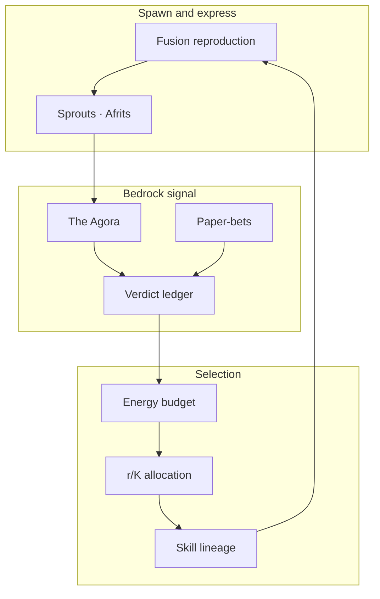
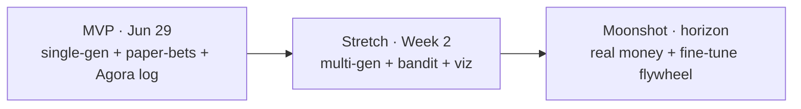

# Doppl — Product Requirements Document

**Version:** 0.1 (early proposal)  
**Date:** 2026-06-17  
**Companion docs:** [`PROPOSAL.md`](./PROPOSAL.md) · [`ARCHITECTURE.md`](./ARCHITECTURE.md)  
**Showcase deadline:** Mon · Jun 29 · 10-minute live presentation  
**Build window:** ~2 weeks (post team formation)

---

## 1. Executive Summary

### Problem Statement

Every agent system shipped today freezes its scaffold — prompts, tools, verification — the moment a human stops typing. "Having a genuinely good idea" has no cheap ground-truth signal, so systems optimize for critic-pleasing fluency instead of verifiable novelty.

### Proposed Solution

**Doppl** is an **idearganism**: a population of agent genomes (agenomes) under selection pressure, with a manufactured fitness function built from adversarial critics, async human judgment (the **Agora**), and cheap real-world bedrock (**pre-registered paper-bets** scored on calibration). The scaffold evolves; bedrock does not.

### Success Criteria (measurable)

| KPI | Target (MVP by Jun 29) | How measured |
|-----|------------------------|--------------|
| **Generational improvement** | Generation N+1 beats N on held-out idea-quality rubric | Side-by-side critic scores + blind-spot coverage on fixed prompt suite |
| **Calibration bedrock** | Pre-registered prediction ledger live; mean Brier score computed over full book | `predictions.jsonl` — all calls scored, losers included |
| **Closed loop demonstrable** | End-to-end: spawn → sprouts/afrits → verdict → energy adjustment | Trace + ledger entries keyed to same `spawncidence_id` |
| **Parallel spawners** | Both `agenotype` and `crucible` produce comparable traces on same prompts | Shared harness run; HTML traces in Agarden hub |
| **Live demo** | 10-minute presentation: seed prompt → visible evolution → best afrit surfaced | Room checklist pass (see §5) |

---

## 2. User Experience & Functionality

### User Personas

| Persona | Who | Primary need |
|---------|-----|--------------|
| **Agardener (Lαlphα)** | Human team member | Async channel to judge sprouts/afrits; gate real-world actions; assign ownership |
| **Agentic peer (Lαlphα)** | Cursor/Claude agent on the team | Run spikes, surface ideas, log verdicts, participate in Rite of Spawncidence |
| **Kernel engineer** | Team owner — runtime surface | Generational loop, Fusion, metabolism, spawn/cull |
| **Verifier engineer** | Team owner — bedrock surface | Critic council, paper-bet ledger, calibration scorer |
| **Demo engineer** | Team owner — observability | Traces, hub, live viz for Jun 29 |
| **Showcase audience** | Gauntlet reviewers | Understand what was attempted; see generational improvement live |

### User Stories

#### US-1: Run a generational Fusion loop

**As a** kernel engineer,  
**I want** to run a single-generation Fusion loop on a fixed prompt set,  
**so that** I can show generation N+1 measurably beats generation N.

**Acceptance criteria:**

- [ ] `./demo` in `spikes/agenotype` completes with Gen 1 critic fail → breed child → Gen 2 run.
- [ ] `fusion_trace.html` renders parent genomes, breeding mandate, child genome, and critic scores.
- [ ] Same prompt suite runnable on `spikes/crucible` for comparison.
- [ ] Generation N+1 critic score ≥ Generation N on ≥1 held-out prompt in the suite (document which).

---

#### US-2: Surface ideas to the Agora

**As an** Agardener,  
**I want** sprouts and afrits posted to the team channel with provenance and trace links,  
**so that** I can judge ideas without blocking the organism.

**Acceptance criteria:**

- [ ] Posts conform to [`bedrock/signal/README.md`](./bedrock/signal/README.md) post schema (`kind`: `sprout` | `afrit`).
- [ ] Each post includes `spawncidence_id`, `source_agenome`, `trace_link`, `internal_score`.
- [ ] Organism continues running while awaiting human reactions (non-blocking).
- [ ] Reactions append to `bedrock/signal/verdicts.jsonl` with `reactor`, `dimension`, optional `because`.

---

#### US-3: Pre-register and score predictions

**As a** verifier engineer,  
**I want** timestamped predictions with confidence logged before resolution,  
**so that** reality adjudicates fitness without $0 blast radius.

**Acceptance criteria:**

- [ ] Append-only `predictions.jsonl` (or equivalent) — every call logged **before** resolution.
- [ ] Each entry: `prediction_id`, `market_or_target`, `predicted_probability`, `ts_registered`, `ts_resolves`, `source_spawncidence`.
- [ ] On resolution: `outcome` and `brier_score` filled for **all** entries (no silent drops).
- [ ] Calibration report: bucketed confidence vs empirical frequency (e.g. 70% bin).

---

#### US-4: Navigate experiment traces

**As a** demo engineer / audience member,  
**I want** a single findable hub listing live HTML traces across spikes,  
**so that** I can witness runs without hunting files.

**Acceptance criteria:**

- [ ] `build_index.py` regenerates root `index.html` scanning `spikes/*/`.
- [ ] Each trace links back to hub; hub shows prompt, judge score, Fusant roster where available.
- [ ] Crucible `--html` auto-refreshes hub on run.

---

#### US-5: Witness the Jun 29 demo

**As a** showcase audience member,  
**I want** to see a live seed prompt evolve through selection and surface a best afrit,  
**so that** I believe the organism improves across generations.

**Acceptance criteria:**

- [ ] Live or pre-recorded run completes in ≤10 minutes.
- [ ] Population tree or generation timeline visible on screen.
- [ ] Fitness-over-time or calibration scoreboard shown.
- [ ] Best afrit replayed with critic gauntlet it survived.
- [ ] One-sentence payoff delivered: *we built the thing that evolved the idea.*

---

### Non-Goals (explicit out of scope for MVP)

- Multi-generational open-ended population (stretch, not MVP).
- Learned bandit spawn allocator (stretch).
- Real-money prediction-market bets (moonshot).
- Self-evolving verifier / in-house fine-tuning flywheel (moonshot).
- Software factory deploying landing pages, scrapers, or bots at scale (tool — horizon only).
- Minting or playing in self-created prediction markets (ethics constraint — never).
- Alzheimer's-grade long-horizon research insight machine (dream target — not on-ramp).
- Resolving agenotype vs crucible fork in design — **the fork is the prey**; both run in parallel.

---

## 3. AI System Requirements

### Tool & API Requirements

| Component | Requirement | Status |
|-----------|-------------|--------|
| **LLM inference** | OpenRouter-compatible API (`OPENROUTER_API_KEY`); cross-lab roster (DeepSeek, NVIDIA, Alibaba, Xiaomi held-out judge) | Built in crucible |
| **Local routing** | Optional `--local` OpenAI-compatible endpoint (`LOCAL_BASE_URL`, `LOCAL_MODEL`) | Built in crucible |
| **Agenome storage** | JSON-serializable `Agenome` dataclass | Built — `spikes/agenotype/agenome.py` |
| **Trace emission** | HTML + JSON extended aphenotype per run | Built |
| **Agora transport** | Slack or Discord webhook (TBD by team) | To-build |
| **Prediction ledger** | Append-only JSONL on disk | To-build |
| **Calibration scorer** | Brier score + bucketed calibration report | To-build |
| **Energy ledger** | Per-lineage budget read/write from verdict payouts | To-build |

### Evaluation Strategy

#### Internal (critic council)

- Adversarial panel with distinct Fusant mandates and disagreeableness dial (`0..1`).
- Held-out judge from a lab **not** in the debater pool (e.g. Xiaomi MiMo-V2.5-Pro).
- Judge emits `consensus_quality: resolved|herded|mixed`; score capped at 6 when herded.
- Compare agenotype vs crucible on **same prompt suite**.

#### Human (Agora)

- Reactions map to dimensions: `novel`, `feasible`, `derivative`, `not-it` — not one approval blob.
- Attributed reactors with disagreeableness weighting.
- Separate ledgers for `sprout` (process/generativity) vs `afrit` (outcome).

#### Reality (paper-bets)

- **Primary eval:** calibration (confidence accuracy), not raw hit rate.
- **Secondary:** Brier score over full pre-registered book.
- **Guard:** prediction cherry-picking fails if ledger count ≠ calls made.
- Target selection: **hard to find, easy to verify** domains first.

#### Amemetics (immune memory)

- Every discovered reward hack → entry in [`BUGS_AND_MITIGATIONS.md`](./BUGS_AND_MITIGATIONS.md) with repro trigger + bedrock assertion.
- Promoted artifacts must correlate with bedrock improvement or witness-approved epistemic gain.

---

## 4. Technical Specifications

### Architecture Overview

See [`ARCHITECTURE.md`](./ARCHITECTURE.md) for full diagrams. Core data flow:

### Core Components

| Component | Location | Responsibility |
|-----------|----------|----------------|
| **Agenome schema** | `spikes/agenotype/agenome.py` | Heritable JSON recipe |
| **Fusion demo** | `spikes/agenotype/fusion_demo.py` | Gen-0 reproduction loop |
| **Crucible** | `spikes/crucible/crucible.py` | Belief-revision sibling spawner |
| **Bedrock signal** | `bedrock/signal/` | Post + verdict JSONL schemas |
| **Skill lineage** | `skills/LINEAGE.md` | Pedigree studbook |
| **Registers** | `MEMORY.md`, `BUGS_…`, `LESSONS_…` | Lα witness / immune memory |
| **Agarden hub** | `build_index.py` → `index.html` | Trace navigation |

### Integration Points

| Integration | Protocol | Notes |
|-------------|----------|-------|
| OpenRouter | HTTPS REST | Primary LLM backend |
| Ollama / local | OpenAI-compatible `/v1/chat/completions` | `--local` flag |
| Agora (Slack/Discord) | Webhook out + reaction listener in | Async; non-blocking |
| Prediction markets | Read-only price feed + manual/paper ledger | No auto-trading in MVP |
| Git / Render | Static deploy of `index.html` hub | `render.yaml` |

### Data Schemas (reference)

- **Agenome:** see [`ARCHITECTURE.md` §3](./ARCHITECTURE.md)
- **Post / Verdict:** see [`bedrock/signal/README.md`](./bedrock/signal/README.md)
- **Run card:** `objective`, `bedrock_metric`, `energy_cap_tokens`, `money_cap_usd`, `blast_radius`, `kill_condition`
- **Prediction entry:** `prediction_id`, `predicted_probability`, `ts_registered`, `ts_resolves`, `brier_score`

### Security & Privacy

| Concern | Requirement |
|---------|-------------|
| **Blast radius** | `dry-run` → `sandboxed` → `real-with-gate`; Agora approval before real-world side effects |
| **Paper-first** | $0 financial exposure until calibration proves out |
| **Market ethics** | Organism must never adjudicate or bet in markets it creates |
| **API keys** | `.env` gitignored; `.env.example` committed per spike |
| **Pre-registration** | Append-only ledgers; no post-hoc selection of winning predictions |
| **Demote-don't-delete** | Single bad outcomes lower budget; autopsy + seed bank before permanent death |

---

## 5. Risks & Roadmap

### Phased Rollout

#### Phase 1 — MVP (Week 1, must ship)

- Single-generation Fusion loop end-to-end.
- Critic council + held-out judge.
- Pre-registered prediction ledger + basic calibration scorer.
- Manual Agora posts + verdict logging.
- Trace HTML + Agarden hub.
- Jun 29 demo script rehearsed.

#### Phase 2 — Stretch (Week 2)

- Multi-generational population loop.
- Energy budget wired to verdict ledger.
- Bandit allocator prototype.
- Novelty / diversity scoring.
- Live population-tree + fitness-over-time visualization.

#### Phase 3 — Moonshot (post-showcase / horizon)

- Small real-money bets with Kelly-style sizing caps.
- Self-evolving verifier.
- In-house fine-tuning on winning lineages.
- Software factory experiments (tool, not primitive).

### Technical Risks

| Risk | Likelihood | Impact | Mitigation |
|------|------------|--------|------------|
| Fitness without ground truth | High | Critical | Paper-bet bedrock + Agora + held-out judges |
| Mode collapse / herding | High | High | Disagreeableness dial; consensus_quality cap |
| Cost blowout | Medium | High | Hard energy caps; metabolism as feature |
| Blast radius / ethics | Low (MVP) | Critical | Paper-first; Agora gate; never play own markets |
| Over-aggressive culling | Medium | Medium | Demote-don't-delete; seed bank; autopsy |
| Two-week scope creep | High | High | Non-goals list; MVP cut is single-generation |
| Agora goes dark (spam) | Medium | Medium | Posting budget; novelty gate |

---

## 6. Team Surfaces & Ownership

| Surface | MVP deliverables | Owner |
|---------|------------------|-------|
| **Kernel / runtime** | Single-gen loop, Fusion, metabolism caps | `[ ]` |
| **Selection / ML** | Manual r/K tagging; bandit prototype (stretch) | `[ ]` |
| **Verifier council** | Critics, paper-bet ledger, calibration scorer | `[ ]` |
| **Demo / observability** | Traces, hub, Agora integration, Jun 29 harness | `[ ]` |

**Week 1:** kernel + paper-bet ledger end-to-end.  
**Week 2:** economy, allocation, visualization.

---

## 7. Demo Script (Jun 29)

| Step | Action | Success signal |
|------|--------|----------------|
| 1 | Seed live prompt or prediction target | Audience sees input |
| 2 | Run population — watch tree / generations | Weak lineages dim; fusion visible |
| 3 | Show fitness + calibration climbing | Chart or scoreboard updates |
| 4 | Surface best afrit + replay gauntlet | Critic trace + calibration score shown |

**Payoff line:** *We didn't build the idea — we built the thing that evolved it.*

---

## 8. Related Documents

| Document | Purpose |
|----------|---------|
| [`PROPOSAL.md`](./PROPOSAL.md) | Capstone Deliverable 01 — problem, approach, scope |
| [`ARCHITECTURE.md`](./ARCHITECTURE.md) | Technical form — diagrams, schemas, build plan |
| [`TREATISE.md`](./TREATISE.md) | Living philosophy and meta-narrative |
| [`GLOSSARY.md`](./GLOSSARY.md) | Lexicon (Agenome, Agora, Afrit, Homology, …) |
| [`MEMORY.md`](./MEMORY.md) | Design forks |
| [`BUGS_AND_MITIGATIONS.md`](./BUGS_AND_MITIGATIONS.md) | Reward-hack immune register |
