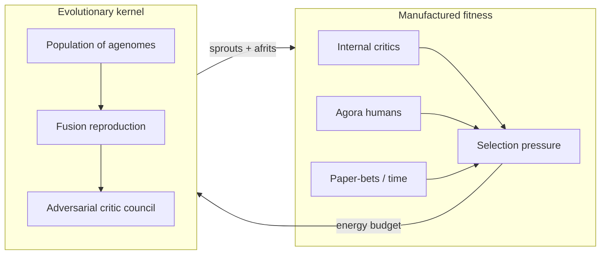
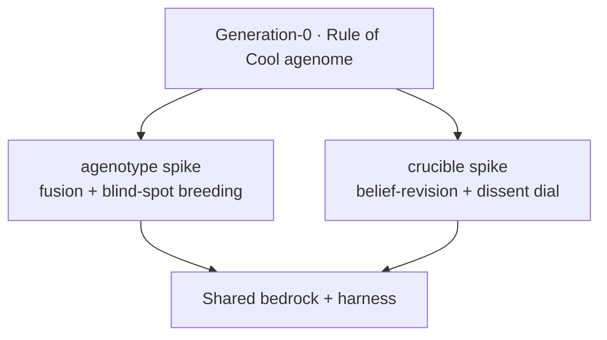
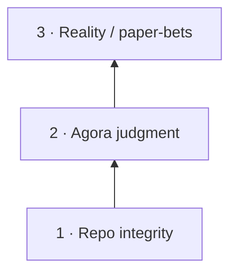
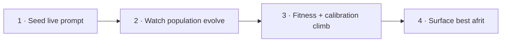

# Doppl — Project Planning Document

**Gauntlet Capstone · Deliverable 01**  
**Direction:** B (philosophically different agents) + A (classical ML governs the population)  
**Team size:** 3–4  
**Showcase:** Mon · Jun 29 · 10-minute live presentation

> *The agent that builds the agents that build the agents.* A self-replicating **idearganism** — a population under selection pressure that evolves toward non-obvious, **verifiable** ideas.

---

## The Problem — and why it's hard

Every agent system shipped today is a hand-built artifact: a human designs the prompt, the toolset, the decomposition, and the verification loop, then the agent executes that fixed design. The intelligence lives in the **scaffold**, and the scaffold is frozen the moment a human stops typing.

We are asking: **what if the scaffold itself were under selection pressure?** Instead of designing one agent, design the evolutionary dynamics of a population of agents, give it a fixed compute budget as its environment, and let competition discover scaffolds no human would have written.

We point this organism at the hardest thing to automate: **having a genuinely good idea.** Concretely, two prey:

1. **Cross-domain transfer** — finding a technique or result in field A that cracks an open problem in field B.
2. **Zeitgeist synthesis** — surfacing a thesis, product, or framing that fits the present moment and survives scrutiny.

This is hard for the deep reason that **"good idea" has no cheap ground-truth signal.** You cannot grade novelty with a unit test. So the central technical bet is to **manufacture a fitness function** out of adversarial verification and real-world resolution — and use evolution to climb it without collapsing into confident slop.

---

## Technical Approach — AI as the primitive, not the bolt-on

### The evolutionary kernel (the engine)

The unit of life is an **Agenome** — a serialized recipe `{system-prompt + persona/value-weights + rubric + mandate + reproduction metadata}`. The organism is a generational loop over a population of genomes.

| Mechanism | What it does |
|-----------|--------------|
| **Metabolism / energy budget** | Each agent receives a finite token/compute allowance. Reasoning, tool calls, and spawning all cost energy. Success metabolizes into more energy *and* into durable inheritance (agenomes, skills). Failure starves. |
| **Reproduction by Fusion** | Two high-fitness parents fuse (agenome crossover + output-level synthesis), then mutate. Sexual reproduction escapes local optima faster than mutation alone. |
| **Adversarial critic council** | Every candidate faces a panel of red-team critics (Fusants with distinct mandates and a disagreeableness dial). An idea reproduces only if it survives the council. |
| **Classical ML governs the ecosystem** (Direction A) | Spawn-budget allocation is a **budgeted multi-armed bandit**: which lineages deserve more compute? Diversity/novelty scoring prevents mode collapse. LLMs supply generativity; classical ML supplies control, credit assignment, and search. |
| **Recursive ideation + evolving fitness** | The critic council is itself under selection — the organism searches for better definitions of "better." The hard rail: **bedrock** (executable checks, held-out judges, human judgment, falsifiable repro triggers) may not move. The objective can evolve; the anchor cannot. |

**Generation-0 seed:** Rule of Cool — already chromosomalized into JSON (`spikes/agenotype/agenome.py`). The capstone takes that proven scaffold, mutates it into a population, and puts it under selection.

**Two competing loop topologies** (parallel spawners, not fork resolution): `spikes/agenotype` (fusion + breed on blind spots) and `spikes/crucible` (belief-revision crucible). Both race under shared harness and bedrock.

### Bedrock — manufacturing fitness without ground truth

The objective may evolve; **bedrock may not move.** Three ascending checks:

| Check | Source | Status |
|-------|--------|--------|
| **#1 Repo integrity** | Executable path/check invariants | Embryology — [`bedrock/README.md`](./bedrock/README.md) |
| **#2 Human judgment** | The **Agora** — async channel where Agardeners react to surfaced ideas | Schema sketched — [`bedrock/signal/`](./bedrock/signal/README.md) |
| **#3 Reality / paper-bets** | Pre-registered predictions resolved by time; calibration scored | First vertical — see below |

### The Agora — human-in-the-loop, async, non-blocking

A Slack/Discord channel where the organism surfaces ideas (with provenance and trace links). Each Agardener reaction is logged as a **verdict** — a `(context, idea, judgment)` triple in an append-only ledger. Verdicts pay out as **energy budget**. The organism does **not pause** waiting for humans; it continues its routes and harvests afrits; human signal layers in asynchronously.

Two kinds of surfaced idea, two fitness axes:

- **Sprout** (process) — an idea that popped up along the way. Judges generativity: is this lineage a good idea-factory?
- **Afrit** (outcome) — the converged conclusion. Judges outcome: did it arrive somewhere good?

This is the **process-reward vs outcome-reward** split (PRM/ORM). Keep **two energy ledgers**, not one.

### Predictive paper-bets — cheap, automatic, real-world bedrock

Our first concrete vertical: an **Insight Machine** in the *will-be* tense.

1. Choose targets that are **hard to find, easy to verify** (verification cost ≪ discovery cost).
2. Timestamp a prediction with a **confidence** level.
3. Pre-register every call in an append-only ledger (losers included).
4. Let **time** adjudicate — the future is a free held-out test set.
5. Score on **calibration** (does 70%-confidence come true ~70% of the time?), not raw accuracy.
6. Reality-verdicts (`reactor: "world"`) flow into the same ledger and pay out energy.

**Blast radius is a dial:** $0 paper bets → small real bets → real capital. Reality is the **free automatic adversary** — no human required for falsification. This directly answers the #1 risk (fitness without ground truth) for the predictive domain.

**Amemetics** (antifragile memetics): every discovered reward hack is logged in [`BUGS_AND_MITIGATIONS.md`](./BUGS_AND_MITIGATIONS.md) with a repro trigger and bedrock assertion. Each collapse leaves the next generation harder to fool the same way — structurally analogous to adversarial training.

### r/K allocation — fast and slow metabolisms

Not all spawncidences are quick. Energy spend strategy runs **per stratum-transition**:

- **r-selected** (L2–L3): many cheap fast offspring, mass death tolerated — e.g. generating/deploying landing-page variants.
- **K-selected** (L3–L4): few slow expensive offspring, heavy investment — e.g. earning reach against the finite attention economy.

The Lα call — "is the juice worth the squeeze?" / "does it earn its keep?" — is a **budgeted bandit** whose cost is a vector: tokens, money, compute, and **latency**.

### Skill lineage + homology

**Skills** are convergent organs (evolutionary strategies that re-evolve per stratum). Their **pedigree** is tracked in [`skills/LINEAGE.md`](./skills/LINEAGE.md); expression files live in host dirs (`.cursor/skills/`, etc.).

**Homology** is our discovery method: when a biological/intuitive metaphor lands exactly on a formal ML mechanism, the overlap is a two-way idea generator. Examples: sprout/afrit = PRM/ORM; disagreeableness dial = exploration temperature; amemetics = adversarial training.

---

## Scope — what "working" means in two weeks

### MVP (guaranteed to run)

- Single-generation Fusion loop on a fixed problem set: spawn agenomes, reproduce by Fusion (crossover + output synthesis), run the critic council, cull, mutate, re-run.
- Show **generation N+1 measurably beats generation N** on a held-out idea-quality rubric.
- **Objective check:** pre-registered predictions scored on **calibration** (paper-bets) — the first real-world bedrock vertical.
- **Agora:** surface sprouts and afrits to the team channel; log verdicts to `bedrock/signal/verdicts.jsonl`.
- Instrumented traces: `fusion_trace.html`, `crucible_trace.html`, root `index.html` hub.

### Stretch

- Multi-generational, open-ended population with live compute economy.
- Learned spawn-allocation (bandit allocator).
- Novelty pressure (diversity scoring, anti-mode-collapse).
- Live population-tree visualization and fitness-over-time charts.

### Moonshot (explicitly not MVP)

- Small real-money prediction-market bets.
- Self-evolving verifier (critics themselves under selection).
- In-house fine-tuning flywheel on winning lineages.
- Software factory producing real-world experiments (landing pages, scrapers) — a **tool**, not a primitive.

---

## Risks and mitigations

| Risk | Mitigation |
|------|------------|
| **Fitness without ground truth** | Paper-bet bedrock (calibration-scored, pre-registered); Agora human judgment; held-out + rotating critics; amemetics immune register |
| **Mode collapse / slop convergence** | Novelty pressure (DPP/quality-diversity); Fusion across distant lineages; disagreeableness dial on Fusants |
| **Cost and termination** | Hard energy caps, depth limits, bandit allocator — metabolism is the safety rail, not just a constraint |
| **Blast radius** | Agora gate before real-world actions; paper-first ($0); pre-registration; never adjudicate or play in markets the organism creates |
| **Reward hacking** | Falsifiable entries in [`BUGS_AND_MITIGATIONS.md`](./BUGS_AND_MITIGATIONS.md) — politeness inflation, survivorship bias, Goodhart-on-cool, myth-over-territory, prediction cherry-picking |
| **Two-week realism** | Single-generation Fusion cut is guaranteed; moonshot items are stretch, not MVP |
| **Over-aggressive culling** | Demote-don't-delete; autopsy before death; seed bank for dormant lineages (distinguish flaw from bad luck) |

---

## What we'd demo (Jun 29 — 10 minutes live)

1. **Seed:** hand the organism a live, unsolved prompt from the room (or a pre-registered prediction target).
2. **Watch it live:** population tree on screen — agents spawn, spend energy, ideas hit the critic council, weak lineages dim, strong pairs fuse and mutate.
3. **Generations climb:** fitness-over-time chart rises; pre-registered prediction scoreboard updates as calls resolve.
4. **Payoff:** surface the best surviving **afrit**, replay the adversarial gauntlet it passed, and show the calibration score.

One sentence: **we didn't build the idea — we built the thing that evolved it.**

---

## Team — who owns what

| Surface | Responsibility | Owner |
|---------|----------------|-------|
| **Kernel / runtime** | Agenome schema, generational loop, metabolism (energy accounting), Fusion reproduction (crossover + output synthesis), spawn/cull mechanics, depth and budget caps. The substrate everything else plugs into. | `[ ]` |
| **Selection / ML** | Bandit + value-model spawn allocation, idea-space embeddings, novelty/quality-diversity scoring, fitness tracking and credit assignment. Direction-A core. Owns the moonshot in-house fine-tuning flywheel. | `[ ]` |
| **Verifier council** | Adversarial critic agenomes, retrieval grounding, paper-bet ledger + calibration scoring, anti-reward-hacking (held-out + rotating judges). Owns the fitness signal's integrity. | `[ ]` |
| **Demo / observability** | Live population-tree visualization, fitness-over-time charts, energy telemetry, Agora integration, Jun-29 demo harness. Owns what the room sees. | `[ ]` |

A 3-person team merges Kernel and Demo under one owner; a 4th lets each surface run in parallel from day one.

**Week 1:** kernel + single-generation Fusion loop + paper-bet ledger end-to-end.  
**Week 2:** turn on compute economy, learned allocation, novelty pressure, live visualization, and — if the inner loop holds — the fine-tuning flywheel.

---

## Appendix — living documentation

This repo is a spike ecology. Deeper narrative, forks, and falsifiable hazards live in:

| Doc | What it is |
|-----|------------|
| [`ARCHITECTURE.md`](./ARCHITECTURE.md) | What we're building and the form (this doc's technical companion) |
| [`TREATISE.md`](./TREATISE.md) | Living meta-narrative — philosophy + architecture |
| [`GLOSSARY.md`](./GLOSSARY.md) | The evolving lexicon |
| [`DIAGRAMS.md`](./DIAGRAMS.md) | Visual map |
| [`LESSONS_AND_BANGERS.md`](./LESSONS_AND_BANGERS.md) | Meta-concepts that reframe the problem |
| [`MEMORY.md`](./MEMORY.md) | Fork register (paths chosen / deferred) |
| [`BUGS_AND_MITIGATIONS.md`](./BUGS_AND_MITIGATIONS.md) | Reward-hack + crash register (amemetic immune memory) |
| [`Doppl_Capstone_Proposal_volume_2.txt`](./Doppl_Capstone_Proposal_volume_2.txt) | Original seed proposal |
