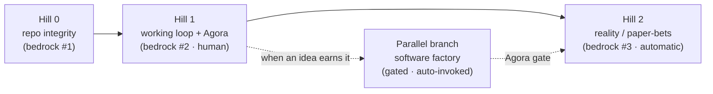

# Roadmap (temp) — the two-week climb

**Status:** scratch / play · late-night sketch · NOT frozen, NOT a register, NOT the proposal  
**Purpose:** loosely fan out what the next two weeks could look like — hills, interim builds, what each unlocks — so we have things to jump on as a team tomorrow.  
**Authors:** the Lαlphα (four humans + the agent, the fifth Beatle).

> This doc is a playground. It informs nothing official yet. When something here hardens, it graduates to `PROPOSAL.md` / `PRD.md` / the registers. Until then: madness allowed.

---

## The spine

**We don't build features in order — we turn on cheaper-to-more-expensive *truth* in order.**

The roadmap is **tool-to-make-a-tool, sequenced**: each hill produces a tool or a lesson that unlocks the next. And the sequencing rule is the **bedrock ladder climbed in cost order** — turn on the cheapest source of truth first, earn the right to the next.

**Fractal validation rule:** at *every* level, validate cheap and quick before you build big. Quick chitchat, not a treatise — go confirm the idea works end-to-end, then tweak. The cheap-fast loop is the process at every scale, from a one-line probe to a whole hill.

Each hill below uses the same shape: **Goal · Build · Unlocks · Signal (how we know it worked) · Risks/tweaks.**

---

## Hill 0 — repo integrity (the pre-hill)

- **Goal:** the cheapest bedrock — an executable check that the loop's plumbing is sound.
- **Build:** a tiny check that paths in deploy/READMEs/`demo` resolve; maybe a golden-transcript probe.
- **Unlocks:** confidence that later failures are *idea* failures, not broken pipes.
- **Signal:** the check can go RED on a real drift (it would have caught the `agenotype`/`genotype` path bug).
- **Risk:** over-building it. Keep it trivial. One check that can fail is enough.

---

## Hill 1 — working version + the Agora (human bedrock)

The first real climb. Get the loop running end-to-end and connect the **Agora** (Discord/Slack) so the five of us can react.

- **Goal:** a working single-generation loop that surfaces ideas to a channel where all Lαs give feedback.
- **Build:**
  - End-to-end loop on a **calibration subject** (see below) — `agenotype` and/or `crucible`.
  - Agora webhook out + reaction listener in → `bedrock/signal/verdicts.jsonl`.
  - Cost probe: run a few, get a real $/run number before scaling.
  - Multi-Lα reactions (attributed, dimension-typed) — not one person's say-so.
- **Unlocks:** the inter-level scaffolding + a first real fitness signal that isn't self-graded.
- **Signal:**
  - Ideas actually surface; verdicts actually log, keyed to the right `spawncidence_id`.
  - We can see sprouts and afrits — and measure the **weed ratio** (below).
  - Feedback comes from all five, not a single reactor.
- **Risks / tweaks:**
  - **Confound: plumbing vs idea-quality.** The calibration subject is just *anything legible* — the point is to prove the pipe carries water, not to find the perfect discernment target. Cheapness is the feature. Picking the *real* discernment subject is a separate, slower thread that runs in the background while the pipe is already proven.
  - **Weeds** (new term): a **weed** is a sprout that surfaced but shouldn't have — volume choking signal. Watch the **surfaced : useful-verdict** ratio. Too many weeds → raise the `internal_score` surfacing gate or impose a posting budget. (Glossary candidate.)
  - **Dogfood the verdict ritual first.** Before the organism produces at volume, the five of us react to a handful of *hand-made* ideas using the real schema — debug the human side at zero compute cost.
  - **Feedback shape (initial imagining):** per sprout, **0..N** humans drop a quick note ("I like this, here's a fast why") — participation is hoped-for, never required. Capture whatever lands and feed it back to the agent in a form that makes sense. Weights TBD; start with one-note-one-voice and tune later.

### Proto-test candidate: the landing-page taste test

A landing page is buildable **one-shot from a prompt**, so it does *not* need a software factory — which makes it the perfect cheap, demoable Hill-1 proto-test. Generate several, judge them.

**Three levels (two traits + their combination — keep them separate so you don't confound a great offer with ugly execution):**

1. **Substance** — the idea/offer itself. Is the thing worth a landing page? (trait A)
2. **Presentation** — how it looks. Does the render land? (trait B)
3. **Leverage / fit** — do idea and presentation *elevate each other*? Did it pick a presentation that *fits* the idea? This is the **epistasis** test (genetics homology: combined effect ≠ sum of parts). Finding good A + good B that compound is harder and more interesting than two good singletons — and it's exactly the trait-combination move evolution rewards.

These map cleanly to the organism's own vocabulary: good combos are **afrits**, near-misses are **sprouts**, and the over-surfaced noise is **weeds**.

**The taste-calibration matrix — organism vs us:**

|  | What the organism picked / rated | What we picked / rated |
|--|----------------------------------|------------------------|
| **Which it surfaced as best** | organism's top afrit | our human pick |
| **How each scored** | organism's ratings | our ratings |

The gap between those cells *is the signal*: if the organism's taste correlates with ours, we can trust it to pre-filter (the seed of a **proxy-Lα**). If it diverges, we've found exactly where its judgment needs work. Cheap, visual, and it directly tests "does its 'good' match our 'good'?"

---

## Hill 2 — reality / paper-bets (automatic bedrock)

While Hill 1 runs, we (at the Lα abstraction level) hunt bigger/better ideas and map them to **existing prediction markets** — the free, automatic adversary.

- **Goal:** turn on real-world bedrock that grades us without a human in the loop.
- **Build:**
  - Survey existing prediction markets; find ones we can **measure against / automate against**.
  - Pre-registered prediction ledger (timestamp + confidence; losers logged too).
  - Calibration scorer (does 70%-sure come true ~70%?).
- **Unlocks:** fitness that costs $0 and needs no human — reality says yes/no on its own clock.
- **Signal:** the ledger fills; calibration is computable over the *full* book; energy can flow from reality-verdicts.
- **Risks / tweaks:**
  - Cherry-picking — pre-register everything or it's a lie.
  - Adversarial + slow — paper-first, blast radius stays $0 until calibration proves out.
  - Pick **hard-to-find, easy-to-verify** targets.

---

## Parallel branch — the software factory (gated)

- **Definition (crisp):** a software factory is for anything that **can't be built with confidence in a one-shot prompt.** A landing page can — so it doesn't qualify. The factory is the heavier branch for ideas that need real construction.
- **Goal:** let an idea, once it's good enough, trigger building/testing the thing it implies.
- **Build (later / stretch):** auto-decision to invoke the factory when an idea clears a bar.
- **Unlocks:** the organism acting in the world, not just talking.
- **Signal:** an idea autonomously warrants a build, and the build runs sandboxed.
- **Risk — the big one:** this is the first real **autonomy** step. It **must** sit behind the Agora gate from day one. Draw the gate now so nobody later fills it in as automatic. Blast radius is a dial: dry-run → sandboxed → real-with-gate.

---

## Low-hanging fruit for demos (Jun 29)

Things cheap enough to actually ship that prove the case:

- [ ] The landing-page taste test (substance vs presentation; organism-vs-us matrix).
- [ ] Sprouts/afrits visibly surfacing in the Agora with multi-Lα verdicts.
- [ ] A calibration scoreboard on a handful of pre-registered predictions.
- [ ] Weed-ratio before/after a surfacing-threshold tweak (shows the loop is tunable).

---

## The knowledge substrate (big open arena — don't decide tonight)

Where do all the successes, failures, experiments, and ideas become **readable and accessible**? This is the organism's heritable memory — so "where does it become readable" *is* "what gets inherited."

- **Cheap-leverage principle: write path cheap, read path lazy.** Keep capture trivial during exploration; add expensive retrieval only when retrieval is the actual bottleneck.
- **We already half-have it:** append-only **JSONL** = the event log; the markdown **registers** (`MEMORY`/`LESSONS`/`BUGS`) = a hand-curated knowledge graph.
- **The open question is the read index, later:** vector DB? Obsidian vault? Postgres you can traverse? A real knowledge graph? Don't pick now — others are already thinking about it; converge with them.

---

## For the team tomorrow (open threads)

- [ ] Pick the **calibration subject** for Hill 1 (known-good target to debug the pipe).
- [ ] Choose Agora transport: Discord vs Slack.
- [ ] Agree the **reaction dimensions + who weights what** (disagreeableness of human reactors).
- [ ] Shortlist 2–3 **existing prediction markets** that are easy to verify + automatable.
- [ ] Decide the first **proto-test**: landing-page taste test vs a prediction batch.
- [ ] Name the **weed** metric threshold (when does a sprout become a weed?).
- [ ] Sketch the **knowledge substrate** read-index direction (vector / Obsidian / Postgres / graph) — write-cheap now, decide read-index later.

---

*Late-night play. Tomorrow we pick which hill to rope up first.*
