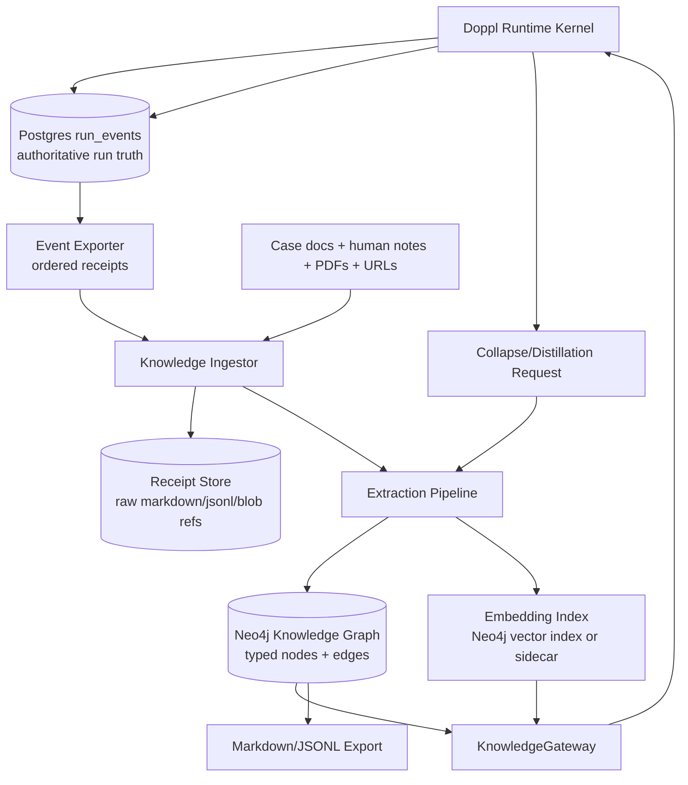

# Plan: Doppl Knowledge Space

## Architecture Summary

The Knowledge Space is a production subsystem with three layers:

1. **Durable receipts:** immutable raw inputs and event-derived receipts.
2. **Knowledge graph:** typed nodes and edges for claims, sources, findings,
   lineages, heuristics, failures, skills, and case insights.
3. **Retrieval and distillation gateway:** ports used by the Doppl runtime before
   and after runs.

Neo4j is the preferred graph engine for the first production-quality local build
because Doppl's memory is relationship-heavy: source -> claim -> case -> run ->
agenome -> candidate -> critic -> outcome. Vector search alone is too opaque for
this. Neo4j's vector indexes also let us combine graph traversal with semantic
search, so the same store can answer "what is similar?" and "why is this
connected?"

The existing Doppl rule still holds: Postgres `run_events` is authoritative for
run truth. The Knowledge Space is authoritative for cross-run memory objects it
owns, but not for historical run decisions.

## System Boundary



## Integration Into A Real Doppl Run

### Pre-Run: Knowledge Packet Selection

1. Operator configures a run.
2. Runtime calls `KnowledgeGateway.selectPacket(runConfig)`.
3. Gateway resolves:
   - matching case/subtype memory,
   - prior high-fitness lineages,
   - source receipts,
   - negative findings,
   - stale warnings,
   - skills/heuristics relevant to the run,
   - withheld-boundary exclusions.
4. Gateway returns a `KnowledgePacket`.
5. Runtime persists the packet in `run_events` before any agenome sees it.
6. Agenomes receive scoped slices of the packet.

New event types to add when promoted:

```ts
type KnowledgeEventType =
  | "knowledge.packet_requested"
  | "knowledge.packet_selected"
  | "knowledge.item_injected"
  | "knowledge.item_excluded"
  | "knowledge.influence_recorded"
  | "knowledge.collapse_requested"
  | "knowledge.item_extracted"
  | "knowledge.promotion_proposed"
  | "knowledge.promotion_decided";
```

### During Run: Influence Tracking

Whenever a candidate cites or relies on memory, the runtime records:

- knowledge item ID,
- citation handle,
- candidate ID,
- role of influence (`fact`, `analogy`, `warning`, `source`, `heuristic`),
- whether the item was accepted, ignored, contradicted, or extended.

This matters for credit assignment. A source can earn trust even if an agenome
dies; an analogy can be deprecated if it repeatedly produces weak candidates.

### Post-Run: Collapse Into Memory

After generation or run completion:

1. Runtime emits `knowledge.collapse_requested`.
2. Distiller reads the run event stream and relevant raw artifacts.
3. It writes a `CollapsePacket` with proposed items and edges.
4. Low-risk raw receipts are inserted automatically.
5. Claims, heuristics, skill candidates, and canonical case insights enter a
   review/promotion queue.
6. Approved items become available for future retrieval.

## Data Model

### Node Labels

| Label | Meaning |
|---|---|
| `Receipt` | Immutable raw source: event payload, URL, document, note, transcript. |
| `Claim` | Atomic statement that may support future reasoning. |
| `Hypothesis` | Unproven but useful proposition. |
| `ResearchFinding` | Summarized finding from a source or run. |
| `Source` | Origin such as URL, file, connector, person, or dataset. |
| `Case` | Doppl case study or evaluation environment. |
| `Run` | Doppl run identity mirrored from event store. |
| `Generation` | Mirrored generation identity. |
| `Agenome` | Mirrored agenome identity plus trait snapshot references. |
| `Candidate` | Mirrored candidate identity and summary. |
| `CriticReview` | Review object linked to event/source. |
| `CheckResult` | Objective or skipped check result. |
| `HiddenVariable` | Non-obvious causal variable recovered by research. |
| `Heuristic` | Reusable problem-solving move. |
| `SkillCandidate` | Workflow that may become an executable skill. |
| `NegativeFinding` | Dead end, false analogy, bad source, reward hack, stale claim. |
| `KnowledgePacket` | Snapshot of memory selected for a run. |
| `CollapsePacket` | Post-run distillation proposal. |

### Required Properties

All knowledge-bearing nodes:

```ts
type KnowledgeNodeBase = {
  id: string;
  label: string;
  kind: string;
  text: string;
  trustTier: "raw" | "draft" | "candidate" | "validated" | "canonical" | "deprecated";
  provenanceRefs: string[];
  createdAt: string;
  updatedAt: string;
  schemaVersion: number;
  sourceVisibility: "public" | "internal" | "withheld_evaluator" | "secret_forbidden";
  validFrom?: string;
  validThrough?: string;
  refreshDueAt?: string;
  embeddingModelId?: string;
  extractionModelId?: string;
};
```

### Edge Types

| Edge | Meaning |
|---|---|
| `SUPPORTED_BY` | Claim/finding supported by receipt or check. |
| `CONTRADICTED_BY` | Claim/finding contradicted by receipt or review. |
| `DERIVED_FROM` | Extracted or summarized from another object. |
| `GENERALIZES` / `SPECIALIZES` | Abstraction hierarchy. |
| `ANALOGOUS_TO` | Cross-domain similarity. |
| `MENTIONS` | Weak mention/reference edge. |
| `USED_IN_RUN` | Knowledge packet or item used in a run. |
| `INFLUENCED_CANDIDATE` | Item affected a candidate artifact. |
| `FAILED_BECAUSE` | Candidate/hypothesis failed for this reason. |
| `WARNED_AGAINST` | Negative finding warns against an action/frame/source. |
| `PROMOTED_TO` | Trust tier transition or skill promotion. |
| `DEPRECATED_BY` | Superseded or invalidated by later evidence. |
| `REFRESH_DUE` | Timeliness maintenance edge. |

## Storage Choices

### Recommended Day-One Production Build

- **Postgres:** existing authoritative Doppl event store.
- **Neo4j Community or Aura local/dev:** graph memory and query engine.
- **Neo4j vector indexes:** semantic retrieval over node text and receipts.
- **File-backed exports:** Markdown/JSONL under a durable knowledge export path.
- **Optional pgvector sidecar:** only if the existing Doppl Postgres vector path
  is already operational; do not duplicate vector truth without a migration plan.

### Why Neo4j Fits

Neo4j is valuable here because the important query is often a path, not a nearest
neighbor:

- "Which source supported the hidden variable that influenced the winning child?"
- "Which negative finding warned against this analogy?"
- "Which agenome trait finds good sources but weak final answers?"
- "Which case insights should be withheld from candidate-producing agents?"

Pure vector search can retrieve similar text, but it cannot explain the lineage
of trust as naturally.

## Local Model Recommendation

Do not fine-tune first. Start with retrieval, extraction schemas, and supervised
review. Fine-tuning is useful only after the Knowledge Space has produced a clean
dataset of accepted/rejected extraction examples.

Recommended local stack:

1. **Embeddings:** `Qwen/Qwen3-Embedding-0.6B`
   - local-friendly,
   - 32k context,
   - up to 1024 dimensions,
   - instruction-aware retrieval.

2. **Reranking:** `Qwen/Qwen3-Reranker-0.6B`
   - use after graph/vector candidate retrieval to sort final packet items.

3. **Extraction / small local fine-tune target:** `Qwen/Qwen3-8B`
   - Apache 2.0 model card,
   - 8.2B parameters,
   - 32k native context,
   - suitable for LoRA/QLoRA on typed extraction and packet assembly.

4. **Fallback if hardware is tight:** use a smaller Qwen3 dense model for
   extraction and keep Qwen3-8B as cloud/local-batch quality target.

Fine-tune tasks should be narrow:

- source-to-claim extraction,
- relation typing,
- negative finding classification,
- trust-tier recommendation,
- Doppl retrieval packet formatting.

Do not fine-tune on:

- secrets,
- withheld evaluator content,
- raw unreviewed model traces,
- whole database dumps,
- or private connector payloads without explicit classification.

## Ingestion Pipeline

### Stage 1: Receipt Capture

Create immutable receipts from:

- run events,
- source documents,
- case-study markdown,
- URL fetches,
- pasted text,
- human notes,
- connector snapshots.

Each receipt gets:

- content hash,
- source URI or event ID,
- visibility tier,
- timestamp,
- parser version,
- raw text/blob reference.

### Stage 2: Extraction

Structured extraction produces candidate nodes and edges:

- claims,
- findings,
- hypotheses,
- hidden variables,
- source assessments,
- negative findings,
- skill candidates,
- heuristic candidates.

All extracted objects begin as `draft` unless policy says otherwise.

### Stage 3: Embedding

Embed:

- receipt chunks,
- claim text,
- finding summaries,
- heuristic descriptions,
- negative findings.

Persist:

- vector,
- embedding model ID,
- dimension,
- instruction used,
- source node ID.

### Stage 4: Linking

Use deterministic IDs and merge policies:

- same receipt hash -> same receipt;
- same event ID -> same mirrored run object;
- semantically similar claims are candidates for `POTENTIAL_DUPLICATE`, not
  automatic merge;
- model-suggested edges require confidence and provenance.

### Stage 5: Promotion

Promotion policies:

- `raw -> draft`: extraction complete.
- `draft -> candidate`: source-backed and schema-valid.
- `candidate -> validated`: repeated support, check result, or human review.
- `validated -> canonical`: stable, scoped, and explicitly accepted.
- any tier -> `deprecated`: contradicted, stale, unsafe, or superseded.

## Query Patterns

### Pre-Run Packet Query

Inputs:

- run objective,
- subtype,
- case ID,
- candidate/evaluator visibility,
- target agent role,
- energy/token budget,
- freshness cutoff.

Returns:

- high-trust case facts,
- active hypotheses,
- warnings,
- relevant source receipts,
- reusable heuristics,
- similar prior runs,
- excluded withheld/stale items.

### Post-Run Collapse Query

Inputs:

- run ID,
- event sequence range,
- best/worst candidates,
- critic deltas,
- source receipts used,
- ignored warnings.

Returns:

- proposed new claims,
- proposed negative findings,
- source hit-rate updates,
- skill candidates,
- trust-tier changes.

### Research Query

Inputs:

- natural language or Cypher template,
- optional graph filters,
- optional vector query.

Returns:

- answer,
- graph path evidence,
- source receipts,
- confidence/freshness.

## API Ports

```ts
interface KnowledgeGateway {
  selectPacket(request: KnowledgePacketRequest): Promise<KnowledgePacket>;
  recordInfluence(event: KnowledgeInfluenceEvent): Promise<void>;
  requestCollapse(request: CollapseRequest): Promise<CollapsePacket>;
  query(request: KnowledgeQuery): Promise<KnowledgeQueryResult>;
  exportSnapshot(request: KnowledgeExportRequest): Promise<KnowledgeExportResult>;
}
```

The Doppl runtime depends on this port, not Neo4j directly.

## Safety And Leakage

- Withheld case-study solutions are stored with `sourceVisibility:
  "withheld_evaluator"` and can only be retrieved by evaluator/check roles.
- Candidate-producing agenomes receive memory through role-scoped packet slices.
- Connector data is read-only by default.
- Prompt text cannot grant access that credentials do not have.
- Knowledge packets are persisted so audit can show exactly what an agent knew.
- If packet selection fails, the run can continue with `memoryMode: off` and a
  visible degradation event.

## Maintenance Jobs

Scheduled tasks:

- ingest new run events;
- extract and link queued receipts;
- refresh stale source nodes;
- detect duplicate claims;
- propose promotions/deprecations;
- export portable snapshot;
- produce daily/weekly "what changed" summary.

These jobs may update the Knowledge Space, but they do not mutate historical run
events.

## Migration Path

### Phase 0: Contract Design

Freeze schemas for `KnowledgeNodeBase`, `KnowledgePacket`, `CollapsePacket`, and
knowledge event types.

### Phase 1: Local Repository

Run Neo4j locally, ingest existing case-study docs and a sample run export, and
support manual Cypher/semantic queries.

### Phase 2: Runtime Read Path

Add `KnowledgeGateway.selectPacket` before generation. Persist the selected
packet into run events.

### Phase 3: Runtime Write Path

Add post-run collapse packets from completed/cold runs. Preserve cold agenome
research and negative findings.

### Phase 4: Promotion Workflow

Add review gates, trust-tier transitions, and export snapshots.

### Phase 5: Local Fine-Tune

After enough reviewed examples exist, LoRA/QLoRA fine-tune a local Qwen model for
typed extraction and packet assembly. Evaluate against held-out extraction
fixtures before using outputs in production memory.

## Open Decisions

1. Should the portable export live inside the repo, a user vault, or a dedicated
   local data directory?
2. Should Neo4j be embedded/local-only at first, Dockerized, or Aura-backed?
3. Which review actions require a human versus an automated policy?
4. How should knowledge trust affect Doppl energy and fitness credit?
5. Should source hit-rate become part of the Discovery spike's source registry?
