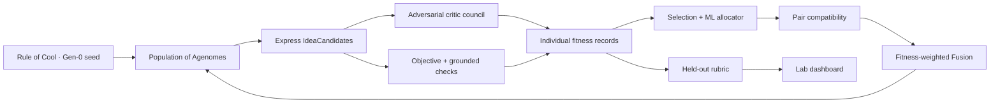

# Doppl — Project Planning Document

**Gauntlet Capstone · Deliverable 01**
**Direction:** B (philosophically different agent) + A (classical ML governs the population)
**Team size:** 4 engineers
**Build window:** ~2 weeks
**Showcase:** Mon · Jun 29 · 10-minute live presentation
**Status:** Synthesized v1.0 · 2026-06-17

> *The agent that builds the agents that build the agents.* A population of agent genomes under selection pressure, evolving toward non-obvious, verifiable ideas — without collapsing into confident slop.

---

## 1. The Problem — and why it's hard

Every agent system shipped today is a **hand-built artifact**: a human designs the prompt, the toolset, the decomposition, and the verification loop, then the agent executes that fixed design. The intelligence lives in the scaffold, and the scaffold is frozen the moment a human stops typing.

We are asking: **what if the scaffold itself were under selection pressure?** Instead of designing one agent, design the evolutionary dynamics of a population of agents, give it a fixed compute budget as its environment, and let competition discover scaffolds no human would have written.

We point this organism at the hardest thing to automate: **having a genuinely good idea.** Concretely, two prey:

1. **Cross-domain transfer** — finding a technique or result in field A that cracks an open problem in field B.
2. **Zeitgeist synthesis** — surfacing a thesis, product, or framing that fits the present moment and survives scrutiny.

This is hard for the deep reason that **"good idea" has no cheap ground-truth signal.** You cannot grade novelty with a unit test. So the central technical bet is to **manufacture a fitness function** out of adversarial verification + executable real-world checks, and use evolution to climb it without optimizing for fooling the critics.

---

## 2. Solution Summary

Doppl is an **evolutionary runtime for agent scaffolds**. The unit of life is an **Agenome** — a serialized, heritable agent configuration `{system_prompt + persona/value_weights + tool_permissions + decomposition_policy + spawn_budget + lineage metadata}`. The organism is a generational loop:

1. A seed prompt creates an environment.
2. A population of Agenomes expresses **IdeaCandidates** (artifacts).
3. An **adversarial critic council** evaluates each candidate independently, with grounded checks where available.
4. **Fitness records** (per-agenome, not per-pair) score each parent.
5. Selection chooses survivors and identifies compatible parent pairs.
6. **Fusion reproduction** produces children via fitness-weighted inheritance from two distinct parents.
7. **Held-out evaluation** measures whether generation N+1 actually improved without becoming the breeding target.
8. The cycle repeats inside a metabolism of scarce tokens, money, depth, and time.

Classical ML (Direction A) governs the ecosystem: a spawn-budget bandit allocates compute across lineages, idea-space embeddings score novelty, and a learned value model predicts which Agenomes deserve to spend tokens.

**Generation-0 seed:** Rule of Cool — an existing, working single-agent skill that absorbs context, generates cross-domain candidates, applies a quality filter, and emits one strong recommendation. The capstone takes that proven scaffold, mutates it into a population, and puts it under selection.



**One sentence:** *We didn't build the idea — we built the thing that evolved it.*

---

## 3. Design Invariants (non-negotiable)

The architecture may pick any implementation that preserves these five invariants.

| # | Invariant | Architectural enforcement |
|---|-----------|---------------------------|
| 1 | **Selection is real, not cosmetic.** Compute scarcity is the environment. | Energy ledger reconciled against actual token usage every call. `max_tokens` cap per LLM call set from the agenome's remaining EU; streaming aborts at breach; negative-balance agenomes excluded from the next generation's `live` set. Overspend is structurally prevented, not just measured. |
| 2 | **Fitness anchors to signal that cannot be faked.** | Partial-credit gate: council scores cannot override an objective-check failure. Held-out judging-half seeded from a **structurally different prior**, frozen at gen-0, and never feeds selection. Held-out rubric correlation tracked per generation. |
| 3 | **Reproduction is two-parent fusion, not cloning.** | `Agenome.parent_ids` is typed as a list of length 2 for `generation > 0`, enforced by Pydantic validator. `kernel/fusion.py` requires two distinct parent_ids. The contract is the enforcement boundary. |
| 4 | **The scaffold is the thing under selection.** | The Agenome IS the unit of state — no fixed agent class. All behavioral surface (prompt, persona, decomposition, tools) lives on the Agenome. |
| 5 | **The tree must terminate.** | Global budget cap, per-agenome cap, depth cap enforced at the `metabolism.py` boundary. Breach raises `EnergyExhausted`, ending that branch cleanly. |

---

## 4. Core Data Model — six frozen contracts

These six Pydantic models are the **seams** between the four ownership surfaces. They are **drafted at the start of Phase 1** and **frozen at the cross-owner sync** after each engineer has built a thin slice against the draft.

| Contract | Producer → Consumer | Purpose |
|----------|---------------------|---------|
| **Agenome** | Kernel ↔ all | Heritable agent recipe. YAML frontmatter + markdown body (mirrors Rule of Cool). |
| **ProblemInstance** | Verifier → Kernel | A prompt + optional `objective_check` ref + optional `held_out_rubric` ref. |
| **IdeaCandidate** | Kernel → Verifier | What an Agenome expressed: content, reasoning trace, energy spent. |
| **CritiqueResult** | Verifier → Selection | Per-critic score with mandate, evidence, and a `held_out` flag. |
| **CheckResult** | Verifier → Selection | Objective-check outcome: `passed`, `partial_score`, output, error, runs (for flaky re-run policy). |
| **GenerationRecord** | Kernel → all | Per-generation snapshot: population, fitness breakdown, value-model features, survivors, offspring, aggregate metrics. |

**Draft early in Phase 1, freeze at the cross-owner sync.** The short mutability window compresses integration risk. Once frozen, contract changes require all four engineers to sign off.

---

## 5. Architecture — stack and module layout

### 5.1 Stack picks

| Layer | Pick | Why |
|-------|------|-----|
| Backend language | Python 3.12 | LLM + ML ecosystem; pydantic v2 for contracts |
| LLM provider | Anthropic (Claude Sonnet 4.6 + Haiku 4.5; Opus 4.7 for demo rubric) | Single family = clean budgeting; Sonnet for ideation/critics, Haiku for utility |
| Orchestration | Custom async Python scheduler (`kernel/loop.py`) | Generational loop is mechanically simple; budget enforcement must be first-class. |
| Persistence | SQLite WAL mode | Single-file, crash-safe, zero-ops; SSE serves from SQLite queries. (Optional JSONL event log for richer Week-2 replay.) |
| Dashboard | Next.js 15 + TypeScript | Demo is load-bearing; SSR + native SSE. |
| Backend transport | FastAPI + SSE; bound to `127.0.0.1` by default | Push-based, browser-native; bearer-token gate for any non-local bind. |
| Embedding | Voyage 3 (`voyage-3-large`) | Strong on technical text; Anthropic-aligned. |
| Novelty (MVP) | Cosine NN distance over rolling archive (last 500 ideas) | Cheap, interpretable. MAP-Elites is Week-2 if time. |
| Retrieval (critic grounding) | Exa | Designed for research/prior-art surfacing. |
| Spawn allocator | UCB1 bandit (Phase 1) → learned value model with `lightgbm` (Phase 2) | Both behind the same `Allocator.allocate(population, total_budget)` interface. |
| Concurrency | asyncio + bounded `Semaphore(N)` (single process) | No GPU; trivial budget enforcement. |
| Energy metering | Virtual currency (EU) + per-call token reconciliation + `max_tokens` cap | One unit for all actions; unfakeable anchor. |

### 5.2 Module layout

```
doppl/
├── doppl/                           # Python package
│   ├── contracts/                   # SHARED — drafted early Phase 1, frozen at sync
│   │   ├── agenome.py
│   │   ├── problem.py
│   │   ├── idea.py
│   │   ├── critique.py
│   │   ├── check.py
│   │   ├── generation.py
│   │   └── events.py                # Demo event stream types
│   ├── kernel/                      # Engineer 1 — Kernel/Runtime
│   │   ├── loop.py                  # Generation scheduler
│   │   ├── metabolism.py            # Energy ledger + reconciliation + overspend policy
│   │   ├── fusion.py                # Crossover + LLM splice + validation + fallback + blind-spot mandate
│   │   ├── mutation.py
│   │   ├── seed.py                  # Rule of Cool ingestion
│   │   └── llm.py                   # Provider-agnostic LLMClient
│   ├── selection/                   # Engineer 2 — Selection/ML
│   │   ├── allocator.py             # UCB1 (Phase 1) → value model (Phase 2) behind one interface
│   │   ├── embeddings.py            # Voyage client + on-disk cache
│   │   ├── novelty.py               # NN distance over archive
│   │   └── fitness.py               # Aggregation rule (partial-credit gate)
│   ├── verifier/                    # Shared directory — split ownership
│   │   ├── council.py               # Engineer 3 — orchestration + stratified sampling + consensus_quality cap
│   │   ├── critics/                 # Engineer 3 — per-mandate prompts
│   │   │   ├── grounding.py
│   │   │   ├── novelty.py
│   │   │   ├── feasibility.py
│   │   │   └── falsification.py
│   │   ├── retrieval.py             # Engineer 3 — Exa client + cache
│   │   ├── anti_hack.py             # Engineer 3 — held-out partition + structurally-different prior
│   │   ├── checks/                  # Engineer 4 — objective checks per domain
│   │   │   ├── code_transfer.py     # MVP primary
│   │   │   └── math_puzzle.py       # Phase-0 Plan B candidate
│   │   ├── sandbox.py               # Engineer 4 — AST allowlist + RLIMIT enforcement
│   │   └── rerun.py                 # Engineer 4 — flaky-check re-run policy
│   ├── demo/                        # SHARED — Phase-2 collective effort
│   │   ├── server.py                # FastAPI app, localhost-bound by default
│   │   ├── stream.py                # SSE broadcaster (SQLite-backed)
│   │   └── replay.py                # Best-idea gauntlet replay
│   ├── persistence/                 # SHARED (lead-owned)
│   │   ├── db.py                    # SQLite schema + WAL setup
│   │   └── store.py                 # Repository pattern over Pydantic types
│   └── cli.py                       # Engineer 1 — `doppl run`, `doppl serve`, `doppl replay`
├── dashboard/                       # SHARED — Phase-2 collective effort
│   ├── app/page.tsx                 # Live tree view
│   └── components/
│       ├── PopulationTree.tsx
│       ├── FitnessChart.tsx
│       └── EnergyMeter.tsx
├── seeds/
│   └── rule_of_cool.md
├── problems/                        # Engineer 4 — ProblemInstance fixtures
│   ├── code_transfer/
│   │   ├── instances/<id>/prompt.md, tests.py, fixtures/
│   │   ├── instances.jsonl
│   │   └── rubric.py
│   └── math_puzzle/                 # Plan B
└── runs/                            # Per-run sqlite + retrieval cache
```

`contracts/` and `persistence/` are lead-owned but everyone imports from them. Every other owner directory is self-contained, which is what makes parallel work possible from the start of Phase 1.

---

## 6. Selection & Fitness — how reproduction actually works

Reproduction is the project's most distinctive thesis. We commit to a three-stage flow rather than averaging parents into a single pair-level score.

### 6.1 Three-stage reproduction

1. **Individual parent evaluation.** Parent A's artifact receives its own critic verdicts, grounded checks, novelty score, and `FitnessRecord`. Parent B receives the same independently. This produces strengths, weaknesses, and heritable critic pressures for each parent.
2. **Pair compatibility judgment.** The system asks whether A and B are worth breeding together. Compatibility ≠ average quality. It checks whether parents are complementary, whether their blind spots cancel or compound, whether their lineages preserve diversity, and whether the weaker parent contributes something the stronger lacks.
3. **Fitness-weighted inheritance.** The child inherits according to the parents' individual fitness ratio. If A scores 80% and B scores 40%, the prior is roughly **2:1** — about two-thirds of the child's scaffold, examples, and reasoning come from A; one-third from the best parts of B. Critic pressure (not blind text-copy) decides which traits actually transfer.

### 6.2 Fitness aggregation (partial-credit gate)

```python
def aggregate(idea, critiques, check_result):
    breeding_critiques = [c for c in critiques if not c.held_out]
    council = mean(c.score for c in breeding_critiques) if breeding_critiques else 0.5

    if check_result is None:
        # Fuzzy domain — surface "no-check" warning on dashboard
        return council

    # Partial-credit gate: scale council by check performance
    check_score = check_result.partial_score  # 0.0-1.0
    return 0.6 * check_score + 0.4 * council
```

**Why not a hard binary gate:** killing any lineage that fails one test destroys the gradient (a 9/10 idea scores identically to a null answer) and amplifies flakiness into lineage death. Partial credit preserves selection signal while still favoring full-pass solutions.

**Re-run policy:** A check returning `partial_score < 0.1` on its first run triggers one re-run. Absorbs infrastructure noise without inflating the check budget.

### 6.3 Hybrid critic council

The council is the fitness function, so it must be powerful and constrained:

- **Stable anchor critics** — small fixed council provides continuity across runs (factual grounding, novelty/prior-art, feasibility, falsification).
- **Experimental critic variants** — Doppl can spawn or mutate critic Agenomes, but their judgments run in **shadow mode** before affecting reproduction.
- **Held-out judging-half** — seeded from a **structurally different prior** than the breeding half (different system_prompt, different persona scalars). Frozen at gen-0. Never feeds selection. The unchanging measuring stick.
- **External anchors** — retrieval, executable checks, datasets.

**Stratified sampling guarantees PRD FR-7:** for each IdeaCandidate, draw one critic per mandate deterministically from the breeding half, then random-fill remaining slots. Pure random sampling misses mandates ~91% of the time at panel_size=4.

**Anti-herding mechanics.** Two named controls keep the council from collapsing into consensus-for-its-own-sake:

- **Disagreeableness dial (`0..1`)** on each critic — resistance to convergence. Critics with higher disagreeableness will hold dissenting positions longer and require stronger evidence to update. Mixed disagreeableness across the panel is preserved through mutation; populations that drift toward all-agreeable critics are penalized in novelty scoring.
- **`consensus_quality` cap** on the panel-level score. The judge classifies each round as `resolved | herded | mixed`. When the panel is classified `herded` (rapid convergence without dissent traversal), the aggregate score is capped at a configured ceiling (e.g., 6/10). Real consensus survives. Cargo-cult consensus pays a structural penalty.

### 6.4 Crossover semantics

Per-field rules in `kernel/fusion.py`:

- **PersonaWeights scalars:** uniform crossover with blend, `child = α·A + (1-α)·B`, `α ~ U(0.3, 0.7)`.
- **tool_permissions (set):** union by default; intersection on permissions flagged "critical."
- **DecompositionPolicy.strategy:** random pick between parents.
- **system_prompt + DecompositionPolicy.prompt_fragment:** LLM-mediated splice with Sonnet.
- **lineage_tag:** new tag minted from both parent tags.

**Splice quality guard (anti-degeneracy):** After each LLM splice, the child runs `K=3` short ProblemInstance probes against parent-derived score bands. Must score within 1 standard deviation of `mean(parent_A_score, parent_B_score)` on ≥2/3 probes. One retry with different temperature; on second failure, fall back to deterministic structured composition (concat parent A intro + parent B middle + parent A close, dedupe). Birth cost ~30 EU per splice.

### 6.5 Offspring breeding mandate — breed on blind spots, not "try harder"

The child's breeding mandate is constructed from the parents' critique trace, not from the original problem prompt. Specifically, the mandate is built from `blind_spots ∪ clarifying_questions` extracted from the parents' `CritiqueResult` records:

- **`blind_spots`** — mandate-tagged weaknesses where one or both parents lost score (e.g., `feasibility: under-specified deployment cost`, `falsification: no counterexample considered`).
- **`clarifying_questions`** — open threads from the critic panel that neither parent resolved.

The child is told: *"Your parents produced strong artifacts but missed X, Y, Z and left questions A, B unanswered. Inherit their strengths; address these specifically."* Crucially, this is **not** "try harder than your parents" or "produce a better answer" — both are degenerate mandates that collapse to noise. Targeting concrete blind spots gives selection pressure something legible to climb.

Mandate construction lives in `kernel/fusion.py` alongside crossover; the extracted blind-spot set is also persisted on the child Agenome's `metadata.mutation_log` so the dashboard lineage view can show *why* each child was bred.

---

## 7. Scope — what "working" means in two weeks

### 7.1 MVP (must ship, the headline claim)

- A generational loop on a fixed problem set: spawn population, reproduce by Fusion (crossover + LLM splice with validation + fallback), run the critic council + objective checks, score with partial-credit gate, allocate via UCB1, mutate, repeat.
- **Verification = critic council + at least one objective check** on at least one domain (`code_transfer` primary).
- **Held-out rubric** measures generation-over-generation improvement on a fixed problem suite.
- **Instrumented dashboard:** population tree, energy per agent, fitness over generations.
- **The MVP exists to demonstrate one claim: generation N+1 measurably beats generation N on the held-out rubric.**

### 7.2 Stretch (Phase 2 if MVP holds)

- Multi-generational, open-ended population with live compute economy.
- **Learned value-model allocator** trained on `GenerationRecord.value_features` captured from gen-0.
- **Novelty pressure** via cosine NN distance scoring; archive-based mode-collapse prevention.
- **Live population-tree visualization** with breeding edges, fragment-splice edges, lineage colors.
- **Async human signal layer** ("Agora") — Slack/Discord webhook where sprouts and outcomes surface for non-blocking human verdict, logged to `verdicts.jsonl`. Verdicts can credit energy budget without pausing the organism.

### 7.3 Moonshot (explicitly not MVP — horizon only)

- **Self-evolving verifier:** critics themselves under selection. Frozen judging-half stays as the measuring stick.
- **In-house fine-tuning flywheel:** distill winning lineages into model weights. The contract pipeline already produces `(agenome, idea, rubric_score)` triples.
- **Weight-level fusion** via open-weight models — `LLMClient` is provider-agnostic; `kernel/fusion.py` can add a `merge_weights()` operator.
- **Predictive paper-bet bedrock:** pre-registered prediction ledger scored on calibration (Brier score), with reality as the free automatic adversary. `$0 → small real → real capital` blast-radius dial.
- **Production-grade sandbox (Modal)** lifts the live-prompt routing restriction.

### 7.4 Anti-requirements

- **No fixed end-user-facing product.** Doppl is the process, not an app built on top of it.
- **No claim of a solved scientific result** within the capstone window.
- **No fitness signal that rests solely on unaided LLM judgment** for research-class domains.
- **No asexual single-parent reproduction** as the primary mechanism (violates invariant 3).
- **Doppl never adjudicates or bets in markets it creates.**

---

## 8. Acceptance criteria (definition of done for MVP)

1. The generational loop runs end-to-end on the fixed problem set without manual intervention per generation.
2. Reproduction demonstrably uses two parents (lineage records show two distinct `parent_ids`).
3. The critic council scores candidates and at least one domain runs a real objective check.
4. Held-out rubric scores show a measurable, reproducible improvement from an early generation to a later one.
5. The budget caps hold: no run exceeds the configured global energy / depth limits.
6. The dashboard renders the population tree, per-agent energy, and a fitness-over-generations chart from real run data.

---

## 9. Team — who owns what

Each engineer owns a piece of the core application that can be built independently against the frozen contracts. Demo / observability is **not** an engineer's primary surface — see "Demo work" below.

| # | Surface | Responsibility | Owner |
|---|---------|----------------|-------|
| 1 | **Kernel / Runtime** | Agenome schema, generational loop, metabolism (energy + max_tokens cap + overspend exclusion), Fusion (crossover + LLM splice + K=3 validation + fallback), offspring breeding mandate from blind spots, mutation, spawn/cull, depth and budget caps, Rule-of-Cool seed ingestion, CLI. The substrate everything else plugs into. | Engineer 1 |
| 2 | **Selection / ML** | UCB1 bandit (Phase 1) → learned value model (Phase 2) behind one `Allocator` interface; idea-space embeddings via Voyage; novelty/diversity scoring; fitness aggregation (partial-credit gate); credit assignment; Phase-2 value-feature capture from gen-0 onward. Direction-A core. Owns the moonshot in-house fine-tuning flywheel. | Engineer 2 |
| 3 | **Critic Council** | Adversarial critic Agenomes (stable anchors + experimental variants + held-out partition with structurally different prior, frozen at gen-0); stratified mandate sampling; disagreeableness dial + `consensus_quality` cap; retrieval grounding via Exa; anti-reward-hacking. Owns the council half of the fitness signal — the LLM-judgment side. | Engineer 3 |
| 4 | **Objective Checks & Problem Domains** | Phase-0 two-domain spike (`code_transfer` primary + `math_puzzle` Plan B); ProblemInstance fixtures with hidden test suites; AST-allowlist sandbox with RLIMIT enforcement; per-domain `rubric.py` scorers; flaky-check re-run policy; held-out rubric application. Owns the unfakeable half of the fitness signal — the executable-check side. | Engineer 4 |

Engineers 3 and 4 split what was formerly one "Verifier" surface. The split is real architectural work: Engineer 3's craft is prompt engineering + retrieval + adversarial design; Engineer 4's craft is sandbox engineering + test-harness authorship + Phase-0 gradient validation. They share the `verifier/` directory but own disjoint files; their handoff is the `CritiqueResult` and `CheckResult` contracts.

### Demo work — not a primary surface

Each engineer is responsible for **emitting events from their surface** via the shared `contracts/events.py` schema. That's the observability contract. Building the dashboard (Next.js components, FastAPI+SSE pipeline, gauntlet replay, live-prompt intake) is a Phase-2 collective effort, not a Phase-1 surface owned by anyone. Phase-1 observability is "events land in SQLite and a dev can `tail` them"; the polished dashboard comes after the MVP loop is proven and the team has bandwidth to converge on the demo.

**3-person team:** Engineer 1 absorbs Engineer 4's surface, but the Phase-0 spike still has to happen first and gates everything.

---

## 10. Build phases

Three phases, no day-by-day plan. The team paces itself within each phase; the phase exits are the only hard gates.

### Phase 0 — Spike (gates everything)

Engineer 4 leads a two-domain spike on `code_transfer` (primary) and `math_puzzle` (Plan B), with Engineer 3 contributing the critic-prompt discrimination check (item 4 below) since the four mandate prompts are theirs. The spike must produce:

1. 5+ validated ProblemInstances per domain. *(Engineer 4)*
2. **Mutation moves the needle:** mutating Rule of Cool 5 ways yields measurably different pass rates on the same instance. *(Engineer 4)*
3. **Gradient is usable:** pass rates across the 5 instances span the middle range (spread > 0.4) — neither all-zero nor all-perfect. *(Engineer 4)*
4. **Critic prompts discriminate:** the four mandate prompts separate 10 known-good and 10 known-bad ideas with > 70% correct classification per mandate. *(Engineer 3)*

**Exit gate:** at least one domain passes (1)–(4). If neither does, the core claim isn't provable and the project escalates before Phase 1 begins.

### Phase 1 — MVP loop

The goal is end-to-end: generational loop on the spike-validated domain, showing measurable rubric improvement gen 0 → gen N. The phase begins with a **contracts draft** (six Pydantic models in `doppl/contracts/`) that each engineer builds thin slices against, and ends after a **cross-owner sync where contracts freeze**. After freeze, contracts are immutable for the rest of the phase.

Phase exit = AC #1–6 passing on the smallest end-to-end slice (~3 generations, population ~10, one ProblemInstance, one mandate per critic panel).

### Phase 2 — Economy, learned control, demo dataset

With the MVP loop holding, turn on:

- Energy reconciliation hardened across multi-generational runs.
- Novelty pressure tuned from Phase-1 convergence data.
- Learned value-model allocator A/B'd against UCB1.
- Held-out rubric measurement reproducible across runs; rubric-vs-check correlation surfaced as a dashboard metric.
- **Full-scale demo dataset run:** 10+ generations, population 20, 5+ ProblemInstances. **This is the source of the demo's headline fitness chart — not the Phase-1 smoke slice.**
- Dashboard polish, gauntlet replay, accessibility verified.
- Demo dry-run on a live unseen prompt (constrained to fuzzy domains per sandbox routing).

Phase exit = Jun 29 demo.

---

## 11. Demo specification (Jun 29 · 10 minutes live)

### 11.1 Demo flow

| Step | Action | Success signal |
|------|--------|----------------|
| 1 | Seed a live, unseen prompt from the room (zeitgeist/research domain) | Audience sees input |
| 2 | Watch the population evolve — tree on screen, two edge types visible | Weak lineages dim; fusion edges appear |
| 3 | Fitness-over-time + held-out rubric chart climbs | Chart line rises across generations |
| 4 | Surface best surviving idea; replay the gauntlet it passed; for `code_transfer`, execute the proposed transfer live | Critic trace + check pass shown |

**Payoff line:** *We didn't build the idea — we built the thing that evolved it.*

### 11.2 Live-prompt input contract

`/seed` endpoint enforces:

- **Length cap:** 2000 characters.
- **Character class:** printable Unicode only; reject control characters except `\n \r \t`.
- **Injection patterns:** reject `<|im_start|>`, `### System:`, "ignore previous instructions" variants. Return HTTP 400 with a friendly message.
- **Domain routing:** live submissions must be `zeitgeist` or `research`. `code_transfer` execution is reserved for pre-vetted bundled instances. (HTTP 403 on live `code_transfer` until Modal sandbox ships.)
- **Rate limit:** one submission per 30 seconds per client.
- **Operator preview:** validated prompt surfaces to the operator on a confirmation screen before injection.

### 11.3 Layout priority (fixed for demo)

- **Primary:** `PopulationTree.tsx` — center-stage, ~60% of screen. "Watchable evolution" lives here.
- **Secondary:** `FitnessChart.tsx` (top-right, ~20%), `EnergyMeter.tsx` (bottom-right strip per active agenome). Always visible.
- **Tertiary:** seed-intake input, transfer execution modal, gauntlet replay controls.

### 11.4 Accessibility commitment

All status encodings use **at least two visual channels** (color + shape, or color + line style, or color + label). Color alone is illegible to colorblind audience members. Verified at the demo dry-run before Jun 29.

### 11.5 Component states (summary)

- **PopulationTree:** `Initial` (placeholder) → `Streaming` (nodes fade in at parent positions) → `Generation boundary` (layout re-compute + auto-pan) → `Error/stalled` (dim + overlay after 30s no events). Two edge types: **breeding** (solid arrowhead) and **fragment-splice** (dashed, gray). Persistent legend top-left.
- **FitnessChart:** `Empty` → `Streaming` (dots per critique + line per generation mean) → `Plateau` (amber line + annotation if 3-gen mean non-increasing for 3 gens).
- **EnergyMeter:** Full → Draining → `<25%` amber → `<10%` pulse → `Empty` "energy_exhausted" label.
- **Seed-intake:** Idle → Validating → Submitting → Confirmed (collapses to pill).
- **Gauntlet replay:** triggered by footer button after evolution completes; play/pause + speed selector; "Return to live" exits.

---

## 12. Risks & Mitigations

| Risk | Likelihood | Impact | Mitigation |
|------|-----------|--------|------------|
| Phase-0 spike finds no checkable problem with a gradient on either candidate domain | Low (mitigated by two-domain spike) | Catastrophic — core claim unprovable | Two-domain spike (code_transfer + math_puzzle) before Phase 1; escalate if both fail |
| Spike gradient exists but doesn't generalize (sharp, all-or-nothing) | Medium | Selection cannot climb | Day-0 acceptance: mutation-moves-the-needle + middle-range spread (>0.4) per domain |
| Fitness without ground truth — council becomes weak judge | High | Critical | Held-out judging-half (structurally different prior, frozen at gen-0); rubric correlation tracked; partial-credit gate weights unfakeable signal above council |
| Mode collapse / slop convergence | High | High | Novelty pressure via NN distance; distant-lineage Fusion; disagreeableness/contrarian persona bias |
| LLM-mediated splice produces garbage prompts | High | Lineage quality collapses without guard | K=3 validation probes; deterministic structured-composition fallback after 2 failures; failure rate surfaced on dashboard |
| Anthropic rate limits throttle population at N>~30 | Medium | Slow runs | Semaphore-bounded; request tier-3 limits ahead |
| Exa rate limit hit during dense critic phases | Medium | Critic grounding degrades | Aggressive caching; back-off + retry; web-search fallback |
| Code-transfer sandbox bypass via dunder / exec / eval | Medium | Lab safety | AST analysis pre-execution (NOT string match); enumerated allowlist; RLIMIT enforcement; live prompts restricted to non-code domains |
| Per-call energy overspend | Medium | Invariant 1 hollow | `max_tokens` cap per call from remaining EU; streaming abort on breach; negative-balance excluded from next gen |
| Held-out judges share Rule of Cool prior with breeders | Medium | Reward-hacking hidden by lockstep drift | `judging_half` seeded from a structurally different adversarial-prior file; frozen at gen-0 |
| Integration mid-Phase 1 reveals contract mismatch | Low (sync-time freeze, not draft-time) | Lost day | Draft contracts at Phase 1 start; freeze at the cross-owner sync; mismatches surface in the mutability window |
| Opus 4.7 rubric cost or rate-limit blows budget during MVP iteration | Medium | Dev iteration stalls; AC-4 delayed | `--rubric-model sonnet` for dev; `--rubric-model opus` reserved for Day-12 full-scale + Day-15 demo |
| Day-7 smoke slice extrapolated as headline claim | Medium | Demo chart looks like noise on stage | Day-12 full-scale run; headline chart drawn from that, not the smoke slice |
| Population 20 + hard culling collapses lineage diversity | Medium | Two-parent breeding pool thins by gen 3 | Sensitivity analysis during Day-0 spike; options: raise pop, soften gate, or add diversity floor |
| Live demo prompt routed through code-execution path | Medium | Lab safety + demo break | DR-1 routing restricts live prompts to `zeitgeist` / `research`; `/seed` returns 403 on `code_transfer` from live endpoint |

---

## 13. Security requirements

The system processes audience-supplied prompts that may generate code that executes in a sandbox. The threat surface is real even for a single demo.

| Concern | Requirement |
|---------|-------------|
| **FastAPI server** | Bind to `127.0.0.1` by default. Any non-localhost bind requires `--bearer-token <secret>` and the `/sse` and `/seed` endpoints require the token in `Authorization: Bearer`. Demo on shared venue wifi MUST tunnel via SSH or use the bearer-token gate. |
| **Sandbox** | AST-level allowlist enforcement (NOT string matching). Enumerated stdlib subset (`math`, `itertools`, `collections`, `heapq`, `bisect`, `functools`, `operator`, `numbers`, `decimal`, `fractions`, `random`, `re`, `string`, `array`, `dataclasses`, `typing`, `enum`). AST rejection of `__import__`, `getattr(__builtins__, ...)`, `exec`, `eval`, `compile`, dunder attribute access. RLIMIT_AS=256MB, RLIMIT_NPROC=0, no fs writes outside `/tmp/doppl-sandbox-<uuid>`, no network. |
| **API secrets** | All keys (Anthropic, Voyage, Exa) from env vars or secrets manager. Never committed. Never logged. Demo-scoped keys only. |
| **Live-prompt validation** | See §11.2. |
| **Operator preview** | Validated live prompt surfaces to operator on a confirmation screen before injection. Operator can reject or re-route. |
| **Never play own markets** | The organism may surface a prediction as a `sprout`, but may not adjudicate or bet in markets it creates. (Stretch-tier paper-bets only.) |

---

## 14. Run lifecycle (CLI)

```
$ doppl run --seed seeds/rule_of_cool.md \
            --problems problems/code_transfer/instances.jsonl \
            --generations 10 \
            --population-size 20 \
            --total-budget 5000000 \   # tokens
            --cost-ceiling-usd 150 \   # hard USD cap; abort with summary if exceeded
            --rubric-model sonnet \    # sonnet for dev; opus for demo measurement
            --bind localhost           # FastAPI bind address
```

1. CLI creates `runs/<run_id>/` (sqlite + retrieval_cache).
2. `kernel/seed.py` ingests Rule of Cool → 1 Agenome. `mutation.py` produces N-1 variants → initial population. `verifier/anti_hack.py` seeds the judging-half from the adversarial-prior file.
3. `kernel/loop.py` enters the generational loop; bounded by `--generations`, `--total-budget`, and `--cost-ceiling-usd`.
4. Dashboard server can run alongside: `doppl serve --run <run_id>` reads the same SQLite + emits SSE.
5. On completion, prints summary (rubric trajectory, best idea per problem, dashboard URL, total USD spent).
6. `doppl replay --run <run_id> --idea <idea_id>` re-runs the critic gauntlet for the chosen idea (for demo).

---

## 15. Dependencies & assumptions

### Phase 1

- **Anthropic API access** at tier-2 or better (concurrency ~40) for Sonnet and Haiku. Opus 4.7 access for rubric (lower concurrency acceptable).
- **Voyage AI API key** for embeddings (or local `sentence-transformers/all-MiniLM-L6-v2` fallback).
- **Exa API key** for prior-art retrieval (or web-search fallback).
- **Per-run USD cost envelope** secured before Phase 0. Working estimate: ~$100-200 per smoke run (Sonnet-rubric, pop 10, 3 gens); ~$500-800 per full-scale demo run (Opus-rubric, pop 20, 10+ gens). Hard ceiling via `--cost-ceiling-usd`.
- **Demo runs locally** on a developer laptop or single VM. No GPU required.
- **Rule of Cool seed** is treated as immutable.
- **Hand-authored adversarial-prior seed** for judging-half bootstrapping; written by Engineer 3 in Phase 0 alongside the spike.
- **Team has 4 engineers** working in parallel (or 3 with Kernel + Demo merged).

### Phase 2

- **`lightgbm`** for value model training.
- Optional: JSONL event log for richer replay.

### Secrets management

All API keys via env vars or secrets manager only. Never in source. Never in logs.

---

## 16. Open questions for the team to resolve

These are decisions the team should settle before or during Phase 1, with the architect's recommendation noted.

1. **Demo positioning on fuzzy domains (P0).** The Jun 29 live unseen prompt will almost certainly be zeitgeist/research with no objective check; the fitness aggregator on fuzzy domains is council-only — the explicitly weak judge. Options: (a) constrain DR-1 to checkable domains (loses "live unseen" flexibility); (b) accept the framing distinction visibly on the dashboard ("gradient-proof runs" vs "process-demo runs"). **Default:** (b), with explicit dashboard labeling.
2. **Rubric model family (P1).** The held-out rubric currently calls Claude Opus 4.7 — same family as the breeders. Switch to non-Anthropic model (GPT-5 or Gemini) for the demo rubric? Ensemble across families? **Default:** same-family with rubric-vs-check correlation as the safety net; revisit if correlation degrades.
3. **Sandbox isolation timing (P1).** Build Modal isolation before Jun 29 to lift the live-prompt routing restriction, or accept the restriction (live prompts only on fuzzy domains)? **Default:** accept the restriction for capstone; Modal is post-showcase.
4. **FR-21 interpretation (P1).** PRD specifies the value model "gates or prioritizes ideation" (pre-spend). Architecture currently weights inside the allocator's lineage selection, not as per-call gating. Add explicit pre-ideation gating, or document the deviation? **Default:** allocator-weighting is satisfactory; document deviation.
5. **LLM splice fallback (P2).** Deterministic structured composition after 2 splice failures preserves invariant 3 but produces less expressive offspring. Accept as production behavior, or single-parent mutation drop (violates invariant 3 occasionally)? **Default:** structured composition; lineage diversity tracked on dashboard.
6. **PersonaWeights flexibility (P2).** The frozen Day-3 contract encodes 5 named scalar fields. Refining axes requires a contract break. Switch to `dict[str, float]` with a starting key set as convention? **Default:** keep typed; if a 6th axis is needed, it's a contract change.
7. **Population size (P2).** Population 20 + partial-credit culling may collapse lineage diversity by gen 3, undermining the visible "two parents fuse" demo. Options: raise pop to 40-50; soften the partial-credit floor; add a diversity floor preventing culling below a minimum lineage count. **Default:** decide during Day-0 spike based on observed culling behavior.
8. **Operator-preview-before-injection (P0, security).** Trust an audience submission immediately after validation, or require operator approval? **Default:** operator preview required; relaxes only if the team accepts the security tradeoff explicitly.
9. **Async human signal layer / "Agora" (deferred).** The narrative-layer Agora concept (Slack/Discord async verdict ledger paying out as energy budget) is Week-2 stretch only — not load-bearing for MVP. Confirm scope.
10. **Parallel spawner topologies (deferred).** The narrative architecture posits `agenotype` and `crucible` as competing loop topologies. The engineering architecture has one kernel. Accept unification, or budget time for a second topology in Phase 2?

---

## 17. Glossary

| Term | Engineering meaning |
|------|---------------------|
| **Agenome** | Serialized agent configuration — the unit of selection. YAML frontmatter + markdown body. |
| **IdeaCandidate / Artifact** | What an Agenome produces from a ProblemInstance — the visible phenotype under selection. |
| **Generation** | One full pass: ideate → critique → score → cull → reproduce → mutate. |
| **Metabolism / Energy (EU)** | Per-agenome compute budget. Actions debit; verified value credits. 1 EU ≈ 100 output tokens of Sonnet. |
| **Fusion** | Two-parent reproduction. Agenome-level crossover + LLM-mediated output splice, with K=3 validation. |
| **Critic council** | Panel of adversarial critic Agenomes with distinct mandates (grounding, novelty, feasibility, falsification). The fitness function. |
| **Objective check** | Real, non-LLM verification for a given domain (e.g., a code-transfer test suite). |
| **Held-out rubric** | Fixed scoring function applied to a held-out prompt suite to measure generation-over-generation improvement. |
| **Held-out judging-half** | Subset of critics seeded from a structurally different prior, frozen at gen-0, never feeds selection. The unfakeable measuring stick. |
| **Rule of Cool** | The existing, working single-agent skill that serves as the generation-0 seed Agenome. |
| **Sprouts / Afrits** *(stretch-tier vocabulary)* | Process-ideas (sprouts) vs outcome-ideas (afrits) surfaced to an async human verdict channel. Each maintains its own energy ledger. |
| **Agora** *(stretch-tier)* | Slack/Discord async channel where humans react to surfaced ideas without blocking the organism. Verdicts log to `verdicts.jsonl`. |
| **Paper-bet** *(moonshot)* | Pre-registered prediction with timestamped confidence, scored on calibration. Reality as the free automatic adversary. |

---

## 18. Companion documents

| Doc | Purpose |
|-----|---------|
| `PROPOSAL.md` | Original capstone proposal — narrative framing |
| `PRD.md` | Product requirements with user stories and acceptance criteria |
| `doppl_prd.md` | Engineering PRD — invariants and contracts focus |
| `ARCHITECTURE (3).md` | Narrative architecture — L1-L4 strata, Agora, parallel spawners |
| `architecture (1).md` | Reproductive architecture — individual parent evaluation, fitness-weighted inheritance |
| `architecture (2).md` | Engineering architecture — frozen Pydantic contracts, day-by-day plan, security spec |
| `Doppl_Capstone_Proposal_volume_2.pdf` | Original seed proposal |

---

*Synthesized from the team's contributed docs on 2026-06-17. Living document — update as Day-0 spike and Day-3 contract freeze land.*
