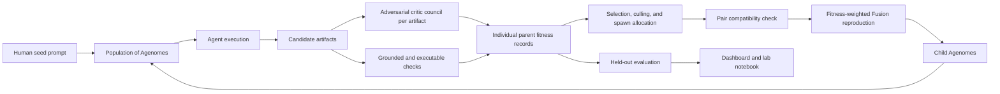
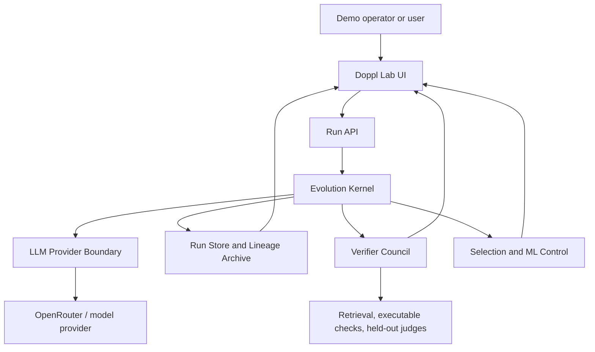
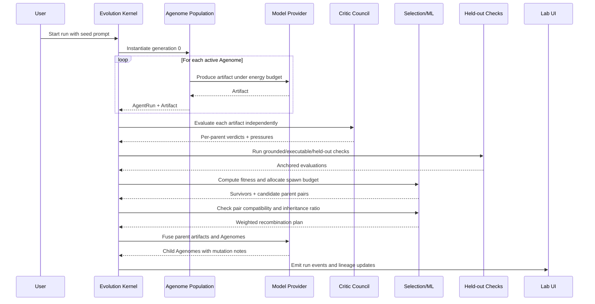
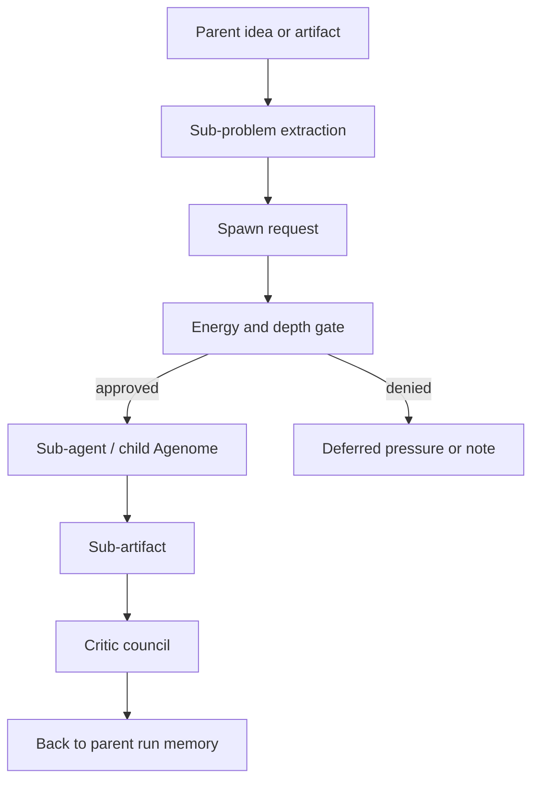
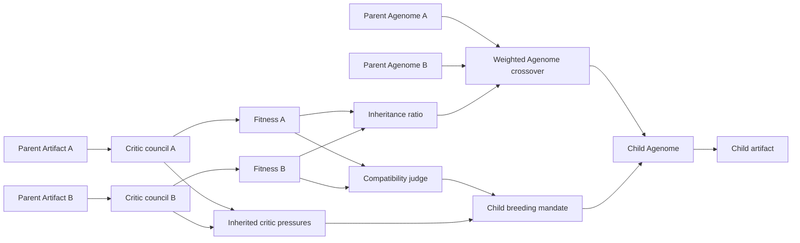
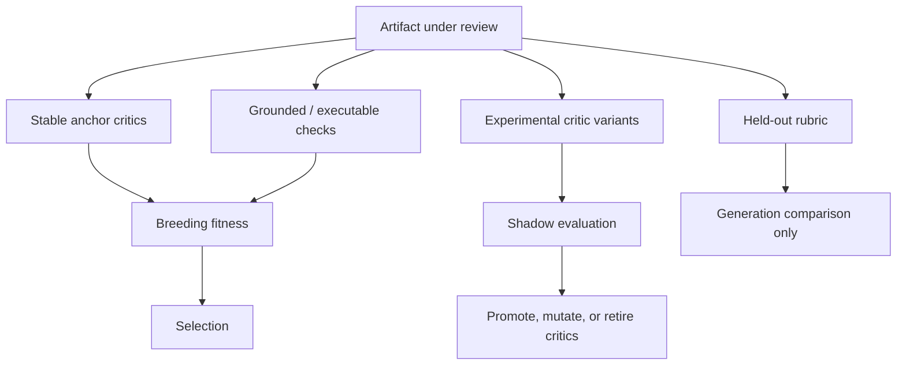
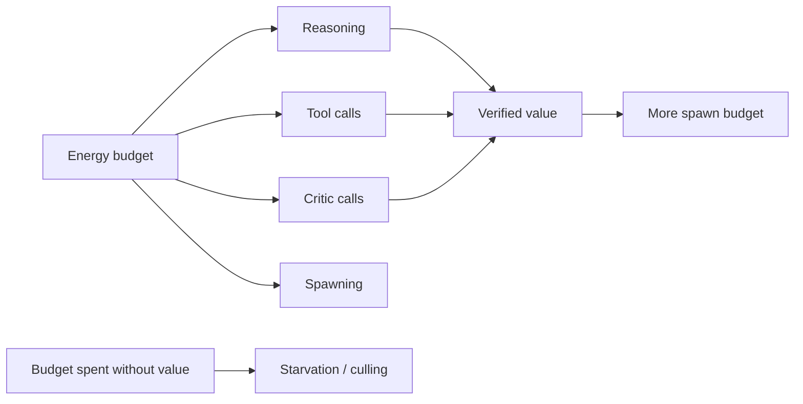
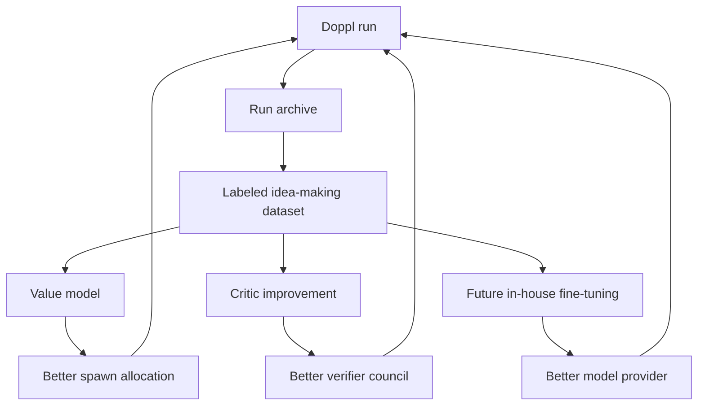

# Doppl Architecture (Dalton)

## Executive Summary

Doppl is an evolutionary runtime for agent scaffolds. Instead of asking one agent to answer a prompt, Doppl runs a bounded population of **Agenomes** that express inspectable **artifacts**, face adversarial **critic pressure**, and reproduce through **fitness-weighted Fusion**.

The key loop is:

1. A seed prompt creates an environment.
2. Agenomes produce artifacts.
3. Critics evaluate each parent artifact individually.
4. Grounded checks and energy accounting create traceable fitness records.
5. Selection chooses survivors and checks whether candidate parent pairs are compatible.
6. Fusion creates child Agenomes using inheritance weights from the individual parent fitness ratio.
7. Held-out checks measure whether the next generation actually improved without becoming the breeding target.

The important architectural correction is that parents are not judged as one blended pair. Each parent earns its own fitness record first. Pair compatibility only answers whether two parents should breed together. The child then inherits according to the score ratio: if parent A scores `80%` and parent B scores `40%`, the default inheritance prior is roughly `2:1`, with critic pressure deciding which traits actually transfer.

The system succeeds when a viewer can trace the whole story: this Agenome produced this artifact; these critics attacked it; these pressures shaped the child; these parent scores produced these inheritance weights; this child artifact improved under held-out evaluation.

## Thesis

Doppl is an evolutionary runtime for agent genomes.

The unit of life is the **Agenome**: a serialized agent scaffold containing prompt, persona or value weights, tool permissions, decomposition policy, spawn budget, lineage, and mutation history. An Agenome expresses itself by producing an **artifact**: an idea, plan, strategy, poem, design, transfer hypothesis, or other inspectable work product. A **critic council** evaluates that artifact and converts weaknesses into selection pressure. Survivors reproduce through **Fusion**, where parent Agenomes and parent artifacts are recombined into child Agenomes. The process runs inside a **metabolism** of scarce tokens, compute, depth, retries, and dollars.

The architecture is not "one agent answers a prompt." It is a bounded artificial ecosystem:

The core architectural promise is that useful traits can flow from evaluated artifacts back into the next generation of agent scaffolds.

## Architectural Hierarchy

The proposal does not make Agenomes, artifacts, and critics equal in the same way. It gives them different biological roles.

| Concept         | Architectural Role         | Biological Analogy  | Why It Matters                                                               |
| --------------- | -------------------------- | ------------------- | ---------------------------------------------------------------------------- |
| Agenome         | Hereditary unit            | Genome              | The mutable scaffold that can reproduce and improve.                         |
| Artifact        | Expressed output           | Phenotype           | The visible thing under selection; it must be inspectable and useful.        |
| Critic council  | Selection environment      | Fitness pressure    | Determines which artifacts and lineages deserve more compute.                |
| Fusion          | Reproduction mechanism     | Sexual reproduction | Recombines useful traits across lineages to escape local optima.             |
| Metabolism      | Scarcity environment       | Energy economy      | Makes selection real by limiting token, model, and spawn budgets.            |
| Classical ML    | Ecosystem governance       | Population control  | Allocates compute, preserves diversity, learns value predictions.            |
| Held-out checks | Anti-reward-hacking anchor | External reality    | Prevents the system from redefining success around what it already produces. |

This distinction is important. Artifacts are not merely UI output, and critics are not merely scoring widgets. But the organism's hereditary substrate is the Agenome population.

## Idea Prey And Seed Agenome

Doppl is not a generic answer generator. The proposal points the organism at two hard classes of idea:

1. **Cross-domain transfer**
   Find a technique, result, operating model, or mechanism from field A that can crack a problem in field B.

2. **Zeitgeist synthesis**
   Surface a thesis, product, framing, or artifact that fits the present moment and survives scrutiny.

These domains matter because they are both fusion problems. Cross-domain transfer fuses distant fields. Zeitgeist synthesis fuses weak signals into a timely thesis. Doppl's reproductive mechanism should rhyme with its target: an organism that produces fusion-shaped ideas should itself reproduce through Fusion.

The de-risked generation-zero Agenome is **Rule of Cool**: a human-authored, frozen idea-machine that absorbs context, generates and ranks cross-domain candidates, applies quality filters, and emits one strong recommendation. Doppl generalizes that seed into a population, then puts the population under selection.

## System Context

The UI is a lab notebook, not the source of truth. The source of truth is the run record: generations, Agenomes, artifacts, critic verdicts, fitness records, energy records, model calls, lineage, and events.

## Core Runtime Objects

### Agenome

An Agenome is the versioned, mutable scaffold of an agent.

Required fields:

- `id`
- `name`
- `systemPrompt`
- `persona`
- `valueWeights`
- `toolPermissions`
- `decompositionPolicy`
- `spawnBudget`
- `generation`
- `parentIds`
- `mutationNotes`
- `inheritedPressures`

The future architecture should treat Agenomes as durable entities, not transient prompts. They should be saved, compared, mutated, retired, and studied across runs.

### Artifact

An Artifact is the output an Agenome expresses into the world.

Required fields:

- `id`
- `runId`
- `agenomeId`
- `agentRunId`
- `generation`
- `artifactType`
- `title`
- `summary`
- `body`
- `claims`
- `evidence`
- `risks`
- `producedAt`

Artifacts should be typed enough to inspect. A poem, board game, product architecture, market thesis, and cross-domain transfer hypothesis should not all collapse into one vague `proposal` string forever. The MVP can keep a compact representation, but the architecture should move toward artifact-specific schemas and renderers.

### Critic Pressure

Critic pressure is the durable output of evaluation.

A critic verdict should not vanish after scoring. It should become structured, heritable information.

Required fields:

- `id`
- `criticId`
- `criticMandate`
- `candidateArtifactId`
- `score`
- `pass`
- `objections`
- `evidenceRequests`
- `counterexamples`
- `toPass`
- `pressureTags`
- `inheritedByChildAgenomeIds`
- `retiredAt`
- `retirementReason`

This lets Doppl say: "This child exists because these parent artifacts failed under these pressures, and this mutation was bred to address them."

## Primary Generational Flow

## Evolution Kernel

The Evolution Kernel owns the run lifecycle:

1. Resolve seed prompt and run configuration.
2. Instantiate a population of Agenomes.
3. Allocate energy budgets.
4. Execute Agenomes to produce artifacts.
5. Evaluate artifacts through critics and grounded checks.
6. Compute fitness.
7. Cull weak lineages and allocate spawn budget.
8. Fuse selected parents into child Agenomes.
9. Run the next generation.
10. Compare generations with held-out evaluation.
11. Persist the run record.
12. Emit observable events for the UI.

The kernel should remain provider-agnostic. OpenRouter, local models, fixture providers, and future in-house models should sit behind the same provider boundary.

## Recursive Ideation

The apex version of Doppl is recursive: ideas spawn sub-ideas, agents spawn sub-agents, and generations feed later generations. The architecture should support this without allowing runaway recursion.

Recursive expansion should always be mediated by metabolism:

Recursive spawning is allowed only when the system can answer:

- what problem is being delegated
- which Agenome or artifact requested the spawn
- what budget is available
- what completion signal is required
- how the sub-result will affect fitness, Fusion, or the final artifact

This keeps recursion architectural rather than combinatorial.

## Reproduction By Fusion

Fusion is the recursive engine of Doppl.

The critic council should evaluate parent Agenomes through their expressed artifacts **individually before any pair-level judgment happens**. Pair evaluation is useful only after each parent has its own fitness record. Otherwise Doppl loses the most important reproductive signal: which parts of each parent deserve to survive.

Fusion should therefore run in three stages:

1. **Individual parent evaluation**
   Parent A's artifact receives its own critic verdicts, grounded checks, novelty score, energy score, and `FitnessRecord`. Parent B receives the same treatment independently. This produces strengths, weaknesses, and heritable critic pressures for each parent.

2. **Pair compatibility judgment**
   The system asks whether A and B are worth breeding together. Compatibility is not the same as average quality. It checks whether the parents are complementary, whether their blind spots cancel or compound, whether their lineages preserve diversity, and whether the weaker parent contributes something the stronger parent lacks.

3. **Fitness-weighted inheritance**
   The child inherits according to the parents' individual fitness ratio, then uses critic pressure to choose the best traits rather than blindly copying text. If A scores `80%` and B scores `40%`, the inheritance prior should be roughly `2:1`: about two thirds of the child's scaffold, policies, examples, and artifact reasoning should come from A, and one third should come from the best parts of B. The ratio is a prior, not a mechanical word-count rule.

The architecture should support two levels of Fusion:

1. **Agenome-level crossover**
   Parent prompts, personas, value weights, decomposition policies, tools, and spawn behavior are recombined into a child scaffold.

2. **Output-level fusion**
   Parent artifacts and critic pressures are synthesized into a child mandate. The child should be bred to preserve strengths and repair blind spots, not merely retry the original prompt.

Fusion should preserve a record of:

- parent Agenome ids
- parent artifact ids
- individual parent fitness scores
- inheritance weights and ratio
- pair compatibility score and rationale
- inherited critic pressures
- traits inherited from each parent
- mutations introduced
- why the child was allowed to spend compute

## Hybrid Critic Council

The critic council is the fitness function, so it must be powerful and constrained.

The architecture should use a **hybrid verifier model**:

1. **Stable anchor critics**
   A small fixed council provides continuity across runs. These critics cover factual grounding, novelty/prior art, feasibility, falsification, user value, specificity, and failure modes.

2. **Experimental critic variants**
   Doppl can spawn or mutate critic Agenomes, but their judgments should not immediately control reproduction. They first run in shadow mode.

3. **Held-out checks**
   Some evaluation remains hidden from breeding and is used only to measure whether evolution actually improved the population.

4. **External anchors**
   Where possible, critic claims are grounded in retrieval, executable checks, datasets, user feedback, or human review.

The rule is: the objective can evolve, but its anchor cannot move. Metric mutations survive only if they keep correlating with bedrock checks the system cannot fake.

## Selection And ML Control

The proposal is explicit that classical ML governs the ecosystem. The architecture should leave room for increasingly sophisticated selection without requiring the MVP to implement all of it at once.

MVP selection:

- critic score
- grounded check score
- novelty score
- diversity preservation
- energy efficiency
- held-out score excluded from breeding

Ambitious selection:

- multi-armed bandit spawn allocation
- learned value model predicting which Agenomes deserve compute
- idea-space embeddings
- nearest-neighbor novelty scoring
- DPP or MAP-Elites-style quality diversity
- lineage-level credit assignment
- fine-tuning dataset from winning and losing runs

Selection should answer one question: which lineages deserve scarce energy next?

Selection should not flatten a parent pair into one blended score before reproduction. Its output should be:

- which individual candidates survived
- each survivor's fitness record
- candidate parent pairs worth considering
- pair compatibility rationale
- inheritance weights for each approved child

This keeps selection from accidentally letting a weak but compatible parent dominate a strong one, while still allowing that weaker parent to contribute a valuable niche trait.

## Metabolism And Budgeting

Metabolism is not just cost control. It is the environment that makes selection meaningful.

The budget layer should enforce:

- per-run dollar cap
- total demo/project cap
- model-call cap
- token estimate cap
- retry cap
- generation cap
- population cap
- spawn-depth cap
- wall-clock timeout
- provider timeout

Every model call should create a `ModelCall` record before execution. The kernel should stop before exceeding budget, not after.

## Persistence And Learning

The long-term Doppl architecture needs durable memory.

Persist:

- runs
- prompts
- Agenomes
- artifacts
- critic verdicts
- critic pressures
- fitness records
- held-out evaluations
- lineage records
- model calls
- runtime events
- saved demo replays

The persistence layer should eventually support two loops:

1. **Fast loop**
   Within-run evolution: Agenomes produce artifacts, face critics, reproduce, and improve over generations.

2. **Slow loop**
   Across-run learning: saved winners, failures, critic pressures, and lineage histories become training data for value models, critic improvement, prompt refinement, and possible fine-tuning.

## Observation Layer

The demo layer should show the organism, not just the result.

Required views:

- seed Agenome library
- active population
- run trace
- population tree
- parent-child lineage
- energy and model-call spend
- critic council verdicts
- critic pressure inheritance
- child breeding mandate
- artifact output
- generation comparison
- held-out evaluation
- replay/saved run mode

The UI should make failures visible. If a generation fails to improve, the demo should show why: weak critics, low novelty, budget exhaustion, mode collapse, or artifact failure.

## Ownership Surfaces

The architecture naturally divides into four surfaces:

| Surface              | Responsibility                                                                                                                                         |
| -------------------- | ------------------------------------------------------------------------------------------------------------------------------------------------------ |
| Kernel / Runtime     | Agenome schema, generational loop, metabolism, Fusion, spawning, culling, depth limits, provider boundaries.                                           |
| Selection / ML       | Spawn allocation, novelty/diversity scoring, idea-space embeddings, value prediction, credit assignment, future fine-tuning flywheel.                  |
| Verifier Council     | Critic Agenomes, stable anchor critics, experimental critics, retrieval grounding, executable checks, held-out evaluation, anti-reward-hacking policy. |
| Demo / Observability | Population tree, run trace, critic pressure view, artifact inspection, energy telemetry, replay harness, demo reliability.                             |

These surfaces should remain separate even if one person owns multiple surfaces during a short build. The boundaries matter because they prevent the organism from collapsing into a single opaque orchestration script.

## Current MVP Versus Target Architecture

| Area          | Current MVP                                                                    | Target Architecture                                                                                 |
| ------------- | ------------------------------------------------------------------------------ | --------------------------------------------------------------------------------------------------- |
| Runtime       | Single Node server with deterministic fixture and cheap live mode              | Provider-agnostic evolution kernel with durable run lifecycle                                       |
| Agenomes      | 20 seed Agenomes, live routes to small subset                                  | Durable Agenome population with cross-run lineage and mutation history                              |
| Artifacts     | Compact candidate title/summary/proposal                                       | Typed artifact schemas with artifact-specific repair and rendering                                  |
| Critics       | Fixed critic gauntlet plus `/critic` page                                      | Hybrid stable and experimental critic council with pressure inheritance                             |
| Selection     | Deterministic per-candidate fitness, diversity heuristics, and weighted Fusion | Bandit/value-model allocation with quality-diversity preservation and explicit inheritance planning |
| Metabolism    | Per-run budget, call caps, retry caps                                          | Full energy economy across reasoning, tools, critics, spawning, and depth                           |
| Persistence   | In-memory run store and deterministic replay                                   | Durable archive of runs, Agenomes, artifacts, pressures, and events                                 |
| Learning      | No long-term learning                                                          | Slow loop for value models, critic tuning, and possible fine-tuning                                 |
| Observability | Run trace, results, population tree, critic page                               | Full lab notebook with artifact diffs, pressure inheritance, and replayable proof                   |

## Recommended Build Order

The architecture is ambitious, but it should be built in slices that each produce a working organism.

1. **Stabilize the kernel objects**
   Make Agenome, Artifact, CriticPressure, FitnessRecord, LineageRecord, and RuntimeEvent explicit contracts.

2. **Make critic pressure heritable**
   Convert critic objections into structured pressures that child Agenomes inherit as breeding mandates.

3. **Improve Fusion**
   Fuse both Agenome traits and parent artifact reasoning. Show each parent's individual score, the compatibility rationale, the inheritance ratio, and exactly what each child inherited.

4. **Persist run archives**
   Save complete runs so the system can replay, compare, and eventually learn across runs.

5. **Add stronger grounding**
   Add retrieval or executable checks for at least one prompt domain.

6. **Upgrade selection**
   Move from deterministic heuristic allocation toward bandit/value-model allocation.

7. **Introduce critic evolution carefully**
   Run experimental critics in shadow mode before allowing them to affect breeding.

8. **Build the slow learning loop**
   Use archived runs as a dataset for value prediction, critic calibration, and future model improvement.

## Architectural Risks

### Fitness Without Ground Truth

If the council is weak, Doppl optimizes for fooling the critics.

Mitigation: stable anchor critics, held-out rubrics, executable checks, retrieval grounding, rotating critics, and human review.

### Mode Collapse

The population may converge on safe, mediocre Agenomes.

Mitigation: novelty pressure, diversity scoring, distant-lineage Fusion, MAP-Elites-style niches, and explicit lineage preservation.

### Artifact Slop

The system may produce convincing explanations instead of useful artifacts.

Mitigation: artifact-specific schemas, repair loops, critic checks for specificity and user value, and UI display of the artifact itself.

### Runaway Cost

Recursive spawning can grow combinatorially.

Mitigation: metabolism as a first-class layer: hard energy caps, spawn budgets, depth limits, and stop reasons.

### Reward Hacking By Evolved Critics

If critics evolve freely, the system may redefine "good" around what it already produces.

Mitigation: hybrid verifier model, shadow-mode critic evolution, stable anchors, and held-out checks that are not used for breeding.

## Success Criteria

Doppl's architecture is working when:

- a user can inspect the full path from seed prompt to winning child artifact
- every child Agenome has traceable parents and inherited pressures
- every child Agenome records individual parent scores, compatibility, and inheritance weights
- every displayed score traces back to critic verdicts, grounded checks, novelty, energy, or held-out evaluation
- generation N+1 can be compared honestly against generation N
- artifacts are real outputs, not descriptions of process
- live model calls are bounded before they happen
- replay mode can demonstrate the organism without secrets or network calls
- the system can preserve useful lineage knowledge across runs

The ultimate test: Doppl should not merely answer a prompt. It should produce an artifact, expose the pressures that shaped it, breed a stronger successor, and leave behind enough structured memory that the next run can become smarter.
